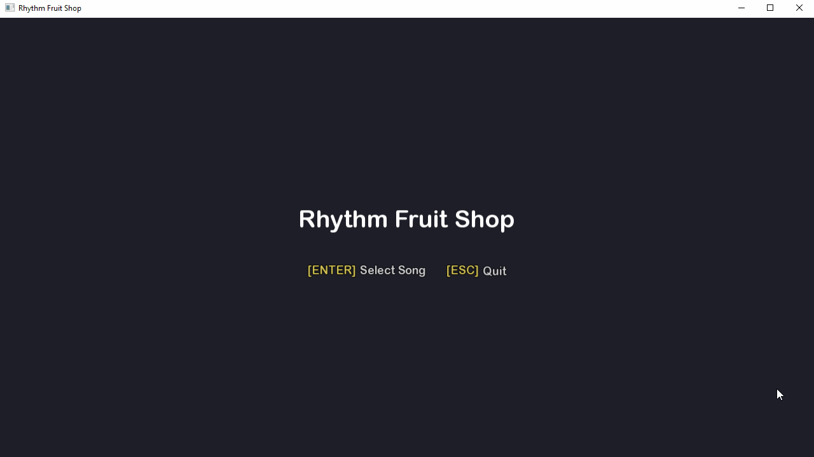

# Rhythm Fruit Shop — C++ Core

Native C++ rhythm game core. Same game world as the [Rhythm Fruit Shop web prototype](https://github.com/YuankunHuang/rhythm-fruit-shop), but a **separate C++ codebase** — not a port. Different charts, assets, and schema.

Four-lane falling notes. Visuals stay intentionally minimal while the clock pipeline, platform layering, and playable loop come together.

Web prototype (visuals, zh-CN narrative, shop loop) → [YuankunHuang/rhythm-fruit-shop](https://github.com/YuankunHuang/rhythm-fruit-shop)

This is my first native C++ project: a compact, playable slice built to demonstrate timing architecture, dependency inversion, deterministic headless tests, and a measured path toward stricter performance contracts.

## Demo

[](assets/showcase/rhythm-fruit-shop-cpp-demo-60s.mp4)

The GIF is a quick README preview. The 60-second MP4 is the review/demo cut for peers, recruiters, and the portfolio site; it covers launch, song select, async loading, gameplay, pause/resume, timing-offset UI, result, and return to song select. For a playable build, use the Windows release artifact or stage `dist/RhythmFruitShop-win64/` locally.

---

## Current Status

Shipped today:

- End-to-end playable Windows demo: main menu → song select → async loading → gameplay → result.
- Showcase media under `assets/showcase/`: README GIF preview plus a 60-second MP4 demo cut.
- Catalog-driven content: 17 visible songs, 29 visible playable difficulty entries, plus a hidden `test-fixture` chart for tests.
- Release package staged at `dist/RhythmFruitShop-win64/` with `RhythmFruitShop.exe`, runtime DLLs, `PLAY.txt`, and staged assets.
- 30 headless doctest cases covering chart/catalog loading, audio path resolution, song clock freeze, judgment windows, scoring, `GameplaySession`, perfect-run determinism, zero-allocation hot-path guard, in-memory record/replay, and `FixedSlotPool`.
- CI workflow builds and runs the headless test target on Windows; the Windows x64 release workflow is manually triggered.
- Manual QA demo pass covers launch, song select, loading, gameplay, pause/resume, timing offset UI, result, and return to song select.

Still planned / not claimed as shipped:

- Production `RFS_HOTPATH_BEGIN/END`, `FramePmrArena`, frame p50/p99 metrics, input-to-judge latency histogram, formal `ChartValidator`, and pause invariant test.

## Quick Start

**Requirements:** Visual Studio 2022/2026 with **Desktop development with C++**, CMake 3.24+, vcpkg (manifest mode)

1. Open the repository root in Visual Studio (**File → Open → Folder**).
2. Select CMake preset **`win64-vcpkg`** (Ninja Multi-Config + vcpkg manifest).
3. Wait for configure. vcpkg installs **nlohmann-json** + **doctest**, plus **SFML 2.6.1** via the default `app` feature, from `vcpkg.json`. (The headless `ci-headless` preset turns the `app` feature off and skips SFML — see [Headless build](#headless-build-ci-headless).)
4. Set **`rfs_demo`** as the startup project and press **F5**.

The debugger working directory is set to the repository root in CMake, so asset paths such as `assets/audio/...` resolve correctly.

> **Configure from an x64 environment.** The `win64-vcpkg` / `ci-headless` presets target the `x64-windows` vcpkg triplet. Visual Studio's "Open Folder" picks up an x64 toolchain automatically; from a command line, use the **x64 Native Tools Command Prompt for VS** (or run `vcvarsall.bat x64`). If a build directory was first configured with a 32-bit `cl.exe`, the cached compiler and the x64 triplet will conflict at link time — delete `out/build/<preset>/` and reconfigure from an x64 shell.

If `VCPKG_ROOT` is not set globally, Visual Studio usually picks up the vcpkg bundled with the C++ workload. From a command prompt you can set:

```bat
set VCPKG_ROOT=C:\Program Files\Microsoft Visual Studio\18\Community\VC\vcpkg
```

Runtime assets are checked in under `assets/` for the current demo build: charts, audio, covers, and `assets/fonts/Inter-Regular.TTF`. The helper batch files remain available for rebuilding imported charts/audio from source material.

If SFML DLLs are missing at runtime during local Debug builds, copy the debug binaries from:

`out/build/win64-vcpkg/Debug/vcpkg_installed/x64-windows/debug/bin/`

into the same folder as `RhythmFruitShop.exe` (or use the Release packaging flow below).

## Controls

| Key | In gameplay | In pause menu | In song select |
|-----|-------------|---------------|----------------|
| **D F J K** | Lanes 0–3 | — | — |
| **Up / Down** | — | — | Change song |
| **Left / Right** | — | Adjust timing offset | Change difficulty |
| **1 / 2 / 3 / 4** | — | Set speed level | Set speed level |
| **F1** | Toggle debug overlay | Toggle debug overlay | — |
| **Enter** | Start (main menu) / confirm (loading, result) | Quit to main menu | Start selected song |
| **Esc** | Open pause overlay | Resume | Back |

Default window size: **1280×720**.

## Demo Flow

```
MainMenu → ChartSelect → Loading (async chart load) → Gameplay → Result → ChartSelect
                              ↑
                         Pause overlay (Esc)
```

Song list and audio paths come from `assets/charts/catalog.json`. Chart authoring and the osu!mania import pipeline live in the companion repo ([YuankunHuang/rhythm-fruit-shop](https://github.com/YuankunHuang/rhythm-fruit-shop)); this repo ships the current demo chart/audio/font/cover asset set under `assets/`.

Current catalog summary: 18 total entries, 17 visible songs, 29 visible playable difficulty entries, and one hidden `test-fixture` entry used by tests.

Example playable entries:

| Song ID | Difficulty | Audio |
|---------|------------|-------|
| `lemon-water-light` | service | `assets/audio/service/lemon-water-light.mp3` |
| `lets-drive` | easy/normal/hard/expert | `assets/audio/tracks/lets-drive.mp3` |
| `megaburn` | easy/normal/hard/expert | `assets/audio/tracks/megaburn.mp3` |

## Architecture

```
main.cpp / rfs_demo          composition root — wires concrete backends
    │
    ├── rfs_app              Application, UIManager, IScreen implementations
    │       └── depends on platform interfaces only (no SFML / miniaudio)
    │
    ├── rfs_platform_sfml    SfmlWindow, SfmlRenderer, SfmlInputSource
    ├── rfs_platform_miniaudio   MiniaudioAudioPlayer, MiniaudioAudioBackendClock
    │
    └── rfs_core             ChartLoader, FrozenChart, SmoothedSongClock, AudioPathResolver,
                             JudgementSystem, ScoreSystem, RuntimeStore, GameplaySession (headless)
            └── no SFML, no miniaudio (enforced by CMake dependency guards)
```

Gameplay screens receive services through `GameContext` (`IRenderer`, `IAudioPlayer`, `UIManager`, `SmoothedSongClock`). Concrete SFML and miniaudio types never appear in `rfs_app`.

Judgment and scoring are pure, headless logic and live in `rfs_core` (`GameplaySession` owns `JudgementSystem`, `ScoreSystem`, `RuntimeStore`). `rfs_app` drives presentation only, so the entire decide/commit path is testable without a window or audio device.

## Timing Pipeline

Song time is **not** advanced by frame `deltaTime`.

```
miniaudio PCM cursor          (IAudioBackendClock)
        ↓
SmoothedSongClock             host interpolation + EMA re-anchor + pause freeze
        ↓
FrameContext.song_time_ms     consumed by GameplayScreen
        ↓
note spawn Y + input judgment (event_song_time_ms from reverse-mapped host timestamp)
```

Input events carry a per-key host-monotonic timestamp at poll time; judgment compares mapped song time against each note's `timeMs`.

## CMake Targets

| Target | Role |
|--------|------|
| `rfs_core` | Rhythm core — chart load, frozen chart data, smoothed clock, audio path resolver, judgement, scoring, headless `GameplaySession` |
| `rfs_platform_iface` | Header-only platform contracts (`IWindow`, `IRenderer`, …) |
| `rfs_platform_sfml` | SFML 2.6 window, render, input (only built when `RFS_BUILD_APP=ON`) |
| `rfs_platform_miniaudio` | Audio playback + sample-position clock |
| `rfs_app` | Screens, game loop, presentation (judgement/scoring live in `rfs_core`) |
| `rfs_demo` | Runnable game executable (only built when `RFS_BUILD_APP=ON`) |
| `rfs_tests` | Headless core tests — determinism (perfect-run invariant), zero-alloc hot-path contract, `FixedSlotPool`, no window/audio device |

Run tests from the repository root after configuring/building:

```bat
out\build\win64-vcpkg\Debug\rfs_tests.exe
```

`rfs_tests` is fully headless and links neither a window nor an audio device, so it can be built and run without the GUI dependencies (see the `ci-headless` preset below). Beyond unit coverage it enforces two engineering contracts:

- **Determinism** — `PerfectRunInvariant` drives a `GameplaySession` with flawless synthetic input and asserts an all-Perfect, full-combo run reaches the theoretical max score (checked against an independent Q16 oracle).
- **Zero hot-path allocation** — `TestZeroAllocHotPath` arms a custom `operator new` counter (`tests/support/AllocationGuard`) around steady-state `HandleLaneTap` / `Update` and asserts zero heap allocations; a calibration case proves the counter itself works.

### Headless build (`ci-headless`)

Core-only build with the GUI dependencies switched off (`RFS_BUILD_APP=OFF`), so vcpkg installs only `nlohmann-json` + `doctest` (no SFML). This is what CI runs:

```bat
cmake --preset ci-headless
cmake --build --preset ci-headless-build --target rfs_tests
ctest --preset ci-headless-test
```

## Release Packaging (Windows x64)

One-command local package flow:

```bat
04_package_release.bat
```

Or build the `win64-vcpkg` Release configuration, then stage from the repository root:

```bat
python scripts\package_cpp_core_release.py
```

This script:

1. Copies `RhythmFruitShop.exe` and the vcpkg runtime DLLs
2. Stages optimized runtime assets via `scripts\package_cpp_core_share.py` (audio, charts, covers, fonts — cover JPEG resize, mp3 re-encode, chart JSON minify). `assets/showcase/` review media is excluded.
3. Produces `dist\RhythmFruitShop-win64\` (exe, DLLs, assets, `PLAY.txt`) and `dist\RhythmFruitShop-win64.zip`

Requirements: Visual Studio with C++ workload, Python 3 (+ Pillow for asset optimization). Optional: `ffmpeg` on PATH for mp3 re-encode during asset staging.

The staged package contains `RhythmFruitShop.exe`, vcpkg runtime DLLs, `PLAY.txt`, and `assets/` next to the executable.

### CI

Two GitHub Actions workflows:

- **CI** (`.github/workflows/ci.yml`) — runs on every push to `main` and on pull requests. It configures the headless `ci-headless` preset (no SFML), builds `rfs_tests`, and runs the full test suite via `ctest`.
- **C++ Release (Windows x64)** (`.github/workflows/release-windows.yml`) — triggered manually via **workflow_dispatch**. Builds the full app with the `win64-vcpkg` preset and uploads `RhythmFruitShop-win64.zip` as an artifact.

## Project Layout

```
  assets/          charts, audio, covers, fonts
  cmake/           warnings, dependency guards
  external/        miniaudio (single-header)
  scripts/         release packaging (package_cpp_core_release.py + share.py)
  src/
    app/           Application, UIManager, IScreen
    game/          screens, layout, rules
    platform/      interfaces + SFML / miniaudio backends
    rhythm/        ChartLoader, SmoothedSongClock, FrozenChart, AudioPathResolver,
                   JudgementSystem, ScoreSystem, RuntimeStore, GameplaySession,
                   RecordingSession, ReplayHeadless
    util/          FixedSlotPool (header-only, heap-free object pool)
  tests/           doctest suites + support/AllocationGuard (zero-alloc instrument)
  vcpkg.json       nlohmann-json + doctest; SFML 2.6.1 (pinned) as the default "app" feature
```

## Engineering Notes

- **Dependency inversion:** `rfs_core` and `rfs_app` must not link SFML or miniaudio. Guards live in `cmake/DependencyGuards.cmake`.
- **UI scaling:** Reference resolution 1280×720; font sizes use uniform `min(sx, sy)` scale via `UiFontConfig`.
- **Resize:** View resets to 1:1 pixel mapping on `sf::Event::Resized`. Live reflow while dragging the window border is limited by Win32 modal resize behaviour; layout updates correctly after the mouse is released.

## License

Personal project — Yuankun Huang, 2026.

Source code and project documentation are published for portfolio review under `LICENSE`. Audio tracks, cover art, fonts, showcase media, and imported chart/source material are covered separately in `THIRD_PARTY_NOTICES.md`; they are included for demonstration and review of this project only and are not relicensed as original project-owned media.
