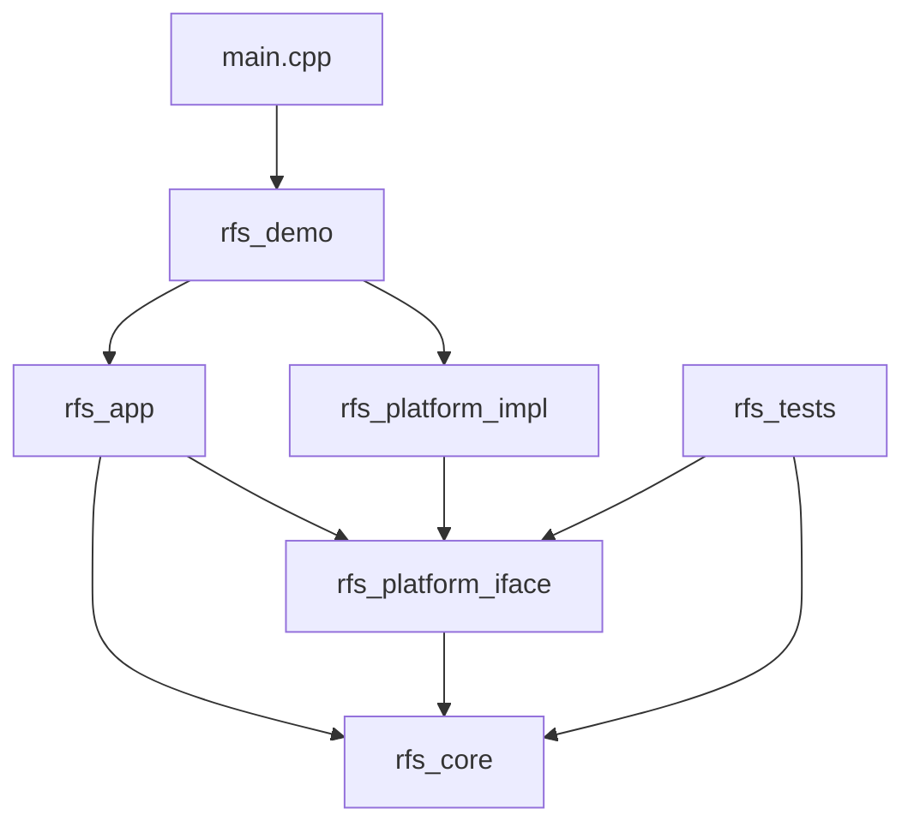
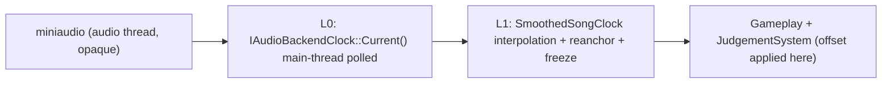

# Rhythm Fruit Shop C++ Core - GDD + TDD

**Document version:** v3.0 (reconciled line-by-line with the shipped code; see changelog at end)
**Author background:** C++ game programmer with 5 years of Unity/C# mobile game-client experience. This is my first native C++ project, started deliberately to build depth in high-performance and systems-level engineering - the foundation I want for simulation/engine-adjacent work over time.
**What this is:** A native C++20 rhythm-game core organized around a deterministic timing pipeline, a strictly inverted dependency graph between gameplay and platform layers, and a command-driven judgment flow.

> **Status tags.** Every feature below carries one of three tags, so a reviewer can tell exactly what is built versus planned:
>
> - **[Shipped]** - present and verified in the current code.
> - **[Planned]** - committed near-term work with a concrete acceptance signal; tracked in the wrap-up backlog (§30).
> - **[v2]** - deliberately deferred, with a recorded trigger condition.
>
> If a line is not tagged [Shipped], it is not yet in the binary. This document is held to one rule above all: **it never claims something the code does not deliver.** Where v2.0 of this document over-promised, v3.0 corrects it.

---

# Executive Brief

This is not a commercial game and not a custom engine. It is a small, native C++ rhythm core, built as a slice of production-shaped code rather than a tutorial, and used as the project where I move from Unity/C# game-client work into native C++ and systems thinking.

A reviewer (hiring manager, engineer, technical interviewer) opening the repository should be able to verify the following inside ten minutes:

1. Rhythm-game timing is modeled as a layered clock pipeline driven by the audio sample cursor, not as `dt` accumulation. **[Shipped]**
2. The dependency graph is inverted so gameplay code is unaware of any concrete window/audio/render backend, and this is enforced at CMake configure time. **[Shipped]**
3. Judgment is written as a pure decision function that returns command buffers, separating "decide" from "commit". **[Shipped]**
4. Memory and update cost are being turned into enforced contracts (zero hot-path heap allocation, measured update/latency budgets), not just claimed. **[Planned]**
5. The project distinguishes what is shipped from what is planned from what is deferred, and tags every claim accordingly.

The visual deliverable is a four-lane falling-note demo with fruit-shop theming. The engineering substance - timing, layering, decision pipeline, and the in-progress performance contracts - is what the document is about.

## Engineering principles

These are the load-bearing principles of the project. The first three are enforced today; the last two are committed work with a defined acceptance signal. Each carries a status tag and an enforcement mechanism.

| # | Principle | Status | Enforcement |
|---|---|---|---|
| I-01 | The rhythm core (`rfs_core`) does not link, include, or reference SFML, miniaudio, or any OS library. | [Shipped] | CMake per-target link allow-list + `rfs_assert_no_forbidden_deps` configure-time guard (§14, §16.3). Build break on violation. |
| I-02 | Authoritative song time comes from the audio clock, never from frame `dt`. (A pre-roll lead-in countdown uses `dt`, but it never feeds judgment - see note below.) | [Shipped] | Judgment reads `event_song_time_ms` mapped from the smoothed clock; there is no `AdvanceByDelta` path into song time. |
| I-03 | Input events carry a host-monotonic capture timestamp; `event_song_time_ms` is derived by reverse-mapping that timestamp through the smoothed clock. | [Shipped] | `SmoothedSongClock::HostNsToSongTimeMs` is the only mapping path; applied once per event in the main loop (§19). |
| I-04 | Judgment is a pure function: it reads `const` runtime state and returns a command buffer by value; it mutates nothing. | [Shipped] | `JudgementSystem::JudgeTaps` / `DetectMisses` are `const` and return `StaticCommandBuffer` by value (§22). |
| I-05 | Inside the gameplay decide/commit path, the global heap allocator observes zero allocations in debug builds. | [Planned] | `RFS_HOTPATH_BEGIN/END` + a debug `operator new` override with a thread-local counter; non-zero delta traps. Acceptance: 60 s of play, zero counted allocations (§26). |
| I-06 | Per-frame scratch memory comes from a stack-backed `std::pmr::monotonic_buffer_resource`, reset at the frame boundary. | [Planned] | `FramePmrArena` (64 KB) + high-water-mark assert (§26). |
| I-07 | Chart data is split into an immutable `FrozenChart` (loaded once, `const` thereafter) and mutable per-session runtime arrays. | [Shipped] | `FrozenChart` exposes only `std::span<const ...>`; mutation is a compile error (§17). |
| I-08 | `rfs_tests` links neither a window nor an audio device, and exercises the rhythm core headless. | [Shipped, extending] | CMake target `rfs_tests` links only `rfs_core` + `rfs_platform_iface` + doctest (§16). A headless `GameplaySession` + a CI test gate are [Planned] (§29). |

> **Note on I-02.** During the lead-in (before audio playback starts) the gameplay screen counts down using frame `dt`. This is intentional: it is pre-song UI timing and is never used to judge a note. Once playback begins, all note positions and judgments are functions of song time sampled from `SmoothedSongClock`.

## Repository identity

- Repo name: `rhythm-fruit-shop-cpp-core`
- Tagline: Native C++20 rhythm-game core with a deterministic, audio-cursor-driven clock pipeline, an inverted platform boundary enforced at build time, and a command-driven judgment flow.

# Part I - Game Design Document (GDD)

## 1. Game overview

### 1.1 High concept

**Rhythm Fruit Shop** is a four-lane falling-note rhythm core. Fruit-themed notes descend along fixed lanes toward a hit line. The player presses a lane key in time with the note crossing the line. Timing accuracy resolves into a discrete judgment (Perfect / Great / Good / Miss), which feeds combo, score, and accuracy.

The C++ build is a **native systems rewrite**, not a port of any HTML prototype. The visual layer is intentionally minimal; the value of the project lies in its timing, architecture, and runtime contracts.

### 1.2 Demo promise

Within 30 seconds of play, the player understands the game. Within 10 minutes of code review, an engineer understands:

- How the application boots and how services are wired. **[Shipped]**
- How song time is established, smoothed, and consumed. **[Shipped]**
- How chart data is loaded, frozen, and queried. **[Shipped]**
- How input is timestamped, reverse-mapped to song time, and judged as a pure decision step. **[Shipped]**
- Where the project intends to draw its hot-path memory contract and how it will be enforced. **[Planned]**

## 2. Product goals

### 2.1 Primary goal

Ship a compact, playable native C++20 rhythm core that demonstrates - in a small, reviewable surface area - that I can carry game-domain experience into native C++ and systems-level engineering: deterministic timing, a clean dependency boundary, a decision-pipeline architecture, and (in progress) enforced performance contracts.

### 2.2 Secondary goals

- Establish a reusable native C++ project template (CMake topology, platform inversion, diagnostics) for later engine-module or simulation-adjacent work.
- Turn a rhythm gameplay idea into an architecture that holds up to engineering review.
- Produce a public GitHub artifact that can be linked from a resume and discussed in depth in an interview.
- Provide concrete C++ surfaces - timing, command pipeline, memory contracts, tests - to anchor a technical conversation.

### 2.3 Scope status

The project deliberately keeps a small surface. What follows is the honest status of each axis.

**Shipped beyond the original v1 plan:**

- **[Shipped]** Multiple charts and a song-selection flow. The repo ships 41 charts (`assets/charts/catalog.json`) and a full `ChartSelectScreen` with difficulty selection. (v2.0 of this document listed this as out of scope; it shipped, so it is promoted here to a delivered feature.)
- **[Shipped]** Async chart/audio loading screen, window-resize handling, calibration offset UI in the pause menu.

**Deferred, each with a trigger in §37:**

- **[v2]** Audio-callback-driven SPSC anchor pipeline (v1 uses a main-thread-polled smoothed clock; see §18.8 for the numerical justification).
- **[v2]** Hold/Slide/Flick note types (v1 supports `Tap` only).
- **[v2]** Replay recorder/player (design hook only; see §38).
- **[v2]** Property-based / fuzz test harness.
- **[v2]** Networked or online play.
- **[v2]** Custom engine, custom renderer, custom audio backend.

## 3. Target audience

| Audience | What they should observe |
|---|---|
| Hiring manager | A scoped, shipped, playable artifact - not coursework - from someone moving into native C++. |
| Engineer | Inverted dependency graph, layered clock model, command-driven judgment (all shipped); memory/latency contracts in progress with clear acceptance gates. |
| Recruiter | Repo description and resume bullets describe only what is built, tagged by status. |
| Player | Inputs feel responsive; judgments feel fair; the demo loop is legible without instruction. |

## 4. Core pillars

### 4.1 Timing precision

Every judgment is the result of an explicit signed delta between an input host timestamp (mapped into song time) and a note's `time_ms` (plus the calibration offset). There is no frame-accumulation path. **[Shipped]**

### 4.2 Input fidelity

Input events are timestamped at *capture*, not at frame consumption. Reverse-mapping into song time happens through the same smoothed clock that gameplay uses, eliminating off-by-one-frame judgment errors.

### 4.3 Architectural legibility

Each module has a small public surface and a documented dependency direction. A reviewer can draw the architecture diagram from `CMakeLists.txt` alone and not be wrong.

### 4.4 Performance discipline [Planned]

Performance is to be expressed as a budget table (§26.5) with measurement tooling and breach actions, not as adjectives. The measurement layer (frame-time p50/p99, input-to-judge latency, hot-path allocation count) is committed work tracked in §30, not yet in the binary.

### 4.5 Engineering candor

What is built, what is planned, and what is deferred are tagged inline and summarized in §37. A reviewer never has to guess what is "real" versus "aspirational" - that is the entire point of the v3.0 reconciliation.

## 5. Gameplay summary

### 5.1 Core loop [Shipped]

1. Main menu -> song select; the chosen chart is validated and assets are warmed on the loading screen.
2. Audio playback begins; the smoothed song clock is armed from the audio sample cursor.
3. Each frame: poll timestamped inputs -> map each to song time -> judge taps (on input) and detect misses (on update) as pure decisions -> apply results -> render notes whose position is a function of song time.
4. Song completes; the result screen renders the summary and returns to song select.

### 5.2 Per-frame pipeline

**Shipped today.** The decision/commit split exists, but the logic currently lives inside `GameplayScreen` rather than a standalone session object:

```text
Application::Run
  Tick smoothed clock from audio sample anchor
  Poll inputs; map each event_host_ns -> event_song_time_ms
  GameplayScreen::HandleInput : JudgeTaps (pure) -> TapCommandBuffer -> ApplyCommand
  GameplayScreen::Update      : DetectMisses (pure) -> MissCommandBuffer -> ApplyCommand; advance next_idx
  GameplayScreen::Render      : project notes/HUD directly from chart + snapshot
```

**Planned (§24, §30).** Extracting a headless `GameplaySession` that makes the phase ordering explicit and side-effect-isolated:

```text
Read    : snapshot song time + this frame's input span
Decide  : JudgementSystem (pure) -> TapCommandBuffer ; MissDetector (pure) -> MissCommandBuffer
Commit  : RuntimeStore::Apply(commands)              # only mutation point
Retire  : lane cursors advance past judged/missed
Project : view model rebuilt for the renderer
```

The motivation for the extraction is testability (it unlocks the headless perfect-run invariant test, §29) and giving the hot-path allocation guard a clean scope (§26). This is **[Planned]**, not shipped.

### 5.3 Controls [Shipped]

Actual key bindings, mapped in `SfmlInputSource` to the `InputAction` enum:

| Action | Key |
|---|---|
| Lanes 0-3 | D / F / J / K |
| Confirm (menu / loading / result) | Enter |
| Pause / resume / back | Esc |
| Song select: change song | Up / Down |
| Song select: change difficulty | Left / Right |
| Difficulty quick-select | 1 / 2 / 3 / 4 |
| Calibration offset (in pause menu) | Left / Right |
| Toggle debug overlay | F1 |

Note: the arrow keys are navigation, not alternate lane keys; there is no separate Restart or F2-calibration binding. Calibration is adjusted with Left/Right inside the pause overlay.

### 5.4 Screen flow [Shipped]

Navigation is a screen stack managed by `UIManager` (`NavigateTo` / `GoBack` / `GoBackToRoot` / `ReplaceTop`, with `FlushPending()` applied once per frame after input). There is no separate `StateStack`/`IGameState` layer; screens implement `IScreen`.

| Screen | Role | Entry / exit notes |
|---|---|---|
| MainMenuScreen | Title + start prompt | Enter -> ChartSelect. Audio idle. |
| ChartSelectScreen | Song + difficulty selection | Enter -> Loading (selected chart). |
| LoadingScreen | Async chart + audio load | On success -> replaces top with Gameplay; on failure shows the error in place (Esc to go back). |
| GameplayScreen | Falling-note play | Song clock running; Esc -> pushes Pause overlay; song end -> replaces top with Result. |
| PauseScreen | Overlay (`IsOverlay() == true`) | Freezes the song clock; Esc resumes; Enter quits to menu. |
| ResultScreen | Score / accuracy / grade summary | Enter -> back to song select. |

Actual transitions:

```text
MainMenu -> ChartSelect -> Loading -> Gameplay -> Result -> (ChartSelect)
Gameplay -> Pause (overlay) -> Gameplay
```

Boot work (constructing platform services, navigating to MainMenu) happens in `Application::Run` rather than as a distinct Boot screen. Load failures are surfaced on LoadingScreen rather than a dedicated Error screen; a structured Error state is recorded as **[v2]**.

## 6. Mechanics

### 6.1 Lanes

The demo runs four vertical lanes (`GameConfig::kLaneCount = 4`). Each note belongs to exactly one lane. Lane-to-key mapping (D/F/J/K) currently lives in `SfmlInputSource`; promoting it to a data-driven `InputBindings` table is **[v2]**.

### 6.2 Note definition

A note is described entirely by immutable data. Actual `NoteDef` (`rhythm/FrozenChart.h`):

| Field | Type | Description |
|---|---|---|
| `id` | `std::uint32_t` | Stable chart-local note identifier. |
| `time_ms` | `std::int32_t` | Song time at which the note should be hit. |
| `lane` | `std::uint8_t` | Lane index, `< lane_count`. |
| `visual_id` | `std::uint16_t` | Visual variant index (fruit type). |

There is no `type` field yet (Tap is the only note kind; Hold/Slide/Flick are **[v2]**). A `static_assert` on `sizeof(NoteDef)` and a dedicated `NoteType` enum are **[Planned]** polish (§17).

### 6.3 Spawn rule

A note is visible/active when:

```text
songTimeMs >= timeMs - approachTimeMs
```

`approachTimeMs` is selected from a scroll-speed table (`GameConfig::kSpeedLevels`) rather than read from the chart header. Traversal uses a monotonic `next_idx` cursor (the renderer scans forward from it within the approach window); the full chart vector is never re-scanned from zero each frame. A dedicated `SpawnScheduler`/`NoteTimeline` object that formalizes this is **[Planned]** as part of the headless session (§21, §24); the cursor behavior itself is **[Shipped]**.

### 6.4 Note position derivation

Note position is a **pure function of song time**, not an integrator:

```text
progress = clamp((songTimeMs - (targetTimeMs - approachTimeMs)) / approachTimeMs, 0, 1)
y        = lerp(spawnY, hitLineY, progress)
```

This eliminates accumulated drift and makes rendering deterministic given a song time sample.

### 6.5 Judgment windows

Default windows, injected via `JudgementConfig` (see §22.2): **[Shipped]**

| Judgment | `|delta|` |
|---|---:|
| Perfect | `<= 50 ms` |
| Great | `<= 100 ms` |
| Good | `<= 150 ms` |
| Miss | `> 150 ms` (the Good window doubles as the miss boundary), or note passes the boundary unjudged |

v1 uses a single boundary for "too far to count as a hit" and "now missed" (both 150 ms). A separate, wider miss window (a dead zone) is **[v2]** and would only require changing a `JudgementConfig` default plus the corresponding test.

### 6.6 Input judgment algorithm (lane-local)

For each lane key-press (handled in `GameplayScreen::HandleInput`): **[Shipped]**

1. Map `action` to `lane`.
2. Use the event's `event_song_time_ms` (already reverse-mapped from `event_host_ns` in the main loop via `SmoothedSongClock::HostNsToSongTimeMs`, §19; falls back to the current frame song time if unset).
3. `JudgementSystem::JudgeTaps` scans notes forward from the monotonic `next_idx`, skipping resolved notes and notes in other lanes.
4. It keeps the unresolved note with the smallest `|input_song_time_ms - (time_ms + song_offset_ms)|` within the Good window, breaking early once future notes are out of range.
5. It returns a `TapCommandBuffer` by value (no mutation); the caller applies it.

The scan is bounded: it stops as soon as the next candidate is beyond the Good window in the future. A per-lane index slice (`LaneCursors[lane]`) that removes the lane filter entirely is **[v2]** (see §17.5).

### 6.7 Miss handling

A note is missed when: **[Shipped]**

```text
songTimeMs - (timeMs + songOffsetMs) > goodWindowMs   AND   note still unresolved
```

`JudgementSystem::DetectMisses` walks forward from `next_idx`, emits an `AutoMiss` `JudgeCommand` for each unresolved note past the boundary, and advances `next_idx`. It runs in `GameplayScreen::Update`; applying the commands resets combo and increments the miss count. Extracting this into a standalone `MissDetector` that runs in a single explicit Decide phase alongside taps is **[Planned]** (§24); the pure-decision shape (it returns a buffer and mutates nothing) is already **[Shipped]**.

### 6.8 Scoring

| Judgment | Base score | Combo |
|---|---:|---|
| Perfect | 1000 | +1 |
| Great | 700 | +1 |
| Good | 300 | +1 |
| Miss | 0 | reset to 0 |

Combo multiplier (deterministic, integer-friendly):

```text
multiplier_q16 = 65536 + min(combo, 100) * 328     // ~0.005 per combo, capped at 100
finalAdd       = (baseScore * multiplier_q16) >> 16
```

Q16 fixed-point keeps scoring deterministic across platforms. Floating-point is forbidden in the score path. **[Shipped]** - implemented in `Scoring::EarnScore` (`game/GameRules.h`): base scores 1000/700/300, `multiplier_q16 = 65536 + min(combo, 100) * 328`, returned as `(int64_t(base) * multiplier_q16) >> 16`. The `int64_t` widening avoids overflow; there is no `float` anywhere on the score path.

### 6.9 Accuracy

Actual implementation (`Grading::Accuracy`, `game/GameRules.h`) expresses the same idea as an integer-weighted ratio: **[Shipped]**

```text
accuracy01 = (perfect*300 + great*200 + good*100) / (total * 300)
           = weights 1.0 / 0.667 / 0.333 / 0.0 over Perfect/Great/Good/Miss
```

Accuracy is `float` here on purpose: it is a display/grading figure for the result screen and debug overlay, computed lazily and **not on the score hot path**. The "no floating-point" rule applies to scoring, not to this presentation-layer ratio.

### 6.10 Feedback

Feedback set: **[Shipped]**

- Inline judgment text fades over `GameConfig::kJudgeDisplayMs`.
- Note hit effects on resolve.
- Combo / score in the HUD; accuracy and grade on the result screen.
- Calibration offset and last-judgment delta in the debug overlay (running p50/p99 timing stats are **[Planned]**, §27).

Particles, screen shake, and bloom are **[v2]**.

## 7. Content design

### 7.1 Chart scope [Shipped]

The build ships 41 charts indexed by `assets/charts/catalog.json`, each a `*.rfs.json` file, selectable through `ChartSelectScreen` with multiple difficulties. Charts are imported from osu!mania sources through an offline pipeline (see the repository README). The rhythm core's correctness does not depend on chart count; the catalog exists to make the demo pleasant to play and review.

> Music and chart-source licensing: the runtime audio is not original work, so the public repository documents that audio and imported chart data are for demonstration only and are not redistributed as the project's own license. This boundary is stated in the README/LICENSE rather than here.

### 7.2 Chart length

Target: 45-75 seconds. Long enough for a full session arc (intro -> peak -> outro); short enough to review repeatedly.

### 7.3 Chart difficulty curve

| Section | Time range | Purpose |
|---|---:|---|
| Intro | 0-10s | Single notes per lane; teach mapping. |
| Build | 10-30s | Alternating lanes, paired notes. |
| Peak | 30-55s | Cross-lane density, shorter inter-note gaps. |
| Outro | 55-70s | Spaced single notes; clean ending. |

### 7.4 Chart format

Charts are `*.rfs.json` files indexed by `catalog.json`; `ChartLoader` reads a chart id + difficulty and produces a `FrozenChart` of notes `{ id, time_ms, lane, visual_id }` sorted by time. The illustrative shape below shows the fields the loader actually consumes; consult `assets/charts/catalog.json` and any `*.rfs.json` for the real schema.

```json
{
  "title": "Example",
  "notes": [
    { "id": 1, "time_ms": 2000, "lane": 0, "visual_id": 0 },
    { "id": 2, "time_ms": 2500, "lane": 1, "visual_id": 1 }
  ]
}
```

A formal `schemaVersion` field with hard load-time rejection on mismatch is **[Planned]** as part of `ChartValidator` (§20.2).

## 8. UX and screens

### 8.1 Main menu

Title, subtitle, start prompt, repository URL line. No audio playing. Background pre-rendered.

### 8.2 Loading screen

Chart title, note count, validation result, audio load result, smoothed-clock arming status.

### 8.3 Gameplay HUD

Score, combo, and the fading last-judgment label. Debug overlay toggleable via F1. (Accuracy and grade are shown on the result screen, not the live HUD.)

### 8.4 Result screen

**[Shipped]:** final score, accuracy, letter grade, max combo, and per-judgment counts; Enter returns to song select. **[Planned]:** mean signed offset, p99 update/render time, and p99 input-to-judge latency, added once the metrics layer lands (§27).

## 9. Visual direction

Geometric placeholders are acceptable and shipped. Lanes are flat panels; notes are colored rounded squares; the hit line is a single horizontal stroke. Custom art is **out of v1 scope**. The visual budget exists to make the systems legible, not to demonstrate art.

## 10. Audio direction

Per-chart audio tracks loaded by `catalog.json` (imported tracks, demonstration-only). The miniaudio backend exposes the sample-position clock contract (§18) via `ma_sound_get_cursor_in_pcm_frames`. Dedicated hit/miss SFX are **[v2]**; art-grade mixing is out of scope.

## 11. Difficulty and tuning

Actual tuning constants: **[Shipped]**

| Parameter | Value | Where |
|---|---:|---|
| Perfect window | 50 ms | `JudgementConfig::perfect_window_ms` |
| Great window | 100 ms | `JudgementConfig::great_window_ms` |
| Good window (also miss boundary) | 150 ms | `JudgementConfig::good_window_ms` |
| Approach time | from `GameConfig::kSpeedLevels` | scroll-speed table |
| Calibration offset | 0 (default) | `PlaySessionConfig::song_offset_ms` |

Windows live in `JudgementConfig` (constructor-injected into `JudgementSystem`, §22.2), never hard-coded inside the algorithm. v1 carries a single calibration offset (§18.7), not separate audio/input offsets.

## 12. Demo acceptance criteria

**Met today [Shipped]:**

1. CMake configure + build succeeds from a clean checkout on Windows MSVC; the dependency guard passes.
2. The executable starts and selects/loads charts without manual asset-path fix-ups.
3. A selected chart loads, validates, and arms the smoothed clock without errors.
4. Four-lane falling notes render with positions that are pure functions of song time.
5. Lane inputs produce Perfect/Great/Good/Miss per the 50/100/150 windows.
6. Score, combo, and miss-reset semantics match §6.8 (Q16).
7. The debug overlay reports song time, calibration offset, last-judgment delta, note index, and frame time.

**Target [Planned] (acceptance signals for §30):**

8. Linux GCC build green (the code is std-only in `rfs_core`; not yet CI-verified on Linux).
9. The overlay reports update p50/p99, input-to-judge latency, and frame-arena high-water mark.
10. `RFS_HOTPATH` blocks observe zero global heap allocations during steady play (debug build).
11. CI runs `rfs_tests` on every push; README + LICENSE + a 30-60 s demo recording are committed.

# Part II - Technical Design Document (TDD)

## 13. Technical overview

### 13.1 Technical thesis

The project demonstrates a **layered timing pipeline** (shipped), an **inverted platform boundary** enforced at build time (shipped), a **command-driven judgment flow** (shipped), and a **contractually-enforced hot-path memory budget** (planned, §26). The first three are the technical story today; the fourth is the committed next step and the clearest bridge toward the systems/high-performance work I am building toward. Everything else (renderer, HUD, result screen) is plumbing.

### 13.2 Stack

| Layer | Choice | Rationale |
|---|---|---|
| Language | C++20 | `std::span`, `std::pmr`, concepts, `<chrono>`, designated initializers. |
| Build | CMake >= 3.24 | Industry-readable target topology; `target_link_libraries` with PUBLIC/PRIVATE/INTERFACE makes the dependency graph executable. |
| Window / input / render | SFML 2.6 | Fastest path to a playable native demo. Confined behind `IWindow` / `IInputSource` / `IRenderer`. |
| Audio + sample clock | miniaudio (single-header) | Provides `ma_sound_get_cursor_in_pcm_frames` for sample-accurate cursor reads from the main thread. Confined behind `IAudioBackendClock` / `IAudioPlayer`. |
| JSON | nlohmann/json (header-only) | Used at load time only; never on the hot path. |
| Tests | doctest (header-only) | Single-header, fast compile, easy CI. |

### 13.3 Backend selection rationale (recorded for the interview answer)

SFML for window/input/render minimises non-architecture risk. miniaudio for audio is selected over `sf::Music` because:

- `sf::Music::getPlayingOffset()` is ~10-20 ms quantised on common Windows configurations and contains pause/resume jumps that the smoothed clock cannot fully hide.
- `ma_sound_get_cursor_in_pcm_frames` exposes a sample-index integer that reads atomically from the main thread without entering audio callback code, which keeps v1 free of lock-free SPSC plumbing while still providing sample-accurate anchors (see §18 and §37).

Because the clock contract is interface-driven (`IAudioBackendClock`), the audio backend can be swapped for SFML audio without touching gameplay code if miniaudio ever needs to be dropped; that swap is recorded as a fallback rather than a planned change.

## 14. System architecture

### 14.1 Dependency direction



Direction rule: arrows point from concrete to abstract. `rfs_core` sits at the bottom and depends on nothing project-internal except itself.

### 14.2 Module map

| Target | Layer | Allowed dependencies | Forbidden dependencies |
|---|---|---|---|
| `rfs_core` | core | `<std>` only | SFML, miniaudio, OS headers |
| `rfs_platform_iface` | platform abstraction | `rfs_core`, `<std>` | concrete backends |
| `rfs_platform_sfml` | platform impl | `rfs_platform_iface`, SFML | miniaudio (separation of concerns) |
| `rfs_platform_miniaudio` | platform impl | `rfs_platform_iface`, miniaudio | SFML |
| `rfs_app` | application | `rfs_core`, `rfs_platform_iface` | concrete backends |
| `rfs_demo` | executable wiring | all of the above | n/a |
| `rfs_tests` | tests | `rfs_core`, `rfs_platform_iface` | concrete backends, window, audio device |

The forbidden column is enforced via CMake (§16.3).

### 14.3 Source-file ownership

| Module | Files (actual) | Notes |
|---|---|---|
| `rfs_core` | `rhythm/*` (chart, clock, judgement, catalog), `game/GameRules.h`, `game/GameConfig.h` | No OS/SFML/miniaudio. `diagnostics/ScopedTimer`, `memory/FramePmrArena`, `AllocationGuard` are **[Planned]** additions here. |
| `rfs_platform_iface` | `platform/I*.h`, `platform/InputEvent.h`, `platform/SampleAnchor.h` | Interfaces only. |
| `rfs_platform_sfml` | `platform/sfml/SfmlWindow`, `SfmlInputSource`, `SfmlRenderer` | |
| `rfs_platform_miniaudio` | `platform/miniaudio/MiniaudioAudioPlayer`, `MiniaudioAudioBackendClock` | |
| `rfs_app` | `app/*` (`Application`, `UIManager`, `FrameContext`), `game/*Screen`, `game/UiDraw`, `game/DebugOverlay` | `diagnostics/FrameMetrics` is **[Planned]** here. |

### 14.4 Backend swap test (a runtime contract)

- **[Shipped]:** `rfs_tests` builds and runs with no audio device and no display server; it links only `rfs_core` + `rfs_platform_iface` (+ doctest). This is the litmus test for the inverted dependency direction, and it passes today (tests feed `SampleAnchor` values directly to the clock).
- **[Planned]:** a named `MockAudioBackendClock` implementing `IAudioBackendClock`, and a headless `GameplaySession` driven by synthetic input for a bit-for-bit deterministic perfect-run score (§29). A `--headless --simulate-perfect-run` demo entry point is part of the same work.

If building `rfs_tests` ever required a window or audio device, the platform inversion would be violated; that is treated as a P0 bug.

### 14.5 Runtime flow [Shipped]

```text
main()
  -> construct SfmlWindow + SfmlInputSource + SfmlRenderer
                + MiniaudioAudioPlayer + MiniaudioAudioBackendClock
  -> Application::Run()
       -> UIManager::NavigateTo(MainMenuScreen)
       -> for each frame:
            events = SfmlInputSource::Poll()                 // span, see §19
            for each event: event.event_song_time_ms = song_clock.HostNsToSongTimeMs(event.event_host_ns)
            song_clock.Tick(audioClock.Current(), now)       // advance smoothed clock from audio cursor
            activeScreen.HandleInput(events)
            activeScreen.Update(dt)                           // dt used only for UI/lead-in, never for judgment
            activeScreen.Render(renderer)
            uiManager.FlushPending()                          // apply nav changes once per frame
       -> shutdown
```

`FramePmrArena::Reset()` and `FrameMetrics::Commit()` are **[Planned]** insertions into this loop (§26-27); they are not present today.

## 15. Project structure

Actual structure (**[Shipped]**); `[Planned]` markers show where the §24/§26/§27 work lands.

```text
rhythm-fruit-shop-cpp-core/cpp_core/
  CMakeLists.txt
  assets/
    audio/                          # per-chart imported tracks (demo-only)
    charts/  catalog.json + *.rfs.json   # 41 charts
    fonts/   Inter-Regular.ttf
  src/
    main.cpp
    rfs_app.cpp
    app/
      Application.{h,cpp}
      UIManager.{h,cpp}             # screen stack (NavigateTo / GoBack / ReplaceTop)
      IScreen.h
      FrameContext.h
    platform/                       # rfs_platform_iface (interfaces only)
      IAudioBackendClock.h  IAudioPlayer.h  IInputSource.h
      IRenderer.h  IWindow.h  InputEvent.h  SampleAnchor.h  UiFontConfig.h
      sfml/      SfmlWindow / SfmlInputSource / SfmlRenderer
      miniaudio/ MiniaudioAudioPlayer / MiniaudioAudioBackendClock
    rhythm/                         # rfs_core
      FrozenChart.h  ChartLoader.{h,cpp}
      ChartCatalog.{h,cpp}  SongDisplay.{h,cpp}  AudioPathResolver.{h,cpp}
      SmoothedSongClock.{h,cpp}
      JudgementSystem.{h,cpp}  JudgeCommand.h  JudgeCommandBuffer.h
    game/                           # rfs_app
      MainMenuScreen / ChartSelectScreen / LoadingScreen
      GameplayScreen / PauseScreen / ResultScreen
      GameRules.h  GameConfig.h  GameColors.h  GameLayout.h
      GameContext.h  GameResult.h  PlaySessionConfig.h
      UiDraw.{h,cpp}  DebugOverlay.{h,cpp}

  # [Planned] additions (see §24, §26, §27):
  #   rhythm/ChartValidator, NoteTimeline, MissDetector, RuntimeStore, ScoreSystem
  #   game/GameplaySession, GameplayViewModel
  #   memory/FramePmrArena, AllocationGuard, Hotpath.h
  #   diagnostics/ScopedTimer, FrameMetrics, LatencyHistogram
  #   util/StrongTypes.h
  #   tests/TestScoreSystem, TestChartValidator, TestNoteTimeline,
  #         TestPauseInvariant, TestPerfectRunInvariant (+ MockAudioBackendClock)
```

(See the README for the offline chart-import tooling that populates `assets/charts/`.)

## 16. Build design

### 16.1 CMake target table

| Target | Type | PUBLIC link | PRIVATE link |
|---|---|---|---|
| `rfs_core` | STATIC | (none) | (none) |
| `rfs_platform_iface` | INTERFACE | `rfs_core` | (none) |
| `rfs_platform_sfml` | STATIC | `rfs_platform_iface` | `sfml-graphics`, `sfml-window`, `sfml-system` |
| `rfs_platform_miniaudio` | STATIC | `rfs_platform_iface` | (miniaudio is header-only; consumed via include dir) |
| `rfs_app` | STATIC | `rfs_core`, `rfs_platform_iface` | (none) |
| `rfs_demo` | EXECUTABLE | (none) | `rfs_app`, `rfs_platform_sfml`, `rfs_platform_miniaudio` |
| `rfs_tests` | EXECUTABLE | (none) | `rfs_core`, `rfs_platform_iface`, `doctest` |

### 16.2 Build principle (the actual technical claim) [Shipped]

> The rhythm core compiles, links, and tests without a window, an audio device, SFML, or miniaudio.

This is not aspirational - the target table above matches `CMakeLists.txt` exactly, and the dependency guard (§16.3) audits it at configure time. It is the single most important architectural signal in the repository, and it is real today.

### 16.3 Dependency guard (cmake/DependencyGuards.cmake)

```cmake
# Forbid rfs_core from acquiring any link interface against SFML or miniaudio.
function(rfs_assert_no_forbidden_deps target forbidden_targets)
    get_target_property(_link_libs ${target} LINK_LIBRARIES)
    if(_link_libs)
        foreach(_lib IN LISTS _link_libs)
            foreach(_forbidden IN LISTS forbidden_targets)
                if(_lib MATCHES "${_forbidden}")
                    message(FATAL_ERROR
                        "Dependency guard: target '${target}' must not link '${_lib}' "
                        "(forbidden pattern: '${_forbidden}'). "
                        "This breaks invariant I-01.")
                endif()
            endforeach()
        endforeach()
    endif()
endfunction()

rfs_assert_no_forbidden_deps(rfs_core            "sfml;miniaudio")
rfs_assert_no_forbidden_deps(rfs_platform_iface  "sfml;miniaudio")
rfs_assert_no_forbidden_deps(rfs_app             "sfml;miniaudio")
rfs_assert_no_forbidden_deps(rfs_tests           "sfml;miniaudio")
```

The guard runs at configure time. A misplaced `target_link_libraries(rfs_core PRIVATE sfml-graphics)` fails CMake before a single source file compiles.

### 16.4 Warnings and standards

```cmake
set(CMAKE_CXX_STANDARD 20)
set(CMAKE_CXX_STANDARD_REQUIRED ON)
set(CMAKE_CXX_EXTENSIONS OFF)

add_library(rfs_warnings INTERFACE)
target_compile_options(rfs_warnings INTERFACE
    $<$<CXX_COMPILER_ID:MSVC>:/W4 /permissive- /WX>
    $<$<NOT:$<CXX_COMPILER_ID:MSVC>>:-Wall -Wextra -Wpedantic -Werror>)
```

`/WX` and `-Werror` are enabled for `rfs_core` and `rfs_app`; `rfs_platform_sfml` and `rfs_platform_miniaudio` MAY soften this only for vendor-include diagnostics.

## 17. Core data model

### 17.1 Type aliases

The shipped code uses a small set of aliases defined where they are used (`platform/InputEvent.h`, `platform/SampleAnchor.h`): **[Shipped]**

```cpp
using HostNanos    = std::int64_t;   // steady_clock tick count
using Milliseconds = std::int32_t;
using SampleIndex  = std::uint64_t;
```

Lane count is `GameConfig::kLaneCount = 4`; max events per frame is `kMaxEventsPerFrame = 64` (in `SfmlInputSource`). A consolidated `util/StrongTypes.h` with wrapper structs (`SongTime`, `NoteId`, `NoteIndex`, `LaneIndex`) for stronger compile-time separation is **[v2]** polish - the current aliases are plain typedefs, which is enough at this scope.

### 17.2 Note definition (immutable) [Shipped]

Actual `NoteDef` (`rhythm/FrozenChart.h`):

```cpp
struct NoteDef final {
    std::uint32_t id        = 0;
    std::int32_t  time_ms   = 0;
    std::uint8_t  lane      = 0;
    std::uint16_t visual_id = 0;
};
```

There is no `NoteType` field yet (Tap-only) and no `static_assert` on layout. Adding both is **[Planned]** polish; Hold/Slide/Flick are **[v2]**.

### 17.3 FrozenChart (immutable post-load) [Shipped]

Actual shape - the chart header is flattened into the class rather than a separate `ChartHeader`, and there is no per-lane index array:

```cpp
class FrozenChart final {
public:
    const std::string&       Title()          const noexcept;
    std::span<const NoteDef> Notes()          const noexcept;   // sorted by time_ms
    std::int32_t             ApproachTimeMs() const noexcept;
    std::uint8_t             LaneCount()      const noexcept;
private:
    friend class ChartLoader;     // only the loader may populate it
    std::string          title_;
    std::int32_t         approach_time_ms_ = 1600;
    std::uint8_t         lane_count_       = 4;
    std::vector<NoteDef> notes_;
};
```

`FrozenChart` exposes only `std::span<const ...>` and a private, friend-only constructor path; there is no mutating accessor. This satisfies invariant I-07 by construction. A per-lane `LaneSlice` index is **[v2]** (§21.2).

### 17.4 Runtime state (mutable, per-session)

The shipped runtime state is deliberately minimal - a `GameplaySnapshot` carried by `JudgementSystem`: **[Shipped]**

```cpp
struct GameplaySnapshot {
    int next_idx = 0;                          // monotonic cursor into the time-sorted notes
    std::vector<std::uint8_t> note_resolved;   // 0 = unresolved, 1 = resolved (1:1 with notes)
};
```

The richer model below - an explicit `NoteRuntimeState` enum, a packed `NoteRuntime`, and a `RuntimeStore` as the single mutation point with per-lane cursors - is **[Planned]** and arrives with the headless session (§24):

```cpp
// [Planned]
enum class NoteRuntimeState : std::uint8_t { Pending, Active, Judged, Missed };
struct NoteRuntime final { NoteRuntimeState state; std::uint8_t _pad0; std::int16_t last_delta_ms; };
class RuntimeStore final {  // owns states_; Apply(commands) is the only mutation point
    /* ... */
};
```

### 17.5 Layout rationale (AoS vs SoA)

The shipped data is a single time-sorted `std::vector<NoteDef>` (AoS) plus a parallel resolved-flag byte array. The reasoning - and the interview answer to "why not full SoA?" - holds: `sizeof(NoteDef)` is ~11-12 bytes, so a few-hundred-note chart fits comfortably in L1; traversal is a forward scan over contiguous memory from a monotonic cursor. Explicit SoA (separate `time_ms[]`, `lane[]`, `visual_id[]` arrays) only pays off at stress-chart scale (>= 10k notes), and is recorded as **[v2]**. The honest version of the answer: *I kept AoS because at this scale it fits in cache and reads cleanly; I documented the SoA trigger rather than pre-optimizing.*

## 18. Timing architecture

### 18.1 Layered model



Layer responsibilities (two layers shipped):

- **L0 - `IAudioBackendClock`** (interface, **[Shipped]**). `SampleAnchor Current()` returns a snapshot `(SampleIndex sample_cursor, HostNanos host_ns, int32_t sample_rate)`. `MiniaudioAudioBackendClock` reads `ma_sound_get_cursor_in_pcm_frames` synchronously from the main thread paired with `steady_clock::now()`; it does **not** enter the audio callback. Tests feed `SampleAnchor` values directly to L1; a named `MockAudioBackendClock` that implements this interface is **[Planned]** (§29).
- **L1 - `SmoothedSongClock`** (**[Shipped]**). Holds the latest anchor; `NowMs(host_now_ns)` interpolates `anchor_song_ms + (host_now_ns - anchor_host_ns)`. `Tick` applies the reanchor policy (§18.5); `SetFrozen`/`ClearFrozen` implement pause (§18.6); `HostNsToSongTimeMs` is the reverse map used for input (§19). Lock-free because it lives entirely on the main thread.
- **L2 - dedicated `ChartClock`** (**[v2]**). The original design routed chart offset, pause bookkeeping, and calibration through a third clock object. In the shipped code these live elsewhere: the calibration offset is applied inside `JudgementSystem` against note times, and pause/freeze lives in `SmoothedSongClock` + `PauseScreen`. A separate `ChartClock` is only worth extracting if offset/pause logic grows; recorded as a deferred refactor, not a missing feature.

### 18.2 Interface signatures

Actual signatures (**[Shipped]**), with diagnostics counters marked **[Planned]**:

```cpp
// platform/SampleAnchor.h
using SampleIndex = std::uint64_t;
struct SampleAnchor final {
    SampleIndex  sample_cursor = 0;
    HostNanos    host_ns       = 0;
    std::int32_t sample_rate   = 48000;
};

// platform/IAudioBackendClock.h
class IAudioBackendClock {
public:
    virtual ~IAudioBackendClock() = default;
    virtual SampleAnchor Current() noexcept = 0;   // polled once per frame
    virtual bool         IsArmed() const noexcept = 0;
};

// rhythm/SmoothedSongClock.h
class SmoothedSongClock {
public:
    void  Reset();
    void  Tick(SampleAnchor anchor, HostNanos host_now_ns);
    float NowMs(HostNanos host_now_ns) const noexcept;
    std::int32_t HostNsToSongTimeMs(HostNanos event_host_ns) const noexcept;
    bool  IsArmed() const noexcept;

    void  SetFrozen(float song_time_ms, HostNanos host_ns_now) noexcept;  // pause
    void  ClearFrozen(HostNanos host_ns_after_pause) noexcept;            // resume
    bool  IsFrozen() const noexcept;

    // [Planned] diagnostics surfaced to the overlay (§27):
    //   float        LastReanchorDeltaMs() const noexcept;
    //   std::uint32_t HardReanchorCount()  const noexcept;
};
```

Note the time type is `float` milliseconds, not a `SongTime` strong type; the strong-type wrapper is **[v2]** polish (§17.1).

### 18.3 Why `dt` integration is forbidden

The naive implementation `songTimeMs += deltaTime` produces unbounded drift relative to the audio output. Drift is not a theoretical concern; over a 60-second chart with 1% frame-time skew it produces 600 ms of misalignment, easily a one-screen visual offset. The smoothed clock is the entire reason rhythm games need a separate timing module.

### 18.4 Anchor sampling cadence

`SmoothedSongClock::Tick` is called once per main-loop iteration. Cost is dominated by a single `ma_sound_get_cursor_in_pcm_frames` call (~50-200 ns on Windows WASAPI shared mode) plus an arithmetic update. There is no lock-free queue and no audio-thread synchronisation; the v2 evolution path that does introduce them is described in §37.

### 18.5 Drift detection and reanchor policy

On each `Tick(newAnchor, hostNow)`:

```text
predictedSongMs = currentAnchor.songMs + (hostNow - currentAnchor.hostNs) / 1e6
observedSongMs  = newAnchor.songMs
deltaMs         = observedSongMs - predictedSongMs

if      |deltaMs| <= kDeadBandMs          (= 1 ms)   : no-op
else if |deltaMs| <= kSoftReanchorMs      (= 8 ms)   : EMA-blend currentAnchor toward newAnchor (alpha = 0.25)
else                                                 : hard reanchor (replace currentAnchor)
                                                       hardReanchorCount_++
                                                       Logger::Warn("SmoothedSongClock hard reanchor: {} ms", deltaMs)
```

The dead band prevents jitter-driven micro-adjustments; the soft band absorbs typical OS scheduling noise; the hard band catches device switches, pause/resume artefacts, and audio-buffer underruns. The interpolation + reanchor behavior is **[Shipped]** in `SmoothedSongClock::Tick`; exposing `LastReanchorDeltaMs` / `HardReanchorCount` counters to the overlay is **[Planned]** (§27).

### 18.6 Pause/resume invariants

Actual flow (**[Shipped]**), built on `SmoothedSongClock` freeze rather than a separate clock:

```text
On Pause (PauseScreen::OnEnter):
    songClock.SetFrozen(currentSongMs, hostNow)   // NowMs() pins to currentSongMs
    if (audio.IsPlaying()) audio.Pause()          // guarded so lead-in pause doesn't mis-resume

On Resume (PauseScreen::OnExit):
    if (was_playing_) audio.Resume()
    songClock.ClearFrozen(hostNowAfterPause)      // re-bases the anchor so time continues from T
```

Freezing pins `NowMs()` to the captured time so song time continues from `T`, not `T + S`. The `was_playing_` guard (added during pause-UX work) makes pausing safe during the lead-in. A headless `TestPauseInvariant` that asserts resume continues from `T` and that exactly one hard reanchor occurs is **[Planned]** (§29); it depends on the headless session extraction (§24).

### 18.7 Calibration model

v1 ships a **single** calibration offset (**[Shipped]**): `PlaySessionConfig::song_offset_ms`, adjustable in the pause overlay (Left/Right) and applied inside `JudgementSystem` against note times. A positive offset shifts effective note times later, compensating for combined audio-output + input latency.

The two-offset model below is **[v2]**. Splitting one offset into an `audio_offset_ms` (output latency) and `input_offset_ms` (key-to-event latency) is correct in principle - they come from independent hardware paths - but a single scalar is sufficient and easier to calibrate at v1 scope:

| Offset | Sign | Meaning |
|---|---|---|
| `audio_offset_ms` | typically positive | Audio-API submission to physical speaker emission. |
| `input_offset_ms` | typically negative | Physical key strike to OS event delivery. |

The trigger for splitting is a calibration UI that measures the two paths independently (tap-to-beat vs. visual-flash sync).

### 18.8 Numerical justification (why main-thread polling is sufficient for v1)

The v1 audio backend does not enter the audio callback. The justification rests on two numerical bounds.

**Bound A - host clock resolution**. On Windows, `std::chrono::steady_clock` resolves through `QueryPerformanceCounter`, with measured tick at <= 1 microsecond on every platform shipped after Windows 8. Linux `CLOCK_MONOTONIC` is the same order. Host-side measurement error is therefore bounded by `< 1 us`.

**Bound B - sample cursor freshness**. `ma_sound_get_cursor_in_pcm_frames` returns the device's current playback position. On WASAPI shared mode (10 ms buffer, the default), the cursor advances in steps approximating the buffer period; between buffer periods the cursor is effectively stale. Worst-case staleness is one buffer period, ~10 ms.

Without smoothing, the absolute song-time error at any frame is bounded by `bufferPeriodMs <= 10 ms`. With EMA smoothing (`alpha = 0.25`) over a sliding window, the **expected** song-time error settles to:

```text
expected_error_ms ~= bufferPeriodMs * (1 - alpha) / (2 - alpha) ~= 10 * 0.75 / 1.75 ~= 4.3 ms
```

This expected bound (~4.3 ms, with the steady-state error well under one buffer period) is the design figure. Empirically confirming it with an instrumented p50/p99 song-time-error readout is **[Planned]** and depends on the metrics layer (§27); v3.0 does not claim a measured number it has not yet captured.

**Why this is acceptable**. The Perfect window is 50 ms; the Good window is 150 ms. An expected smoothed-clock error of a few milliseconds is a small fraction of the Perfect window and well below the variance of the human input pipeline (USB poll rate + OS scheduler quantum + key-switch travel, typically 5-15 ms combined). The smoothed clock keeps timing error below the perceptual threshold for a 4-lane, Tap-only demo.

**Conclusion**. Audio-callback-driven anchors with a lock-free SPSC ring (the **[v2]** path in §37) would reduce expected error from a few milliseconds to tens of microseconds. The improvement is real but unobservable to the player at this scope (4 lanes, 60-144 Hz, Tap-only). Building lock-free plumbing to gain unobservable accuracy fails the scope-discipline test that this project is partly built to demonstrate.

This is the engineering judgment recorded for the interview answer: *bounded, justified, with the alternative path documented and a concrete trigger condition for adopting it (240 Hz displays, 8+ lanes, VSRG difficulty), and the measurement to confirm the bound itself queued as committed work.*

## 19. Input architecture

### 19.1 Event model

Actual definitions (`platform/InputEvent.h`, **[Shipped]**):

```cpp
using HostNanos    = std::int64_t;
using Milliseconds = std::int32_t;

enum class InputAction : std::uint8_t {
    Lane0, Lane1, Lane2, Lane3,
    Escape, Enter, ToggleDebug,
    NavUp, NavDown, NavLeft, NavRight,
    Level1, Level2, Level3, Level4
};

struct InputEvent final {
    InputAction  action            = InputAction::Lane0;
    bool         pressed           = false;
    std::uint8_t _pad0             = 0;
    std::uint8_t _pad1             = 0;
    HostNanos    event_host_ns     = 0;   // captured at poll time
    Milliseconds event_song_time_ms = 0;  // filled by reverse-mapping (§19.3)
};
```

The enum models the actual control set: four lanes, Escape (pause/back), Enter (confirm), navigation arrows, and difficulty quick-select. There is no `Pause`/`Restart`/`CycleCalibration` action - Escape handles pause, and calibration uses NavLeft/NavRight inside the pause overlay. Adding `static_assert(sizeof(InputEvent) == 16)` to lock the layout is **[Planned]** polish.

### 19.2 IInputSource contract

Actual contract (`SfmlInputSource`, **[Shipped]**):

```cpp
class IInputSource {
public:
    virtual ~IInputSource() = default;
    // Drains OS events into a backend-owned static buffer; returns a span valid for this frame.
    virtual std::span<InputEvent> Poll() noexcept = 0;
};
```

The SFML backend holds a `std::array<InputEvent, kMaxEventsPerFrame>` (`kMaxEventsPerFrame = 64`). `Poll()` drains the SFML event queue, stamps each event with `event_host_ns = steady_clock::now()` at poll time (`event_song_time_ms` is filled later by the main loop), and returns a span. **The platform layer never allocates per frame**, which is the source-side basis for the hot-path zero-allocation goal (I-05).

The span is mutable on purpose so the main loop can write `event_song_time_ms` in place. If a frame produces more than 64 events the overflow is currently dropped silently; adding a `Logger::Warn` on breach is **[Planned]** (trivial, but listed rather than claimed). Capturing the OS-native event timestamp instead of poll time is **[v2]**.

### 19.3 Reverse mapping into song time

The `Application` main loop performs reverse mapping immediately after `Poll`:

```cpp
auto events = inputSource.Poll();
for (auto& e : events) {
    e.event_song_time_ms = song_clock.HostNsToSongTimeMs(e.event_host_ns);
}
// events forwarded to the active screen's HandleInput
```

Reverse mapping through `SmoothedSongClock::HostNsToSongTimeMs` is the **only** path from `event_host_ns` to song time. Using "frame start time" as a stand-in - common in tutorial code - is forbidden by I-03. (The `input_offset_ms` term shown in v2.0 is gone: v1 applies its single calibration offset inside `JudgementSystem`, §18.7.)

### 19.4 Same-frame consumption invariant

Input events are consumed in the same frame in which they were polled. The backend buffer's contents are only valid until the next `Poll()`; nothing stores an `InputEvent` past frame end. The active screen's `HandleInput` reads the span and copies anything it needs. **[Shipped]**

### 19.5 Diagnostics [Planned]

A `LatencyHistogram` recording `poll_to_judge` durations at p50/p99, surfaced in the overlay and result screen, is committed work (§27). Until it lands, the document does not claim "measured end-to-end input latency"; the current overlay shows the last judgment delta only.

## 20. Chart loading and validation

### 20.1 Loader contract

Actual contract (`rhythm/ChartLoader.h`, **[Shipped]**):

```cpp
struct LoadError { std::string code; std::string message; };

class ChartLoader final {
public:
    // Loads a chart in rfs-cpp-v1 format; `difficulty` selects a key under "difficulties".
    std::optional<FrozenChart> Load(const std::filesystem::path& path,
                                    const std::string& difficulty,
                                    LoadError& out_error);
};
```

The loader returns `std::optional<FrozenChart>` plus a structured `LoadError` out-parameter (an explicit, dependency-free alternative to `std::expected`). Exceptions are caught at the boundary and converted to errors; gameplay code never sees an exception.

Loader steps (**[Shipped]**):

1. Open the file; reject if missing.
2. Parse JSON; parse errors map to a `LoadError`.
3. Select the requested difficulty; build `notes_` from `{ id, time_ms, lane, visual_id }`.
4. Sort `notes_` by time for deterministic forward traversal.
5. Return the constructed `FrozenChart` (mutation is friend-only via `ChartLoader`).

### 20.2 Validator contract [Planned]

A dedicated `ChartValidator` with structured failure codes is committed work, not yet in the code (today the loader does field-level checks inline and reports a single `LoadError`). The intended rule set, and its acceptance test `TestChartValidator`, are:

| Rule | Failure code |
|---|---|
| `lane_count > 0 && lane_count <= kLaneCount` | `chart.laneCount` |
| Every note's `lane < lane_count` | `chart.lane` |
| Every note's `time_ms >= 0` | `chart.timeNegative` |
| Note `id` values unique across the chart | `chart.idDuplicate` |
| `schemaVersion` matches the supported version | `chart.schema` |

Empty-notes charts are accepted with a warning. A schema-version field with hard rejection on mismatch lands here too. Until then, malformed charts fail to load and the error is shown on the loading screen.

### 20.3 What the loader is allowed to do

The loader is the **only** place allowed to open a file, parse JSON, and allocate the persistent `FrozenChart::notes_`. After `Load` returns, none of these operations occur for the lifetime of the session. **[Shipped]**

## 21. Note timeline and spawning

### 21.1 Design constraint [Shipped]

The chart is never scanned in full per frame. Both judgment and rendering traverse forward from a monotonic `next_idx` cursor over the time-sorted `FrozenChart::Notes()` span, and miss detection advances that cursor past resolved/expired notes.

### 21.2 NoteTimeline / SpawnScheduler [Planned]

Today the cursor logic is inlined in `GameplayScreen` and `JudgementSystem`. Extracting it into named objects with explicit contracts is committed work (it is the same extraction that produces the headless `GameplaySession`, §24):

```cpp
// [Planned]
class NoteTimeline final {
public:
    explicit NoteTimeline(const FrozenChart& chart) noexcept;
    // Advance the spawn cursor to the latest note whose (time_ms - approach) <= now;
    // return the half-open range of newly-active notes.
    std::span<const int> AdvanceSpawn(float now_ms) noexcept;
private:
    const FrozenChart& chart_;
    int spawn_cursor_ = 0;
};
```

A per-lane `LaneSlice` (so judgment skips the lane filter entirely) is **[v2]** and only pays off at higher lane counts.

### 21.3 Complexity (current behavior) [Shipped]

| Operation | Complexity | Notes |
|---|---|---|
| Active-note scan per frame | O(active notes) | Forward from `next_idx` within the approach window. |
| Miss retirement per frame | O(notes expiring this frame) | `DetectMisses` advances `next_idx`. |
| Judgment lookup per input | O(k) near the cursor | Bounded by the Good window / inter-note spacing. |
| Render per frame | O(active notes) | Active notes are few at v1 chart density. |

## 22. Judgment system (command pattern, pure function)

### 22.1 Judgment contract

Actual command types (`rhythm/JudgeCommand.h` + `rhythm/JudgeCommandBuffer.h`, **[Shipped]**):

```cpp
enum class JudgeResult { Perfect, Great, Good, Miss };

struct JudgeCommand {
    int         note_index = -1;
    JudgeResult result     = JudgeResult::Miss;
    enum class Kind { AutoMiss, TapHit } kind = Kind::AutoMiss;
};

template <std::size_t Capacity>
struct StaticCommandBuffer {           // trivially-copyable; std::array + count; no heap
    std::array<JudgeCommand, Capacity> data{};
    std::size_t count = 0;
    void Push(JudgeCommand);
    std::span<const JudgeCommand> Span() const;
    void Clear();
};

using TapCommandBuffer  = StaticCommandBuffer<8>;
using MissCommandBuffer = StaticCommandBuffer<32>;
```

A single `JudgeCommand` type carries both tap hits and auto-misses, discriminated by `Kind`. Buffers are stack-allocated fixed-capacity arrays - no heap on the judgment path.

### 22.2 Judgment configuration [Shipped]

```cpp
struct JudgementConfig {
    std::int32_t perfect_window_ms = 50;
    std::int32_t great_window_ms   = 100;
    std::int32_t good_window_ms    = 150;
};
```

`JudgementConfig` is constructor-injected (`explicit JudgementSystem(JudgementConfig config = {})`) and read back via `Config()`; windows are never hard-coded in the algorithm. There is intentionally **no** `miss_window_ms`: in v1 the Good window doubles as the miss boundary (a note further than `good_window_ms` from its time is a miss). A separate, wider miss dead zone is **[v2]** and is a one-field change here plus its test.

### 22.3 Pure-function signature [Shipped]

`JudgementSystem` exposes two pure decision methods - `JudgeTaps` (for this frame's key presses) and `DetectMisses` (for notes past the boundary). Both are `const`, read a `const` chart + snapshot, and return a buffer by value; neither mutates input. That const-in / value-out shape is the type-level expression of invariant I-04.

```cpp
class JudgementSystem {
public:
    explicit JudgementSystem(JudgementConfig config = {}) noexcept;
    const JudgementConfig& Config() const noexcept;

    // Pure: read const state, return commands by value.
    TapCommandBuffer  JudgeTaps(const FrozenChart&, const GameplaySnapshot&,
                                std::span<const InputEvent>, float now_ms,
                                std::int32_t song_offset_ms) const;
    MissCommandBuffer DetectMisses(const FrozenChart&, const GameplaySnapshot&,
                                   float now_ms, std::int32_t song_offset_ms) const;
};
```

(Signatures abbreviated to the load-bearing parameters; see `rhythm/JudgementSystem.h` for the exact list.)

### 22.4 Tap algorithm [Shipped]

`JudgeTaps` scans notes forward from the snapshot's `next_idx`, skips resolved notes and notes in other lanes, and keeps the unresolved same-lane note with the smallest `|input_song_time_ms - (time_ms + song_offset_ms)|` within the Good window, stopping early once future notes leave the window. The chosen note is rated Perfect/Great/Good by absolute delta and pushed as a `TapHit` `JudgeCommand`. No allocation, no mutation, no exceptions.

### 22.5 Miss detection [Shipped]

`DetectMisses` walks forward from `next_idx`; any unresolved note with `now_ms - (time_ms + song_offset_ms) > good_window_ms` becomes an `AutoMiss` `JudgeCommand`. Same purity contract as `JudgeTaps`. Folding both into a single explicit Decide phase inside a headless session is the **[Planned]** refactor (§24).

## 23. Score system

### 23.1 What is shipped

Scoring is implemented as **pure free functions** in `game/GameRules.h`, not a class: **[Shipped]**

- `Scoring::EarnScore(result, combo)` - the Q16 base x multiplier from §6.8 (`int64_t` intermediate, `>> 16`); no `float`.
- `Grading::Accuracy(perfect, great, good, total)` and the letter-grade mapping - the display ratio from §6.9 (`float`, presentation-only).

The mutable counters (score, combo, max combo, per-judgment counts) currently live as members of `GameplayScreen`, updated in `ApplyCommand`. Keeping scoring as stateless functions makes them trivial to unit-test in isolation, which is exactly what `TestScoreSystem` (§29) will exercise.

### 23.2 Planned extraction

Pulling the counters out of `GameplayScreen` into a small `ScoreSystem` value type is **[Planned]** as part of the headless session (§24). The intended shape:

```cpp
// [Planned]
class ScoreSystem final {
public:
    void Reset() noexcept;
    void Apply(const JudgeCommand& cmd) noexcept;   // delegates to Scoring::EarnScore
    std::int64_t Score()    const noexcept;
    std::int32_t Combo()    const noexcept;
    std::int32_t MaxCombo() const noexcept;
    // ... per-judgment counts + lazy Accuracy01() / BuildSummary()
};
```

The motivation is testability and giving the result screen a single summary object, not new gameplay behavior - the scoring math is already shipped and correct.

## 24. GameplaySession

> **Status: [Planned].** This is the single most important refactor in the wrap-up backlog (§30). Today the per-frame logic lives inside `GameplayScreen` (which also touches the renderer and input directly). The decision/commit *shape* already exists - `JudgeTaps`/`DetectMisses` are pure and return buffers, `ApplyCommand` is the mutation point - but it is not yet behind a headless, side-effect-free `GameplaySession` object. Extracting it is what unlocks the headless tests in §29. The section below describes the target, honestly tagged.

### 24.1 Role [Planned]

A headless `GameplaySession` would orchestrate a single song attempt, owning the `RuntimeStore`, `JudgementSystem`, `MissDetector`, `ScoreSystem`, `NoteTimeline`, and `GameplayViewModel`, while owning **no** audio, input, or rendering surface. Crucially it would have no SFML/miniaudio dependency, so a test can drive it frame-by-frame with synthetic input and a `MockAudioBackendClock`.

### 24.2 Per-frame pipeline (the target shape) [Planned]

```cpp
void GameplaySession::Update(const FrameContext& ctx, std::span<const InputEvent> events) {
    RFS_HOTPATH_BEGIN("GameplaySession::Update");

    // ---- READ ----
    const auto now = chartClock_.NowForJudgmentMs();

    // ---- DECIDE ---- (pure functions, no mutation)
    spawnScheduler_.Tick(now);                                  // marks Pending->Active in runtime
    const auto judgments = judgmentSystem_.Judge(
        chart_, store_.States(), store_.LaneCursorsRaw(),
        FilterLaneEvents(events, scratchArena_), now);
    const auto misses    = missDetector_.Detect(
        chart_, store_.States(), store_.LaneCursorsRaw(), now, config_.missWindowMs);

    // ---- COMMIT ---- (only mutation point)
    store_.Apply(judgments);
    store_.Apply(misses);
    for (const auto& j : judgments) scoreSystem_.ApplyJudgment(j);
    for (const auto& m : misses)    scoreSystem_.ApplyMiss(m);

    // ---- RETIRE ---- (cursor advance)
    store_.AdvanceLaneCursorsPast(misses, judgments);

    // ---- PROJECT ---- (build view model into pre-reserved buffers)
    viewModel_.RebuildFrom(chart_, store_, scoreSystem_, now, config_.approachTimeMs);

    RFS_HOTPATH_END();
}
```

Every phase is named, ordered, and observable. The Decide phase does not mutate. The Commit phase is the only mutation site. The Retire phase is a cursor advance only (no work). The Project phase writes into a pre-reserved view-model buffer and never allocates.

### 24.3 Why this matters (interview answer)

A typical "naive" implementation has the judgment system mutating the runtime array in-place. That couples the unit test to a mutable runtime, makes the judge non-`const`, and conflates "what to do" with "doing it". Keeping the decide/commit split (already true of `JudgeTaps`/`DetectMisses`):

- Lets `JudgementSystem` stay a set of `const` pure functions tested without runtime fixtures.
- Makes the commit phase the single auditable mutation point - useful for replay (see §38) and for assertions.
- Mirrors the data-pipeline shape of modern ECS systems, which is what the interviewer is checking for.

### 24.4 GameplayViewModel [Planned]

A dedicated, renderer-facing view model is part of the same extraction. Today `GameplayScreen::Render` projects notes directly from the chart + snapshot; the type below formalizes that projection into a reusable, pre-reserved buffer.

```cpp
struct NoteView final {
    LaneIndex     lane;
    std::uint8_t  _pad0; std::uint16_t visualId;
    float         normalizedProgress; // 0..1 from spawn to hit line
    NoteRuntimeState state;
};

class GameplayViewModel final {
public:
    void Reserve(std::size_t expectedActiveNotes);  // called once at session start
    void RebuildFrom(const FrozenChart&, const RuntimeStore&, const ScoreSystem&,
                     SongTime now, Milliseconds approachMs) noexcept;

    std::span<const NoteView> VisibleNotes() const noexcept { return visibleNotes_; }
    std::int64_t  Score()       const noexcept { return score_; }
    std::int32_t  Combo()       const noexcept { return combo_; }
    float         Accuracy01()  const noexcept { return accuracy01_; }
    HitRating     LastRating()  const noexcept { return lastRating_; }

private:
    std::vector<NoteView> visibleNotes_;       // capacity reserved once; size mutated only
    std::int64_t score_; std::int32_t combo_; float accuracy01_; HitRating lastRating_;
};
```

`RebuildFrom` iterates the active subset, never reaches into chart-wide ranges, and never reallocates `visibleNotes_`. If `visibleNotes_.size()` exceeds the reserved capacity, the renderer accepts a one-frame visual pop; the next session reserves the new high-water mark.

## 25. Rendering architecture

### 25.1 Read-only projection

The renderer is a write-only sink: it decides no hits, advances no cursors, and mutates no score or runtime state. Screens read game state and submit draw structs; the renderer just rasterizes them. **[Shipped]**

### 25.2 IRenderer contract [Shipped]

Actual interface (`platform/IRenderer.h`). It is a generic immediate-mode submission API built on plain draw structs, not a rhythm-specific one:

```cpp
struct TextDraw { float x, y; Anchor anchor; TextStyle style; std::string text;
                  std::uint32_t rgba; std::uint32_t outline_rgba; float outline_thickness; };
struct LineDraw { float x0, y0, x1, y1; std::uint32_t rgba; };
struct QuadDraw { float x, y, w, h; std::uint32_t rgba; };

class IRenderer {
public:
    virtual void SetWindowSize(float w, float h) = 0;   // fonts scale with window height
    virtual void BeginFrame() = 0;
    virtual void Clear(std::uint8_t r, std::uint8_t g, std::uint8_t b) = 0;
    virtual void EndFrame() = 0;
    virtual void SubmitText(const TextDraw&) = 0;
    virtual void SubmitLine(const LineDraw&) = 0;
    virtual void SubmitQuad(const QuadDraw&) = 0;
    virtual void SubmitSprite(float x, float y, float w, float h, int tex, float alpha = 1.f) = 0;
    virtual float MeasureTextWidth(std::string_view, TextStyle) = 0;
    virtual int  LoadTexture(const std::string&) = 0;
    virtual int  LoadTextureAsync(const std::string&) = 0;   // async asset loading
    virtual void PollAsyncLoads() = 0;
    virtual bool IsTextureReady(int handle) = 0;
    virtual bool GetTextureSize(int handle, float& w, float& h) = 0;
};
```

A note quad is just a `SubmitQuad` with lane-derived `x` and song-time-derived `y`; there is no rhythm-specific `SubmitNoteQuad`. This generality is what lets the same renderer drive menus, the loading screen, the HUD, and gameplay. Implementation (`SfmlRenderer`) reuses pooled `sf::Text`/shape objects rather than allocating per frame.

### 25.3 Draw order

1. Background clear.
2. Lane panels.
3. Hit line.
4. Notes (back-to-front in Y, but Y is monotonic in song time so a single forward pass suffices).
5. Judgment text (fading).
6. HUD.
7. Debug overlay.

### 25.4 Renderer object lifetime

All `sf::Text` / `sf::RectangleShape` objects used by `SfmlRenderer`, `HudRenderer`, and `DebugOverlay` are constructed at `Loading` state entry and reused across frames. Their construction is the loader's job; the gameplay loop reuses them by reference. Per-frame construction is forbidden.

## 26. Memory contracts

> **Status: [Planned] for the entire section.** None of `FramePmrArena`, `AllocationGuard`/`RFS_HOTPATH_*`, the PMR concept guard, or the budget table exist in the code today. This is the design I will implement against the headless `GameplaySession` (§24), and it is the highest-signal item in the wrap-up backlog (§30) for the systems/high-performance direction I am moving toward. It is documented here in full as the implementation blueprint, with each piece tagged. **Acceptance signal for the whole section: 60 seconds of play in a debug build reports zero counted hot-path allocations, and the overlay shows a non-trivial frame-arena high-water mark.**

### 26.1 Three memory domains [Planned]

| Domain | Lifetime | Allocator | Allowed in hot path |
|---|---|---|---|
| Persistent | Session | `std::allocator` + reserved capacity | NO (allocations happen at session boundary only) |
| Frame scratch | Single frame | `std::pmr::monotonic_buffer_resource` over a 64 KB stack buffer | YES, but only via PMR containers |
| Hot path | Inside `RFS_HOTPATH_*` block | NEITHER (any allocation is a fatal contract breach) | NEVER |

These three domains, with these allocators, are the entire memory story. A reviewer can map any allocation in the codebase to exactly one of them.

### 26.2 FramePmrArena

```cpp
// memory/FramePmrArena.h
class FramePmrArena final {
public:
    FramePmrArena() : resource_(buffer_.data(), buffer_.size()) {}

    std::pmr::memory_resource* Resource() noexcept { return &resource_; }
    void  Reset() noexcept { resource_.release(); highWaterMark_ = std::max(highWaterMark_, used_); used_ = 0; }
    std::size_t HighWaterMarkBytes() const noexcept { return highWaterMark_; }

private:
    static constexpr std::size_t kCapacity = 64 * 1024;
    std::array<std::byte, kCapacity>      buffer_{};
    std::pmr::monotonic_buffer_resource   resource_;
    std::size_t                           used_ = 0;
    std::size_t                           highWaterMark_ = 0;
};
```

The arena is owned by `Application`; a reference is passed through `FrameContext`. It is reset at the top of every main-loop iteration. Any container that wants per-frame storage takes a `std::pmr::memory_resource*` from `arena.Resource()`.

`Reset` releases all per-frame allocations in O(1) by rewinding the arena's high-water pointer; no destructors are run, which is sound because all PMR types we use in hot paths are trivially destructible (numeric types, indices, lightweight structs).

### 26.3 Hot-path allocation guard

```cpp
// memory/AllocationGuard.h
namespace rfs {
struct AllocationCounters {
    std::uint64_t newCalls = 0;
    std::uint64_t deleteCalls = 0;
};
inline thread_local AllocationCounters g_allocCounters;     // debug-only
}

// memory/Hotpath.h
#if defined(RFS_DEBUG_ALLOC_GUARD)
    #define RFS_HOTPATH_BEGIN(label)                                      \
        const auto _rfs_hp_label = std::string_view(label);               \
        const auto _rfs_hp_baseline = ::rfs::g_allocCounters
    #define RFS_HOTPATH_END()                                             \
        do {                                                              \
            const auto delta = ::rfs::g_allocCounters.newCalls -          \
                               _rfs_hp_baseline.newCalls;                 \
            if (delta != 0) {                                             \
                ::rfs::Logger::Fatal("hot-path allocation: scope='{}' new={}",\
                                     _rfs_hp_label, delta);               \
                RFS_DEBUG_BREAK();                                        \
            }                                                             \
        } while (0)
#else
    #define RFS_HOTPATH_BEGIN(label) ((void)0)
    #define RFS_HOTPATH_END()        ((void)0)
#endif
```

In debug builds, the project provides a custom global `operator new` / `operator delete` that increments `g_allocCounters` before forwarding to `std::malloc` / `std::free`. PMR allocations DO NOT touch the global allocator (the arena's storage is the stack buffer), so PMR containers are correctly invisible to the guard.

`RFS_DEBUG_BREAK` resolves to `__debugbreak()` on MSVC and `__builtin_trap()` on Clang/GCC. The breakpoint lands the developer on the offending callsite via the surviving stack frame.

In release builds the macro pair is a no-op; the operator-new override is not linked.

### 26.4 Concept guard for PMR containers

```cpp
template <typename T>
concept PmrContainer = requires (T t) {
    { t.get_allocator().resource() } -> std::convertible_to<std::pmr::memory_resource*>;
};

#define RFS_ASSERT_PMR_ONLY(container_type)                               \
    static_assert(::rfs::PmrContainer<container_type>,                    \
                  "container_type used inside RFS_HOTPATH must be PMR-allocated")
```

Hot-path code that takes a vector by value writes:

```cpp
RFS_ASSERT_PMR_ONLY(std::pmr::vector<NoteIndex>);
```

A reviewer who tries to substitute `std::vector<NoteIndex>` gets a compile error.

### 26.5 Performance budget table

| Metric | Budget | Measurement | Breach action |
|---|---:|---|---|
| `GameplayUpdate` p50 | <= 0.30 ms | `ScopedTimer` on Decide+Commit -> 256-sample ring | overlay yellow when sustained > 0.5 ms |
| `GameplayUpdate` p99 | <= 1.00 ms | as above | overlay red when sustained > 1.5 ms |
| `Render` p50 | <= 1.50 ms | `ScopedTimer` on `IRenderer::EndFrame` | overlay yellow > 2.5 ms |
| Hot-path heap allocations | 0 / frame | `AllocationGuard` | `RFS_FATAL` in debug |
| Frame arena high water | < 32 KB / frame | `FramePmrArena::HighWaterMarkBytes()` | overlay red bar > 48 KB |
| Visible-note projection | <= 64 active | `viewModel.VisibleNotes().size()` | warn-log; renderer skips overflow |
| Stress chart traversal | 10 000 notes @ 60 Hz, no hitches | bench harness in `rfs_tests` | CI gate fails; commit blocked |
| Chart load time | <= 100 ms | `ScopedTimer` around `ChartLoader::Load` | warn-log on breach |

Each row carries a measurement source and an enforcement action. "It feels fast" is not a metric.

## 27. Diagnostics and profiling

> **Status.** What ships today is a **basic debug overlay** (F1): current song time, calibration offset, last-judgment delta, current note index, and frame time. The richer machinery below - `ScopedTimer`, the 256-frame `FrameMetrics` ring with p50/p99, and the `LatencyHistogram` - is **[Planned]** and lands together with the budget table (§26.5). The overlay mock-up in §27.4 is the *target* layout, not the current one.

### 27.1 ScopedTimer [Planned]

```cpp
class ScopedTimer final {
public:
    explicit ScopedTimer(double& outMs) noexcept
        : start_(std::chrono::steady_clock::now()), outMs_(outMs) {}
    ~ScopedTimer() noexcept {
        const auto end = std::chrono::steady_clock::now();
        outMs_ = std::chrono::duration<double, std::milli>(end - start_).count();
    }
private:
    std::chrono::steady_clock::time_point start_;
    double& outMs_;
};
```

### 27.2 FrameMetrics [Planned]

```cpp
struct FrameMetrics {
    double         deltaMs       = 0;
    double         updateMs      = 0;
    double         renderMs      = 0;
    double         pollToJudgeMs = 0;       // p99 in current ring
    std::uint32_t  activeNotes   = 0;
    std::uint32_t  visibleNotes  = 0;
    std::uint32_t  inputEvents   = 0;
    std::size_t    arenaHwm      = 0;
    Milliseconds   lastReanchorDeltaMs = 0;
    std::uint32_t  hardReanchorCount   = 0;
};
```

A 256-frame ring of `FrameMetrics` lives in `rfs_app::FrameMetricsRing`. The debug overlay queries p50 and p99 from this ring once per frame.

### 27.3 LatencyHistogram [Planned]

A bucketed histogram (powers of two from 50 us to 32 ms) recording `poll_to_judge` per input event, with the result screen printing p50/p95/p99/max. Once shipped, this becomes the artefact that backs a "measured input latency end-to-end" claim - which, until then, the resume and §32 do **not** make.

### 27.4 Debug overlay layout (target) [Planned]

The current overlay shows a subset (song time, offset, last delta, note index, frame time). The full layout below is the target after §26-27 land:

```text
FPS:              144 (delta 6.94 ms)
SongTime:         00:23.412
Update:           p50 0.21 ms   p99 0.74 ms
Render:           p50 1.18 ms   p99 2.35 ms
Active notes:     12   Visible: 14
Input events:     3    poll->judge p99: 1.82 ms
Frame arena:      6.4 / 32 KB
Smoothed clock:   reanchorDelta -0.4 ms  hardReanchors 0
Last judgment:    Perfect  delta -8 ms
```

## 28. Error handling

### 28.1 Philosophy [Shipped]

Loading code fails loudly with structured error codes; gameplay code never fails. Exceptions do not cross the loader boundary. The loader's `std::optional<FrozenChart>` + `LoadError` out-parameter (§20.1) is the error channel out of `rfs_core`.

### 28.2 Error matrix

| Failure | Behaviour | Status |
|---|---|---|
| Chart file missing | `LoadError`; the loading screen shows the error in place (Esc to go back). | [Shipped] |
| JSON parse error | `LoadError` with a parse code. | [Shipped] |
| Missing difficulty key | `LoadError` (covered by `TestChartLoader`). | [Shipped] |
| Schema version mismatch | dedicated `chart.schema` code via `ChartValidator`. | [Planned] |
| Validator rule failure | structured rule code from §20.2. | [Planned] |
| miniaudio init failure | currently surfaced as a load/playback error; SFML-audio fallback. | [v2] |

A dedicated `ErrorScreen` (rather than surfacing failures on the loading screen) is **[v2]** (§5.4).

### 28.3 Logging

Diagnostic logging today is lightweight (console/`std::cerr`-style messages at load and key transitions). A leveled `Logger` (Trace/Info/Warn/Error/Fatal) with `Logger::Fatal` aborting after flush - the sink that the **[Planned]** `RFS_HOTPATH_END` guard (§26.3) traps into - is committed work alongside the diagnostics layer (§27).

## 29. Testing strategy

### 29.1 Shipped tests (in `rfs_tests`, links only `rfs_core` + `rfs_platform_iface` + doctest)

12 doctest cases across 4 files, all running headless: **[Shipped]**

| File | Cases (purpose) |
|---|---|
| `TestJudgementSystem.cpp` | +50 ms -> Perfect; +100 ms -> Great; +151 ms -> no command; tap with +50 offset -> Perfect at effective time; `DetectMisses` respects offset before effective+Good. |
| `TestChartLoader.cpp` | loads a fixture difficulty; rejects missing file; rejects missing difficulty; validates catalog building; `AudioPathResolver` resolves clips; `SongDisplay` parses song info. |
| `TestSmoothedSongClock.cpp` | clock interpolates correctly through a freeze/resume cycle. |

These pin the load-bearing behavior: judgment windows, offset handling, chart loading/validation paths, and clock freeze. They satisfy invariant I-08 (headless, no window/audio device).

### 29.2 Planned tests

The following are committed and depend on the §23/§24 extraction (a `ScoreSystem` value type, a `ChartValidator`, and a headless `GameplaySession` + `MockAudioBackendClock`):

- **`TestScoreSystem`** - Q16 multiplier increments and caps at combo 100; miss resets combo, retains max. **[Planned]**
- **`TestChartValidator`** - rejects lane-out-of-range, duplicate ids, negative times, schema mismatch. **[Planned]**
- **`TestPauseInvariant`** - resume continues song time from `T`, not `T + S`; exactly one hard reanchor. **[Planned]**
- **`TestPerfectRunInvariant`** (the macro invariant) - drive a headless session frame-by-frame with simulated perfect inputs; assert all-Perfect, zero misses, and `score == ExpectedMaxScore(chart)`. **[Planned]**

```cpp
// [Planned] - shape of the macro invariant test
TEST_CASE("PerfectRunInvariant: perfect inputs produce the theoretical max score") {
    auto chart = ChartLoader{}.Load(kFixtureChart, "easy", err).value();
    GameplaySession session(chart, MockAudioBackendClock{}, JudgementConfig{});
    auto inputs = SimulatePerfectInputs(chart);
    while (!session.IsFinished()) session.Update(inputs.NextFrame());
    const auto s = session.Summary();
    REQUIRE(s.miss == 0); REQUIRE(s.great == 0); REQUIRE(s.good == 0);
    REQUIRE(s.perfect == std::ssize(chart.Notes()));
    REQUIRE(s.score == ExpectedMaxScore(chart));
}
```

This is the single most valuable planned test: it exercises loader -> judgment -> score end-to-end under a deterministic clock, and it is the reason the headless-session extraction (§24) is prioritized.

### 29.3 Out of test scope

- Property-based / generator testing - **[v2]** (§37).
- Fuzzing of `ChartLoader` - **[v2]**.
- Visual regression - out of scope.

### 29.4 Manual QA checklist

1. Cold start; no platform warning.
2. Hit each lane; correct mapping.
3. Force misses; combo resets, miss count increments.
4. Pause mid-song, wait, resume; song time continues from the pause point (the shipped freeze behavior, §18.6).
5. Return to song select and replay; state is reset.
6. (After §26-27 land) inspect the overlay across 60 s for zero hot-path allocations and bounded frame time.

## 30. Wrap-up backlog (committed work)

The core is shipped and playable. This is the prioritized, committed backlog that turns the **[Planned]** tags in this document into code. It is ordered so each item unlocks the next, and each carries an explicit acceptance signal. This list is the honest "what's next", not a time-boxed sprint.

### 30.1 Priority 1 - Headless session extraction (unlocks everything else)

- Extract a `GameplaySession` out of `GameplayScreen`: own `RuntimeStore` + `ScoreSystem`, expose `Update(events, song_time)` and `Summary()`, with **no** SFML/miniaudio dependency (§24).
- Add a `MockAudioBackendClock` implementing `IAudioBackendClock` (§18.2, §29).
- **Acceptance:** `rfs_tests` can construct and step a `GameplaySession` headlessly; existing 12 tests still pass.

### 30.2 Priority 2 - Invariant tests

- `TestScoreSystem`, `TestChartValidator`, `TestPauseInvariant`, and the `TestPerfectRunInvariant` macro test (§29.2).
- Promote chart validation into a `ChartValidator` with structured codes (§20.2).
- **Acceptance:** perfect-run test asserts theoretical max score under a deterministic clock; CI runs `rfs_tests` (§31/CI).

### 30.3 Priority 3 - Memory contract (the systems-direction signal)

- `FramePmrArena` (64 KB, reset per frame), `RFS_HOTPATH_BEGIN/END`, debug `operator new` counter (§26).
- **Acceptance:** 60 s of debug play reports zero counted hot-path allocations; the overlay shows a bounded frame-arena high-water mark.

### 30.4 Priority 4 - Diagnostics + measurement

- `ScopedTimer`, 256-frame `FrameMetrics` ring (p50/p99), `LatencyHistogram`; reanchor counters surfaced (§27, §18.5).
- **Acceptance:** the overlay/result screen show measured update p50/p99 and input-to-judge latency; the §18.8 timing bound is empirically confirmed.

### 30.5 Priority 5 - CI test gate + polish

- Extend CI to build and run `rfs_tests` on every push (today it only packages `rfs_demo`, §31/CI).
- `static_assert` on `InputEvent`/`NoteDef` layout; `Logger::Warn` on input overflow; `NoteType` enum.
- Add `LICENSE`, a `docs/` folder, and a short demo GIF/recording.
- **Acceptance:** a red `rfs_tests` blocks merges; repo has license + demo media.

### 30.6 Working rule

Documentation drift is treated as a defect: whenever one of these items lands, its **[Planned]** tag in this document flips to **[Shipped]** in the same change. The document is the contract; the code is the proof.

## 31. README structure

```markdown
# Rhythm Fruit Shop C++ Core

A native C++20 rhythm-game core with a deterministic, audio-cursor-driven
timing pipeline, an inverted platform boundary enforced at build time, and
a command-driven judgment flow. My first native C++ project, built to grow
toward high-performance systems work.

## Why this exists                 (the Unity -> native C++ pivot, honestly framed)
## 30-second demo                  (GIF/screenshot)
## Build (Windows MSVC) and Run
## Architecture at a glance        (mermaid graph from §14.1)
## Timing pipeline                 (two-layer clock + numerical justification, §18)
## What's shipped vs planned       (the three-tier table - mirror this doc)
## Tests                           (12 headless cases; how to run rfs_tests)
## Roadmap                         (the §30 backlog: memory contract, metrics, CI gate)
## License
```

The README is the entry point for a 10-minute review and must be skimmable in that window. It carries the same "shipped vs planned" honesty as this document - notably a clear note that audio/imported-chart data is demonstration-only.

## 32. Resume bullets

Two tiers. The first tier describes only what is shipped and verifiable in the repo today; use these as-is. The second tier is for after the §30 backlog lands - phrased as roadmap until then, never as a present-tense claim.

### 32.1 Shipped (use now)

- Built `rhythm-fruit-shop-cpp-core`, a native C++20 rhythm-game core, around a two-layer song-time clock (sample-accurate `IAudioBackendClock` cursor -> `SmoothedSongClock` with host-clock interpolation, reanchor, and pause/freeze), eliminating frame-delta drift instead of integrating `dt`.
- Inverted the dependency graph between gameplay and platform: `rfs_core` is barred from linking SFML/miniaudio by a CMake configure-time guard, so the rhythm core, judgment system, and chart loader compile and unit-test headlessly with no window or audio device.
- Modeled judgment as pure decision functions (`JudgeTaps`/`DetectMisses`) that read `const` state and return fixed-capacity command buffers by value, separating "decide" from "commit" and keeping the judgment path allocation-free.
- Implemented deterministic Q16 fixed-point scoring (integer base x combo multiplier, `int64_t` intermediate, `>> 16`) with no floating-point on the score path.
- Captured input events with host-monotonic timestamps and reverse-mapped them through the smoothed clock to song time as the single sanctioned input-to-song-time path.
- Wrote a headless doctest suite (12 cases) over judgment windows/offsets, chart loading/validation, and clock freeze, linking only the core + platform interfaces.

### 32.2 Roadmap (use after the work lands, §30)

- A zero-hot-path-allocation contract (stack-backed `std::pmr` frame arena + debug `operator new` guard that traps on any heap allocation in the update path).
- Measured update p50/p99 and input-to-judge latency via a frame-metrics ring and latency histogram, surfaced in-overlay - which will also empirically confirm the ~ few-ms timing bound derived in the timing analysis.
- A headless `GameplaySession` plus a perfect-run invariant test asserting simulated perfect inputs yield the theoretical maximum score, gated in CI.

## 33. Cover-letter snippet

```text
My background is five years of Unity/C# game-client development. I am moving
deliberately into native C++ and systems-level engineering, and I built
rhythm-fruit-shop-cpp-core as the first concrete step. It is a small but
production-shaped native C++ rhythm-game core, and it actually ships:

  - A two-layer song-time clock driven by the audio sample cursor with
    host-clock interpolation and pause/freeze - no frame-delta drift - with a
    documented evolution path to a callback-driven anchor for higher-Hz scope.
  - An inverted dependency graph: the rhythm core compiles and unit-tests
    without a window, an audio device, or any platform library, enforced at
    CMake configure time.
  - Judgment as pure decision functions that return command buffers, separating
    decide from commit, with deterministic integer (Q16) scoring.

My next milestone for the project - already designed and documented - is an
enforced zero-hot-path-allocation memory contract and a measured latency/
frame-time budget, which is the direction I most want to grow in. The
repository documents exactly what is shipped versus planned. I would welcome
the chance to walk through the timing layer and the memory-contract design.
```

This snippet claims only shipped work in the present tense and frames the memory/latency contract as the next milestone - matching the repository's own tagging.

## 34. Interview talking points

### 34.1 "Why C++ and why this scope?"

I am a game programmer moving into native C++ and systems work, and I wanted a small project that proves the fundamentals rather than a broad one that proves none. The scope is built around three things that are shipped and one that is in progress: timing as a layered pipeline, dependency inversion across the platform boundary, judgment as a pure decision flow (all shipped), and memory as an enforced contract (designed, building next). Keeping it small is what let me make each piece real and documented instead of hand-wavy.

### 34.2 "Why main-thread polling for the audio clock instead of an audio-callback anchor?"

I worked the error budget. WASAPI shared-mode buffer period is ~10 ms; with smoothing the expected song-time error settles to a few milliseconds - small relative to a 50 ms Perfect window and below the variance of the human input pipeline. Audio-callback anchors plus a lock-free SPSC ring would push that toward tens of microseconds, which is unobservable to a player at four lanes and Tap-only. So I shipped the simpler main-thread design and recorded the callback path as a v2 with explicit triggers (240 Hz, 8+ lanes, VSRG). I am candid in interviews that the empirical p50/p99 confirmation is queued behind the metrics layer I am building - I derived the bound, I have not yet measured it.

### 34.3 "Why the command pattern for judgment?"

To make judgment a pure function. `JudgeTaps` and `DetectMisses` read `const` state and return fixed-capacity buffers; the caller commits them. That buys unit tests with no mutable fixtures, a single auditable mutation site, and a clean path to deterministic replay later. Today that logic lives inside the gameplay screen; the next refactor pulls it into a headless `GameplaySession` so I can drive it frame-by-frame in tests - and I am clear about that being in progress, not done.

### 34.4 "How will you verify zero hot-path allocations?" (in-progress, be honest)

This is designed but not yet built, and I say so. The plan: bracket the update path with `RFS_HOTPATH_BEGIN/END`; in debug, link an `operator new` that bumps a thread-local counter; on scope exit, a non-zero delta traps. Per-frame scratch comes from a stack-backed `std::pmr` arena that bypasses the global allocator, so legitimate scratch is invisible to the guard. The acceptance signal is 60 s of play with zero counted allocations. It is the top item on my backlog because it is the clearest bridge toward the high-performance work I want to do.

### 34.5 "What's shipped vs what's next?"

Shipped: the two-layer clock, the build-enforced platform inversion, pure-function judgment, Q16 scoring, song select with 41 charts, and a headless test suite. Next, in order: extract the headless session, add the invariant tests, build the memory contract, add measured metrics, and gate tests in CI. The design doc tags every feature so there's no ambiguity about which is which - I'd rather show that discipline than over-claim.

### 34.6 "What would you defer to a real v2?"

The audio-callback anchor pipeline, explicit SoA layout at stress-chart scale, hold/slide note types, a replay recorder over the command stream, and property-based fuzzing of the chart loader. Each has a recorded trigger condition rather than being a vague "later".

## 35. Risk register

| Risk | Mitigation |
|---|---|
| Hot-path guard (once built) catches a legitimate allocation that cannot be removed | Allow-list it behind an explicit `RFS_HOTPATH_PERMIT(reason)` macro with a recorded justification; two or more entries signals a structural problem, not a local fix. |
| Test build accidentally pulls in SFML/miniaudio | The CMake guard in §16.3 fires at configure time. (Active today.) |
| Audio/imported-chart licensing | Repo states audio + imported chart data are demonstration-only; no redistribution as project-licensed content. |
| Scope creep into engine territory | The deferred list in §2.3 / §37 is the boundary; "while I'm in there" changes are rejected. |
| Documentation drift | Each shipped backlog item flips its tag from [Planned] to [Shipped] in the same change; this v3.0 reconciliation is the baseline. |

## 36. Definition of done

This project is not a fixed-deadline deliverable; it has a **shipped** bar (met today) and a **target** bar (the §30 backlog).

### 36.1 Shipped bar (met)

1. CMake build green on Windows MSVC from a clean checkout; the dependency guard passes.
2. Demo runs end-to-end: song select (41 charts) -> play -> result, with pause/resume.
3. `rfs_tests` (12 headless cases) passes, linking only `rfs_core` + `rfs_platform_iface` + doctest.
4. The clock pipeline, platform inversion, pure-function judgment, and Q16 scoring are implemented.
5. This document accurately tags every feature as shipped/planned/v2.

### 36.2 Target bar (the §30 backlog)

1. Headless `GameplaySession` + `MockAudioBackendClock`; `TestPerfectRunInvariant` passes.
2. Memory contract: zero counted hot-path allocations across 60 s of debug play.
3. Measured update p50/p99 and input-to-judge latency in the overlay/result screen.
4. CI builds and runs `rfs_tests` on every push.
5. `LICENSE`, README (architecture, timing, shipped-vs-planned), and a 30-60 s demo GIF are committed.

## 37. Threading model and future evolutions

### 37.1 Current threading model [Shipped]

- **Main thread** owns: window, input polling, smoothed-clock anchor sampling, gameplay update, and rendering.
- **miniaudio audio thread** is internal to miniaudio and **not entered by gameplay code**. Synchronisation is read-only via `ma_sound_get_cursor_in_pcm_frames` from the main thread.
- **Asset loading** on the loading screen is asynchronous (the renderer exposes `LoadTextureAsync`/`PollAsyncLoads`), but it touches no gameplay state and is drained on the main thread.

The result is that gameplay logic itself has zero synchronisation primitives; the only concurrency lives in the audio backend and the asset loader, both behind interfaces.

### 37.2 v2 evolution: audio-callback-driven anchors

The `IAudioBackendClock` interface is shaped to accommodate a callback path without any change to gameplay code. The v2 implementation would:

- Register a miniaudio data callback (`ma_data_callback_proc`).
- Inside the callback, sample `(currentSampleIndex, steady_clock::now())` and push into a `SpscRing<SampleAnchor, 16>` (lock-free, single-producer single-consumer).
- The main-thread `MiniaudioAudioBackendClock::Current()` drains the ring and returns the most recent anchor (no gameplay-code change, since it already calls `Current()`).

Trigger conditions for adopting this path:

- Display refresh >= 240 Hz, where v1's EMA smoothing introduces visible note jitter.
- Lane count >= 8 with VSRG-class density (>= 30 notes/second sustained).
- Empirical breach of the §26.5 budget for `Update` p99 due to anchor staleness, measured by `LatencyHistogram`.

### 37.3 Other recorded v2 evolutions

| Evolution | Trigger condition | Footprint estimate |
|---|---|---|
| Explicit SoA `NoteDefSoA` | Stress chart >= 10 000 notes per lane | 1 day |
| Hold / Slide / Flick note types | Second chart in the corpus | 2 days |
| Replay recorder/player | Demo of determinism beyond the test suite | 1 day (command stream already exists) |
| Property-based test harness | Fuzzing or mutation testing required | 0.5 day |
| Custom fixed-step physics for hold notes | Hold-note feature accepted | 0.5 day |
| Asset hot-reload | Iteration time on charts becomes a bottleneck | 1 day |

### 37.4 Why this section exists

A senior engineer is judged not only on what they built but on what they chose not to build, and whether they can articulate the conditions under which the choice would flip. This section is the recorded answer to that question and a check against documentation drift: every v1-vs-v2 line below has a binary observable in the v1 build.

## 38. Determinism and replay (design hook)

> **Status: [Planned]. No replay code exists today** - there is no `ReplayRecord` type, header, or `ReplayFrom` entry point. This section records why the architecture is *amenable* to replay; the committed plan to actually build it is **Phase 1 of the project north star (§39)**, where replay stops being a deferred hook and becomes the next deep milestone after the §30 backlog.

### 38.1 Why the architecture is replay-amenable

The decide/commit split (§5.2, §24) means a session is, in principle, deterministic given a fixed input stream and a fixed clock-anchor stream. The triple that would uniquely determine an outcome:

```text
// [v2] - not implemented
ReplayRecord {
    chart_id + difficulty                  // identifies the FrozenChart
    inputs:  std::vector<InputEvent>       // the entire poll history
    anchors: std::vector<SampleAnchor>     // the entire anchor history
    config:  JudgementConfig + song_offset // windows + calibration
}
```

### 38.2 What this would require

- A headless `GameplaySession` (§24) as the deterministic execution target - the prerequisite, and itself [Planned].
- Recording inputs + anchors in the main loop; a playback driver (`ReplayClock` + a mock input source); and serialization.

### 38.3 Honest cost

Modest once the headless session exists, because the decide/commit shape removes the hard part. But it is genuinely deferred work, not a header sitting in the repo - which is precisely the kind of over-claim this v3.0 rewrite removes.

## 39. Project north star: the determinism deep-dive roadmap

> **Status: [Planned] roadmap, not shipped.** This section records the long-term direction for the project: instead of widening into many game genres, it is taken **vertically deep along one spine - determinism** - until it demonstrates real-time systems engineering, not just a playable demo. Every phase below has an acceptance signal, and each phase's [Planned] tag flips to [Shipped] only when its signal is met.

### 39.1 Thesis: one theme, taken deep, not many themes taken shallow

The strategic choice is to keep a **single theme** (this rhythm core) and extend it **downward into harder systems problems**, rather than rebuilding the same shallow depth across new genres. The unifying axis is **determinism**: a system whose output is a pure function of its inputs and clock. Determinism is the through-line that connects timing (shipped), replay, and networked simulation - they are the same property observed at three depths.

Explicitly **out of scope for this roadmap** (they add surface area, not spine depth): online leaderboards / backend CRUD, "full-stack" web layers, and heavy visual-effects polish. They may appear later as garnish, but they are not milestones and must not dilute the depth narrative.

### 39.2 Phase 0 - Provable determinism + performance (= the §30 backlog)

Finish the wrap-up backlog (§30): headless `GameplaySession`, zero hot-path allocation contract, and measured update/latency budgets.

- **Acceptance:** `TestPerfectRunInvariant` passes under a `MockAudioBackendClock`; 60 s of debug play reports zero counted hot-path allocations; overlay shows measured p50/p99.
- **Why it is the foundation:** replay and netcode are both *built on* a headless, deterministic, allocation-stable session. This phase is the substrate for everything after it.

### 39.3 Phase 1 - Replay (the determinism payoff)

Promote §38 from design hook to implementation: record the input + clock-anchor stream, and replay it through the headless session for **bit-exact reproduction** of a run.

- **Build:** a `ReplayRecord` (chart id + difficulty, input history, anchor history, `JudgementConfig` + offset); recording in the main loop; a `ReplayClock` + mock input source as the playback driver; simple serialization.
- **Acceptance:** record a live run, replay it headlessly, and assert the final score, judgment counts, and per-note results are **identical** to the original (bit-exact). A divergence is a determinism bug and is treated as P0.
- **Why it matters:** this is the demonstration that the "deterministic" claim is real and not rhetorical - the single most convincing artifact for a real-time/systems interview.

### 39.4 Phase 2 - Deterministic networked play (the capstone)

Extend determinism across the network: two clients running the same deterministic session in sync.

- **Build:** start with **lockstep** (exchange only inputs per tick; both sides simulate identically), then optionally evolve toward **rollback** (client-side prediction + re-simulation on input arrival) - the same model class used by competitive games. Replay infrastructure from Phase 1 is the substrate: a netcode session is a replay fed by a live, remote input stream.
- **Acceptance:** two clients play/spectate the same chart in sync; under injected latency and jitter, both reach identical end states (the determinism invariant holds across the network); a desync is detectable and diagnosable.
- **Why it matters:** this is the vertebra that targets real-time multiplayer / netcode roles directly, and it is the hardest, most AI-resistant, highest-signal piece of the whole project.

### 39.5 Optional second theme (only if aiming explicitly at the simulation door)

If the target shifts toward simulation/robotics/autonomous-systems work, add **one** further project - a large-scale agent / traffic simulation (spatial hashing, data-oriented layout, performance budgets, determinism) - as a second, separate deep dive. This is optional and later; it is **not** part of the rhythm-core roadmap above. The primary north star remains Phases 0-2.

### 39.6 The one-sentence narrative this roadmap buys

On completion of Phases 0-2, the project supports a single, coherent claim that hires a real-time systems engineer:

> *"A rhythm core that is provably deterministic, with bit-exact replay and deterministic lockstep multiplayer netcode."*

Three deep milestones on one spine beat a shelf of shallow genres. That coherence - not breadth - is the point.

---

# Appendix A - Assistant working prompt (v3.0)

Use this prompt when continuing the project (e.g. working the §30 backlog). It encodes the constraints that are real today plus the honesty rule.

```text
You are assisting on rhythm-fruit-shop-cpp-core, a native C++20 rhythm-game core.
The design contract is in this GDD/TDD and is binding. Every feature is tagged
[Shipped] / [Planned] / [v2]; respect those tags and never describe planned work
as if it exists.

Shipped invariants (do not regress):
- rfs_core does NOT link/include SFML, miniaudio, or any OS library. The CMake
  guard rfs_assert_no_forbidden_deps enforces this; do not weaken it.
- Song time comes from the audio clock, never from frame dt (the lead-in
  countdown is the only dt use and never feeds judgment).
- InputEvent carries event_host_ns; event_song_time_ms is derived only via
  SmoothedSongClock::HostNsToSongTimeMs.
- JudgeTaps / DetectMisses are const and return command buffers by value.
- FrozenChart exposes only std::span<const ...>.

When implementing a [Planned] item from §30, flip its tag to [Shipped] in this
document in the same change, and update the README if reviewer-visible behaviour
changes. Do not introduce engine-like features (ECS framework, scripting,
asset hot-reload) or claim a metric you have not measured.
```

# Appendix B - Acceptance gates

Shipped gates pass today; planned gates are the acceptance signals for §30.

```text
[Shipped]
GATE-01  CMake configures clean; rfs_core link line contains no SFML/miniaudio.
GATE-02  rfs_tests builds and runs headlessly (no window, no audio device).
GATE-03  rfs_demo runs song-select -> play -> result, with pause/resume.
GATE-05  Lane inputs produce Perfect/Great/Good/Miss per the 50/100/150 windows.
GATE-07  Pause/resume continues song time from the freeze point.

[Planned] (map to §30 priorities)
GATE-06  Perfect-run invariant test: simulated perfect inputs == theoretical max score.
GATE-09  Overlay shows update p50/p99, frame-arena HWM, reanchor delta, last delta.
GATE-10  RFS_HOTPATH guard observes zero hot-path allocations across 60 s of play.
GATE-11  CI builds and runs rfs_tests on every push.
GATE-12  LICENSE + README (shipped-vs-planned) + 30-60 s demo media committed.
```

# Appendix C - Reviewer checklist

In ~30 minutes a reviewer should be able to confirm what is real and locate what is planned:

1. *"The dependency graph is correct."* - [Shipped] Inspect `CMakeLists.txt` link lines + `rfs_assert_no_forbidden_deps`.
2. *"The clock model is the right shape for a rhythm game."* - [Shipped] §18 + `TestSmoothedSongClock`.
3. *"Judgment is a pure decision function."* - [Shipped] `const` `JudgeTaps`/`DetectMisses` returning buffers by value.
4. *"Scoring is deterministic."* - [Shipped] Q16 path in `GameRules.h`, no float.
5. *"The candidate is honest about scope."* - [Shipped] Every claim is tagged; the memory/latency contracts are clearly marked [Planned] with acceptance signals, not over-claimed.

The bar this document sets for itself is not "everything is built" - it is "nothing is misrepresented".

---

## Document changelog

- **v3.1 (2026-06-05)** - Added §39 "Project north star: the determinism deep-dive roadmap" - one theme (this rhythm core) taken vertically deep along the determinism spine, in three [Planned] phases with acceptance signals: Phase 0 = the §30 backlog (provable determinism + zero-alloc + measured budgets), Phase 1 = bit-exact replay (promoting §38 from a deferred hook), Phase 2 = deterministic lockstep/rollback multiplayer netcode. Recorded an explicit anti-scope (no leaderboard/full-stack/VFX as milestones) and an optional later second theme (large-scale agent/traffic simulation) only if aiming at the simulation door. Updated §38 status from [v2] hook to [Planned] Phase 1.
- **v3.0 (2026-06-05)** - Reconciled the entire document line-by-line with the shipped code. Introduced the [Shipped]/[Planned]/[v2] tagging system. Re-anchored positioning to a game programmer growing into native C++/systems work (removed senior-title and 48-hour-sprint framing). Corrected drift: two-layer clock (L2 ChartClock -> [v2]); single `song_offset_ms` (dual calibration -> [v2]); judgment windows 50/100/150 and removal of the spurious `miss_window_ms`; real `NoteDef`/`FrozenChart`/`JudgeCommand`/`IRenderer`/`InputAction` shapes; `UIManager` screen flow; actual controls; accuracy weights; real `ChartLoader` signature; actual 12-case test suite. Reframed memory contracts, diagnostics, headless `GameplaySession`, `ScoreSystem`/`ChartValidator`/`NoteTimeline`, and replay as [Planned]/[v2] with acceptance signals. Replaced the sprint plan with a committed wrap-up backlog (§30). Rewrote resume/cover-letter/interview material to claim only shipped work. Promoted multi-chart song select from "out of scope" to a delivered feature. Softened the timing "measured p99" claim to a derived bound pending the metrics layer.
- **v2.0** - Production-grade rewrite (aspirational architecture; superseded by v3.0's reconciliation with code).
- **v1.0** - Initial design.

*End of document.*

