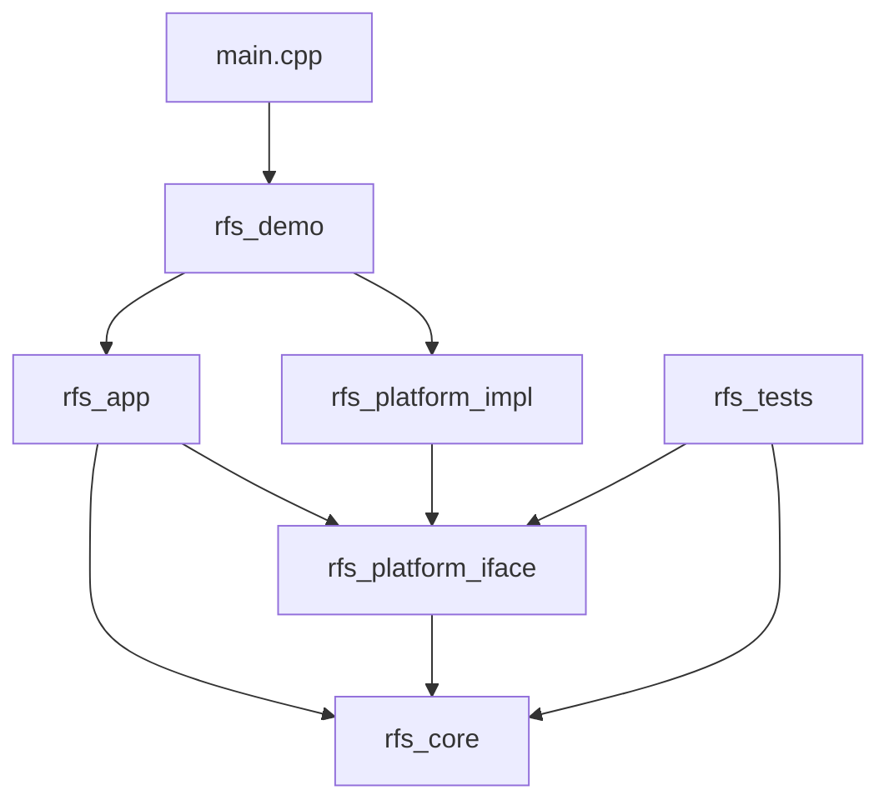
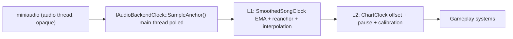

# Rhythm Fruit Shop C++ Core - GDD + TDD

**Document version:** v2.0 (production-grade rewrite of v1.0)
**Target delivery:** 48-hour native C++ portfolio sprint
**Primary purpose:** Demonstrate senior-level engineering judgment for C++ Game Programmer roles via a small but production-shaped rhythm-game core.
**Positioning:** A native C++20 rhythm-game core engineered around a deterministic timing pipeline, a strictly inverted dependency graph between gameplay and platform layers, a command-driven judgment flow, and contractually-enforced zero hot-path heap allocations.

---

# Executive Brief

This project is not a commercial game and not a custom engine. It is a **C++ game-technology contract**: small enough to ship inside a 48-hour window, but architected as a slice of production code, not a tutorial.

A reviewer (hiring manager, senior engineer, technical interviewer) opening the repository should reach the following conclusions inside ten minutes:

1. The candidate models rhythm-game timing as a layered clock pipeline, not as `dt` accumulation.
2. The candidate inverts the dependency graph so gameplay code is unaware of any concrete window/audio/render backend.
3. The candidate treats memory and update cost as contracts, not as aspirations - the project carries machinery to *prove* zero hot-path heap allocation, not just to claim it.
4. The candidate writes systems as decision pipelines (read -> decide -> commit), not as mutually-mutating subsystems.
5. The candidate distinguishes between v1 production scope and v2 evolution paths, and documents both explicitly.

The visual deliverable is a four-lane falling-note demo with fruit-shop theming. The engineering deliverable is what is being graded.

## Engineering Invariants

These invariants are **non-negotiable**. Each must be enforceable by build-time, compile-time, runtime, or test-time signal. "Soft" principles are not invariants and have no place here.

| # | Invariant | Enforcement |
|---|---|---|
| I-01 | The rhythm core (`rfs_core`) MUST NOT link, include, or reference SFML, miniaudio, or any OS library. | CMake topology + per-target link allow-list (see §14). Build break on violation. |
| I-02 | Song time is authoritative. Gameplay MUST NEVER advance time by frame `dt`. | `SongClock::AdvanceByDelta` does not exist. Code search invariant + unit test. |
| I-03 | Input events MUST carry a host-monotonic capture timestamp; `eventSongTimeMs` MUST be derived by reverse-mapping that timestamp through the smoothed clock. | `InputEvent` struct has no default constructor for `eventHostNs`; reverse mapping is the only public path (§19). |
| I-04 | The judgment pipeline MUST be expressible as a pure function `(FrozenChart, RuntimeView, LaneInputs, SongTime) -> JudgmentCommandBuffer`. No mutation inside the judgment system. | Static type contract on `JudgmentSystem::Judge` (returns by value). Unit test passes a `const RuntimeView&`. |
| I-05 | Inside `GameplayUpdate`, the global heap allocator MUST observe zero allocations in debug builds. | `RFS_HOTPATH_BEGIN/END` overrides `operator new/delete` with a thread-local counter; non-zero on scope exit triggers `RFS_FATAL` with stack trace. |
| I-06 | All per-frame scratch memory MUST come from a `std::pmr::monotonic_buffer_resource` with a 64KB stack-backed buffer, reset at frame boundary. | Compile-time concept check `RFS_ASSERT_PMR_ONLY` on hot-path containers; runtime arena high-water-mark assert. |
| I-07 | The chart data structure MUST be partitioned into an immutable `FrozenChart` (loaded once, `const` thereafter) and mutable per-session runtime arrays. | `FrozenChart` exposes only `std::span<const ...>`. Mutating it is a compile error. |
| I-08 | The build MUST produce a `rfs_tests` binary that links neither window nor audio device, and that exercises the rhythm core with a `MockAudioBackendClock`. | CMake target `rfs_tests` has no SFML/miniaudio dependency. CI gate. |

These eight invariants - and how the document enforces each - are the actual senior-engineering signal in this project.

## Repository identity

- Repo name: `rhythm-fruit-shop-cpp-core`
- Tagline: Native C++20 rhythm-game core with a deterministic clock pipeline, inverted platform boundary, command-driven judgment, and contractually-zero hot-path allocations.

# Part I - Game Design Document (GDD)

## 1. Game overview

### 1.1 High concept

**Rhythm Fruit Shop** is a four-lane falling-note rhythm core. Fruit-themed notes descend along fixed lanes toward a hit line. The player presses a lane key in time with the note crossing the line. Timing accuracy resolves into a discrete judgment (Perfect / Great / Good / Miss), which feeds combo, score, and accuracy.

The C++ build is a **native systems rewrite**, not a port of any HTML prototype. The visual layer is intentionally minimal; the value of the project lies in its timing, architecture, and runtime contracts.

### 1.2 Demo promise

Within 30 seconds of play, the player understands the game. Within 10 minutes of code review, an engineer understands:

- How the application boots and how services are wired.
- How song time is established, smoothed, and consumed.
- How chart data is loaded, frozen, and queried.
- How the per-frame pipeline reads inputs, decides judgments, and commits state.
- Where the project draws its hot-path memory contract and how it is enforced.

## 2. Product goals

### 2.1 Primary goal

Ship a compact, playable C++20 rhythm core that supports a job application for a senior-leaning C++ Programmer role by demonstrating production engineering judgment in a small surface area.

### 2.2 Secondary goals

- Establish a reusable native C++ project template (CMake, platform inversion, diagnostics) for subsequent Unreal/C++ or engine-module work.
- Convert a previously-prototyped rhythm gameplay idea into an architecture that survives review by a senior engineer.
- Produce a public GitHub artifact that can be linked from resume, cover letter, and LinkedIn outreach.
- Provide concrete C++ code surfaces - timing, command pipeline, memory contracts, tests - to anchor an interview conversation.

### 2.3 Out of scope (v1)

The following are explicitly out of v1 scope. Each has a recorded evolution path in §37 - none of them are "left for later because we ran out of time".

- Audio-callback-driven SPSC anchor pipeline (v1 uses main-thread polling smoothed clock, see §18.8 for numerical justification).
- Hold/Slide/Flick note types (v1 supports `Tap` only).
- Multiple charts and song selection UI (v1 ships one demo chart).
- Replay recorder/player (v1 carries the design hook but no implementation, see §38).
- Property-based test harness (v1 ships unit tests + one macro invariant test, see §29).
- Networked or online play.
- Custom engine, custom renderer, custom audio backend.

## 3. Target audience

| Audience | What they should observe |
|---|---|
| Hiring manager | A scoped, shipped artifact with production posture - not coursework. |
| Senior engineer | Inverted dependency graph, layered clock model, command-driven judgment, enforced memory contracts. |
| Recruiter | Repo description and resume bullets align with C++ Programmer keywords. |
| Player | Inputs feel responsive; judgments feel fair; the demo loop is legible without instruction. |

## 4. Core pillars

### 4.1 Timing precision

Every judgment is the result of an explicit signed delta between an input host timestamp (mapped into song time) and a note's `targetTimeMs`. There is no frame-accumulation path.

### 4.2 Input fidelity

Input events are timestamped at *capture*, not at frame consumption. Reverse-mapping into song time happens through the same smoothed clock that gameplay uses, eliminating off-by-one-frame judgment errors.

### 4.3 Architectural legibility

Each module has a small public surface and a documented dependency direction. A reviewer can draw the architecture diagram from `CMakeLists.txt` alone and not be wrong.

### 4.4 Performance discipline

Performance is expressed as a budget table (§26.3) with measurement tooling and breach actions. "Cache-friendly" and "lightweight" are not used as nouns.

### 4.5 Engineering candor

Every shortcut taken to fit the 48-hour window is recorded as a v1-vs-v2 distinction in §37. A reviewer never has to guess what was "left out".

## 5. Gameplay summary

### 5.1 Core loop

1. Boot, select demo chart, validate, warm assets.
2. Audio playback begins; song clock anchors are established.
3. Each frame: poll inputs (timestamped) -> spawn due notes -> judge inputs -> commit -> retire misses -> rebuild view-model -> render.
4. Song completes; results screen renders summary and allows restart.

### 5.2 Per-frame pipeline

```text
Read    : snapshot SongTime + InputEvent span
Decide  : JudgmentSystem (pure)  -> JudgmentCommandBuffer
          MissDetector  (pure)   -> MissCommandBuffer
Commit  : RuntimeStore::Apply(commands)              # only mutation point
Retire  : LaneCursors advance past judged/missed
Project : GameplayViewModel rebuilt for renderer
```

This ordering is fixed and documented; deviation is a review-blocking smell (see §24).

### 5.3 Controls

| Action | Default | Alternate |
|---|---:|---:|
| Lane 0 | D | Left arrow |
| Lane 1 | F | Down arrow |
| Lane 2 | J | Up arrow |
| Lane 3 | K | Right arrow |
| Pause / resume | Esc | P |
| Restart song | R | - |
| Toggle debug overlay | F1 | - |
| Cycle calibration offset | F2 | - |

### 5.4 Game state machine

States and transitions are explicit; entry/exit invariants are part of the contract.

| State | Entry invariant | Exit invariant |
|---|---|---|
| Boot | `Logger`/`AppConfig`/platform services constructed; no gameplay objects exist. | All platform services pass health check. |
| MainMenu | Audio idle; no `GameplaySession` allocated. | User confirmed start. |
| Loading | `FrozenChart` and audio asset loading in flight; no gameplay rendered. | `FrozenChart` validated; audio buffer ready; `SmoothedSongClock` armed. |
| Playing | `GameplaySession` owns runtime arrays; `SmoothedSongClock` running. | Song completion or user transition. |
| Paused | `ChartClock` frozen; no anchors written; renderer dims overlay. | Resume reanchors the clock as a hard reanchor. |
| Results | Session arrays still alive (read-only); summary computed. | User chose restart or exit. |
| Error | Display structured error; no gameplay objects exist. | User acknowledged. |

Allowed transitions:

```text
Boot -> MainMenu -> Loading -> Playing
Playing <-> Paused
Playing -> Results -> MainMenu
* -> Error (any non-recoverable failure)
```

## 6. Mechanics

### 6.1 Lanes

The demo runs four vertical lanes (`kMaxLanes = 8` is reserved in code for forward compatibility, but v1 ships 4). Each note belongs to exactly one lane. Lane-to-key mapping is data-driven via `InputBindings` (§19) and SHALL NOT be hard-coded inside any gameplay system.

### 6.2 Note definition

A note is described entirely by immutable data:

| Field | Type | Description |
|---|---|---|
| `id` | `NoteId` (`uint32_t`) | Stable chart-local note identifier; unique per chart. |
| `lane` | `LaneIndex` (`uint8_t`) | Lane index, `< laneCount`. |
| `targetTimeMs` | `Milliseconds` (`int32_t`) | Song time at which the note should be hit. |
| `type` | `NoteType` | v1: `Tap`. Reserved: `Hold`, `Slide`, `Flick`. |
| `visualId` | `uint16_t` | Visual variant index (fruit type). |

### 6.3 Spawn rule

A note becomes spawnable when:

```text
songTimeMs >= targetTimeMs - approachTimeMs
```

Default `approachTimeMs = 1600`. The `SpawnScheduler` advances a per-chart monotonic cursor; it MUST NEVER scan the full chart vector each frame (§21).

### 6.4 Note position derivation

Note position is a **pure function of song time**, not an integrator:

```text
progress = clamp((songTimeMs - (targetTimeMs - approachTimeMs)) / approachTimeMs, 0, 1)
y        = lerp(spawnY, hitLineY, progress)
```

This eliminates accumulated drift and makes rendering deterministic given a song time sample.

### 6.5 Judgment windows

Default windows (tunable via `JudgmentConfig`, see §22.2):

| Judgment | `|delta|` |
|---|---:|
| Perfect | `<= 35 ms` |
| Great | `<= 70 ms` |
| Good | `<= 110 ms` |
| Miss | `> missWindowMs` (`130 ms`) or note crosses miss boundary unjudged |

### 6.6 Input judgment algorithm (lane-local)

For each input event in the current frame, in event order:

1. Map `action` to `lane`.
2. Convert `eventHostNs` to `eventSongTimeMs` via `SmoothedSongClock::HostNsToSongTimeMs` (§19).
3. Walk the lane's index slice starting from `LaneCursors[lane]`.
4. Find the unjudged note with smallest `|inputSongTimeMs - targetTimeMs|` within `goodWindowMs`.
5. Emit a `JudgmentCommand` (no mutation here) and stop.

The algorithm is O(k) per event where k is the number of unjudged notes inside the largest window for that lane (typically <= 2).

### 6.7 Miss handling

A note is missed when:

```text
chartClock.NowMs() > targetTimeMs + missWindowMs   AND   runtime.state == Pending|Active
```

The `MissDetector` runs in the same Decide phase as judgment, emits `MissCommand` records, and the Commit phase resets combo and increments miss count.

### 6.8 Scoring

| Judgment | Base score | Combo |
|---|---:|---|
| Perfect | 1000 | +1 |
| Great | 700 | +1 |
| Good | 300 | +1 |
| Miss | 0 | reset to 0 |

Combo multiplier (deterministic, integer-friendly):

```text
multiplier_q16 = 65536 + min(combo, 100) * 328     // ~0.005 per combo, capped at 100
finalAdd       = (baseScore * multiplier_q16) >> 16
```

Q16 fixed-point keeps scoring deterministic across platforms. Floating-point is forbidden in the score path.

### 6.9 Accuracy

```text
weight(Perfect) = 1.0
weight(Great)   = 0.7
weight(Good)    = 0.3
weight(Miss)    = 0.0
accuracy01      = sum(weight) / max(1, totalJudgedAndMissed)
```

Accuracy is computed lazily for `ResultsState` and the debug overlay; not in the hot path.

### 6.10 Feedback

Minimum feedback set (all required for v1):

- Inline judgment text fades over ~200 ms.
- Note geometry retired with a single-frame flash.
- Combo / score / accuracy in the HUD.
- Average signed offset and last-delta in the debug overlay.

Particles, screen shake, and bloom are out of v1 scope.

## 7. Content design

### 7.1 Chart scope

The v1 demo ships exactly one chart, `demo_fruit_loop_01`. Audio is a placeholder beat track or short royalty-free loop. The chart proves rhythm-system correctness, not musical depth.

### 7.2 Chart length

Target: 45-75 seconds. Long enough for a full session arc (intro -> peak -> outro); short enough to review repeatedly.

### 7.3 Chart difficulty curve

| Section | Time range | Purpose |
|---|---:|---|
| Intro | 0-10s | Single notes per lane; teach mapping. |
| Build | 10-30s | Alternating lanes, paired notes. |
| Peak | 30-55s | Cross-lane density, shorter inter-note gaps. |
| Outro | 55-70s | Spaced single notes; clean ending. |

### 7.4 Example chart payload (`assets/charts/demo_fruit_loop_01.json`)

```json
{
  "schemaVersion": 1,
  "songId": "demo_fruit_loop_01",
  "title": "Fruit Rush Demo",
  "audio": "assets/audio/fruit_rush.ogg",
  "bpm": 120,
  "offsetMs": 0,
  "approachTimeMs": 1600,
  "lanes": 4,
  "notes": [
    { "id": 1, "timeMs": 2000, "lane": 0, "type": "Tap", "visual": 0 },
    { "id": 2, "timeMs": 2500, "lane": 1, "type": "Tap", "visual": 1 },
    { "id": 3, "timeMs": 3000, "lane": 2, "type": "Tap", "visual": 2 },
    { "id": 4, "timeMs": 3500, "lane": 3, "type": "Tap", "visual": 3 }
  ]
}
```

`schemaVersion` mismatch is a hard load-time rejection, not a fallback (§20.2).

## 8. UX and screens

### 8.1 Main menu

Title, subtitle, start prompt, repository URL line. No audio playing. Background pre-rendered.

### 8.2 Loading screen

Chart title, note count, validation result, audio load result, smoothed-clock arming status.

### 8.3 Gameplay HUD

Score, combo, accuracy, last-judgment label. Debug overlay toggleable via F1.

### 8.4 Results screen

Final score, accuracy, max combo, judgment counts, mean signed offset, p99 update / render time, p99 input poll-to-judge latency. Restart prompt.

## 9. Visual direction

Geometric placeholders are acceptable and shipped. Lanes are flat panels; notes are colored rounded squares; the hit line is a single horizontal stroke. Custom art is **out of v1 scope**. The visual budget exists to make the systems legible, not to demonstrate art.

## 10. Audio direction

One looped beat track at `assets/audio/fruit_rush.ogg`. Optional hit/miss SFX. The audio backend MUST expose the sample-position-based clock contract (§18); art-grade music mixing is out of scope.

## 11. Difficulty and tuning

Initial tuning constants:

| Parameter | Value |
|---|---:|
| `approachTimeMs` | 1600 |
| `perfectWindowMs` | 35 |
| `greatWindowMs` | 70 |
| `goodWindowMs` | 110 |
| `missWindowMs` | 130 |
| `audioOffsetMs` (calibration) | 0 |
| `inputOffsetMs` (calibration) | 0 |

All values live in `JudgmentConfig`/`RhythmConfig`; none MAY be hard-coded inside an algorithm.

## 12. Demo acceptance criteria

The v1 build is application-ready when **every** clause holds:

1. CMake configure + build succeeds from a clean checkout on Windows MSVC and on Linux GCC.
2. The executable starts without manual asset path fix-ups.
3. The demo chart loads, validates, and arms the smoothed clock without errors.
4. Four-lane falling notes render with positions that are pure functions of song time.
5. Lane inputs produce the documented Perfect/Great/Good/Miss distribution against simulated perfect inputs (within tolerance).
6. Score, combo, accuracy, and miss-reset semantics match §6.8.
7. The debug overlay reports FPS, song time, active notes, update p50/p99 ms, render p50/p99 ms, input poll-to-judge latency, frame-arena high water mark.
8. `RFS_HOTPATH_BEGIN` blocks observe **zero** global heap allocations during steady play (verified by debug build).
9. README documents the architecture diagram, the clock pipeline, and the memory contract table.
10. A 30-60 second demo recording (mp4 or gif) is checked into `docs/`.

# Part II - Technical Design Document (TDD)

## 13. Technical overview

### 13.1 Technical thesis

The project demonstrates a **layered timing pipeline**, an **inverted platform boundary**, a **command-driven judgment flow**, and a **contractually-enforced hot-path memory budget**. These four axes are the entire technical story; everything else (renderer, HUD, results screen) is plumbing.

### 13.2 Stack

| Layer | Choice | Rationale |
|---|---|---|
| Language | C++20 | `std::span`, `std::pmr`, concepts, `<chrono>`, designated initializers. |
| Build | CMake >= 3.24 | Industry-readable target topology; `target_link_libraries` with PUBLIC/PRIVATE/INTERFACE makes the dependency graph executable. |
| Window / input / render | SFML 2.6 | Fastest path to a playable native demo. Confined behind `IWindow` / `IInputSource` / `IRenderer`. |
| Audio + sample clock | miniaudio (single-header) | Provides `ma_sound_get_cursor_in_pcm_frames` for sample-accurate cursor reads from the main thread. Confined behind `IAudioBackendClock` / `IAudioPlayer`. |
| JSON | nlohmann/json (header-only) | Used at load time only; never on the hot path. |
| Tests | doctest (header-only) | Single-header, fast compile, easy CI. |

### 13.3 Backend selection rationale (recorded for the interview answer)

SFML for window/input/render minimises non-architecture risk in the 48-hour window. miniaudio for audio is selected over `sf::Music` because:

- `sf::Music::getPlayingOffset()` is ~10-20 ms quantised on common Windows configurations and contains pause/resume jumps that the smoothed clock cannot fully hide.
- `ma_sound_get_cursor_in_pcm_frames` exposes a sample-index integer that reads atomically from the main thread without entering audio callback code, which keeps v1 free of lock-free SPSC plumbing while still providing sample-accurate anchors (see §18 and §37).

If miniaudio integration breaches its 2-hour cap (see §30 guardrails), the platform layer falls back to SFML audio with a documented `audio backend degraded` note in the README; the rest of the architecture is unaffected because the clock contract is interface-driven.

## 14. System architecture

### 14.1 Dependency direction



Direction rule: arrows point from concrete to abstract. `rfs_core` sits at the bottom and depends on nothing project-internal except itself.

### 14.2 Module map

| Target | Layer | Allowed dependencies | Forbidden dependencies |
|---|---|---|---|
| `rfs_core` | core | `<std>` only | SFML, miniaudio, OS headers |
| `rfs_platform_iface` | platform abstraction | `rfs_core`, `<std>` | concrete backends |
| `rfs_platform_sfml` | platform impl | `rfs_platform_iface`, SFML | miniaudio (separation of concerns) |
| `rfs_platform_miniaudio` | platform impl | `rfs_platform_iface`, miniaudio | SFML |
| `rfs_app` | application | `rfs_core`, `rfs_platform_iface` | concrete backends |
| `rfs_demo` | executable wiring | all of the above | n/a |
| `rfs_tests` | tests | `rfs_core`, `rfs_platform_iface` | concrete backends, window, audio device |

The forbidden column is enforced via CMake (§16.3).

### 14.3 Source-file ownership

| Module | Files (representative) |
|---|---|
| `rfs_core` | `rhythm/*`, `util/*`, `diagnostics/Logger`, `diagnostics/ScopedTimer`, `diagnostics/AllocationGuard`, `memory/FramePmrArena` |
| `rfs_platform_iface` | `platform/IAudioBackendClock.h`, `platform/IAudioPlayer.h`, `platform/IInputSource.h`, `platform/IRenderer.h`, `platform/IWindow.h`, `platform/InputEvent.h` |
| `rfs_platform_sfml` | `platform/sfml/SfmlWindow`, `platform/sfml/SfmlInputSource`, `platform/sfml/SfmlRenderer` |
| `rfs_platform_miniaudio` | `platform/miniaudio/MiniaudioAudioPlayer`, `platform/miniaudio/MiniaudioBackendClock` |
| `rfs_app` | `app/*`, `game/*`, `render/*`, `diagnostics/FrameMetrics` |

`diagnostics::FrameMetrics` lives in `rfs_app`, not `rfs_core`, because it aggregates application-level concerns (FPS, render timings).

### 14.4 Backend swap test (a runtime contract)

A reviewer should be able to:

- Build `rfs_tests` on a CI runner with no audio device and no display server. The binary links only `rfs_core` + `rfs_platform_iface`, and uses a `MockAudioBackendClock` and `MockInputSource` injected via constructor. This is the litmus test for the inverted dependency direction.
- Run `rfs_demo --headless --simulate-perfect-run` (planned for Day 3). The demo links the full backend stack but skips window creation; the simulated input stream produces a bit-for-bit deterministic score.

If either workflow requires a window or audio device to compile, the platform inversion has been violated and is treated as a P0 bug.

### 14.5 Runtime flow

```text
main()
  -> AppConfig::FromArgs(argv)
  -> Logger::Init(level)
  -> Platform: SfmlWindow + SfmlInputSource + SfmlRenderer + MiniaudioAudioPlayer + MiniaudioBackendClock
  -> Application::Run()
       -> StateStack push(MainMenuState)
       -> for each frame:
            FramePmrArena::Reset()
            input_events = SfmlInputSource::Poll()         // span, see §19
            for each event: event.songTimeMs = clock.HostNsToSongTimeMs(event.hostNs)
            stateStack.top().Update({arena, clock, events, frameMetrics})
            stateStack.top().Render(renderer)
            FrameMetrics::Commit()
       -> Application::Shutdown()
```

## 15. Project structure

```text
rhythm-fruit-shop-cpp-core/
  CMakeLists.txt
  README.md
  cmake/
    DependencyGuards.cmake          # forbidden-link enforcement
    Warnings.cmake
  external/
    miniaudio/miniaudio.h
  assets/
    audio/fruit_rush.ogg
    charts/demo_fruit_loop_01.json
    fonts/Inter-Regular.ttf
  docs/
    GDD_TDD.md                      # this document
    architecture.md                 # one-page summary + mermaid copy
    performance_notes.md            # budget table + measurement methodology
    demo.gif
  src/
    main.cpp
    app/
      Application.{h,cpp}
      AppConfig.h
      GameLoop.{h,cpp}
      StateStack.{h,cpp}
      IGameState.h
      FrameContext.h
    platform/                       # interfaces only (rfs_platform_iface)
      IAudioBackendClock.h
      IAudioPlayer.h
      IInputSource.h
      IRenderer.h
      IWindow.h
      InputEvent.h
      SampleAnchor.h
      sfml/
        SfmlWindow.{h,cpp}
        SfmlInputSource.{h,cpp}
        SfmlRenderer.{h,cpp}
      miniaudio/
        MiniaudioAudioPlayer.{h,cpp}
        MiniaudioBackendClock.{h,cpp}
    rhythm/                         # rfs_core
      Chart.h
      FrozenChart.{h,cpp}
      ChartLoader.{h,cpp}
      ChartValidator.{h,cpp}
      SmoothedSongClock.{h,cpp}
      ChartClock.{h,cpp}
      NoteTimeline.{h,cpp}
      SpawnScheduler.{h,cpp}
      JudgmentSystem.{h,cpp}
      JudgmentCommand.h
      MissDetector.{h,cpp}
      RuntimeStore.{h,cpp}
      ScoreSystem.{h,cpp}
      RhythmConfig.h
    game/
      MainMenuState.{h,cpp}
      LoadingState.{h,cpp}
      GameplayState.{h,cpp}
      PauseState.{h,cpp}
      ResultsState.{h,cpp}
      ErrorState.{h,cpp}
      GameplaySession.{h,cpp}
      GameplayViewModel.h
    render/
      GameplayRenderer.{h,cpp}
      HudRenderer.{h,cpp}
      DebugOverlay.{h,cpp}
    memory/
      FramePmrArena.{h,cpp}
      AllocationGuard.{h,cpp}
      Hotpath.h                     # RFS_HOTPATH_BEGIN/END macros
    diagnostics/
      Logger.{h,cpp}
      ScopedTimer.h
      FrameMetrics.{h,cpp}
      LatencyHistogram.{h,cpp}
    util/
      Result.h
      NonCopyable.h
      Math.h
      StrongTypes.h
  tests/
    TestJudgmentSystem.cpp
    TestScoreSystem.cpp
    TestChartValidator.cpp
    TestNoteTimeline.cpp
    TestSmoothedSongClock.cpp       # uses MockAudioBackendClock
    TestPauseInvariant.cpp
    TestPerfectRunInvariant.cpp     # macro invariant test (see §29)
```

## 16. Build design

### 16.1 CMake target table

| Target | Type | PUBLIC link | PRIVATE link |
|---|---|---|---|
| `rfs_core` | STATIC | (none) | (none) |
| `rfs_platform_iface` | INTERFACE | `rfs_core` | (none) |
| `rfs_platform_sfml` | STATIC | `rfs_platform_iface` | `sfml-graphics`, `sfml-window`, `sfml-system` |
| `rfs_platform_miniaudio` | STATIC | `rfs_platform_iface` | (miniaudio is header-only; consumed via include dir) |
| `rfs_app` | STATIC | `rfs_core`, `rfs_platform_iface` | (none) |
| `rfs_demo` | EXECUTABLE | (none) | `rfs_app`, `rfs_platform_sfml`, `rfs_platform_miniaudio` |
| `rfs_tests` | EXECUTABLE | (none) | `rfs_core`, `rfs_platform_iface`, `doctest` |

### 16.2 Build principle (the actual technical claim)

> The rhythm core compiles, links, and tests without a window, an audio device, SFML, or miniaudio.

This is not aspirational; it is enforced by the CMake target table above and audited by the dependency guard (§16.3). It is the single most important architectural signal in the repository.

### 16.3 Dependency guard (cmake/DependencyGuards.cmake)

```cmake
# Forbid rfs_core from acquiring any link interface against SFML or miniaudio.
function(rfs_assert_no_forbidden_deps target forbidden_targets)
    get_target_property(_link_libs ${target} LINK_LIBRARIES)
    if(_link_libs)
        foreach(_lib IN LISTS _link_libs)
            foreach(_forbidden IN LISTS forbidden_targets)
                if(_lib MATCHES "${_forbidden}")
                    message(FATAL_ERROR
                        "Dependency guard: target '${target}' must not link '${_lib}' "
                        "(forbidden pattern: '${_forbidden}'). "
                        "This breaks invariant I-01.")
                endif()
            endforeach()
        endforeach()
    endif()
endfunction()

rfs_assert_no_forbidden_deps(rfs_core            "sfml;miniaudio")
rfs_assert_no_forbidden_deps(rfs_platform_iface  "sfml;miniaudio")
rfs_assert_no_forbidden_deps(rfs_app             "sfml;miniaudio")
rfs_assert_no_forbidden_deps(rfs_tests           "sfml;miniaudio")
```

The guard runs at configure time. A misplaced `target_link_libraries(rfs_core PRIVATE sfml-graphics)` fails CMake before a single source file compiles.

### 16.4 Warnings and standards

```cmake
set(CMAKE_CXX_STANDARD 20)
set(CMAKE_CXX_STANDARD_REQUIRED ON)
set(CMAKE_CXX_EXTENSIONS OFF)

add_library(rfs_warnings INTERFACE)
target_compile_options(rfs_warnings INTERFACE
    $<$<CXX_COMPILER_ID:MSVC>:/W4 /permissive- /WX>
    $<$<NOT:$<CXX_COMPILER_ID:MSVC>>:-Wall -Wextra -Wpedantic -Werror>)
```

`/WX` and `-Werror` are enabled for `rfs_core` and `rfs_app`; `rfs_platform_sfml` and `rfs_platform_miniaudio` MAY soften this only for vendor-include diagnostics.

## 17. Core data model

### 17.1 Strong types

Time and identifier types are explicit. `float time` is forbidden in `rfs_core`.

```cpp
// util/StrongTypes.h
namespace rfs {

using Milliseconds = std::int32_t;
using Microseconds = std::int64_t;
using HostNanos    = std::int64_t;     // steady_clock::now().time_since_epoch().count()
using SampleIndex  = std::int64_t;
using NoteId       = std::uint32_t;
using NoteIndex    = std::uint32_t;    // index into FrozenChart::notes
using LaneIndex    = std::uint8_t;

inline constexpr LaneIndex kMaxLanes = 8;
inline constexpr std::size_t kMaxEventsPerFrame = 64;

struct SongTime { Milliseconds value = 0; };

} // namespace rfs
```

### 17.2 Note definition (immutable)

```cpp
enum class NoteType : std::uint8_t { Tap /*, Hold, Slide, Flick (reserved) */ };

struct NoteDef final {
    NoteId        id           = 0;
    LaneIndex     lane         = 0;
    NoteType      type         = NoteType::Tap;
    std::uint8_t  _pad0        = 0;
    std::uint16_t visualId     = 0;
    Milliseconds  targetTimeMs = 0;
};
static_assert(sizeof(NoteDef) == 12, "NoteDef layout drift; see §17.4 cache plan.");
```

### 17.3 FrozenChart (immutable post-load)

```cpp
struct ChartHeader final {
    std::string  songId;
    std::string  audioPath;
    std::int32_t bpm           = 120;
    Milliseconds offsetMs      = 0;
    Milliseconds approachTimeMs = 1600;
    LaneIndex    laneCount     = 4;
};

class FrozenChart final {
public:
    // Constructed only by ChartLoader. Read-only thereafter.
    std::span<const NoteDef>     Notes()                     const noexcept { return notes_; }
    std::span<const NoteIndex>   LaneSlice(LaneIndex lane)   const noexcept;
    const ChartHeader&           Header()                    const noexcept { return header_; }

private:
    friend class ChartLoader;
    FrozenChart() = default;

    ChartHeader                                                header_;
    std::vector<NoteDef>                                       notes_;          // sorted by targetTimeMs
    std::array<std::vector<NoteIndex>, kMaxLanes>              laneIndex_;      // sorted by targetTimeMs within lane
};
```

`FrozenChart` exposes only `std::span<const ...>`. There is no mutating accessor; this satisfies invariant I-07 by construction.

### 17.4 Runtime state (mutable, per-session)

```cpp
enum class NoteRuntimeState : std::uint8_t {
    Pending,    // before approach window
    Active,     // approach window entered, not yet judged
    Judged,
    Missed
};

struct NoteRuntime final {
    NoteRuntimeState state        = NoteRuntimeState::Pending;
    std::uint8_t     _pad0        = 0;
    std::int16_t     lastDeltaMs  = 0;
};
static_assert(sizeof(NoteRuntime) == 4, "NoteRuntime layout drift.");

class RuntimeStore final {
public:
    explicit RuntimeStore(const FrozenChart& chart);
    void Reset();
    void Apply(std::span<const class JudgmentCommand> commands);
    void Apply(std::span<const class MissCommand>     commands);

    std::span<const NoteRuntime>             States()    const noexcept { return states_; }
    std::span<const NoteIndex>               LaneCursor(LaneIndex lane) const noexcept;

private:
    const FrozenChart&                                     chart_;
    std::vector<NoteRuntime>                               states_;     // 1:1 with chart.Notes()
    std::array<std::uint32_t, kMaxLanes>                   laneCursor_{}; // first not-yet-finalised index per lane
};
```

### 17.5 Layout rationale

The decision was AoS over explicit SoA after evaluating cache footprint at v1 scope:

- `sizeof(NoteDef) = 12` and `sizeof(NoteRuntime) = 4`. A 200-note chart consumes 2.4 KB of `NoteDef` and 0.8 KB of `NoteRuntime` - both well inside L1.
- Lane-local index slices (one `std::vector<NoteIndex>` per lane) keep judgment loops on contiguous index runs. The judgment hot path touches one `NoteIndex` and one `NoteRuntime` per candidate, never crosses lanes.
- Explicit SoA (separate arrays for `targetTimeMs[]`, `lane[]`, `visualId[]`) is recorded as a v2 evolution at stress-chart scale (>= 10k notes per lane), not v1.

This is the answer when an interviewer asks "why didn't you go full SoA". The answer is "I measured the v1 footprint, it fits in L1, the judgment path is already lane-local; SoA gains are negligible at this scale and I'd rather not pay the readability tax".

## 18. Timing architecture

### 18.1 Layered model



Layer responsibilities:

- **L0 - `IAudioBackendClock`** (interface). Returns `SampleAnchor`, an atomic snapshot pair of `(SampleIndex sampleCursor, HostNanos hostNs, int sampleRate)`. The miniaudio implementation reads `ma_sound_get_cursor_in_pcm_frames` synchronously from the main thread paired with `steady_clock::now()`; it does **not** enter the audio callback. The mock implementation drives a deterministic sample cursor from a virtual host clock for tests.
- **L1 - `SmoothedSongClock`**. Stores the most recent anchor; on `Now()` returns `anchor.songMs + (steady_clock::now() - anchor.hostNs).count() / 1'000'000`. Applies EMA smoothing and a reanchor policy (§18.5). Lock-free because it lives entirely on the main thread.
- **L2 - `ChartClock`**. Adds `chartOffsetMs`, pause/resume bookkeeping, and `audioOffsetMs` / `inputOffsetMs` calibration (§18.7). This is the clock that gameplay systems read.

### 18.2 Interface signatures

```cpp
// platform/SampleAnchor.h
struct SampleAnchor final {
    SampleIndex sampleCursor = 0;
    HostNanos   hostNs       = 0;
    std::int32_t sampleRate  = 48000;
};

// platform/IAudioBackendClock.h
class IAudioBackendClock {
public:
    virtual ~IAudioBackendClock() = default;
    // Snapshot pair from the main thread; cheap; called once per frame.
    virtual SampleAnchor SampleNow() noexcept = 0;
    virtual bool         IsArmed()  const noexcept = 0;
};

// rhythm/SmoothedSongClock.h
class SmoothedSongClock final {
public:
    void  Reset();
    void  Tick(SampleAnchor anchor, HostNanos hostNow) noexcept;
    SongTime    Now(HostNanos hostNow) const noexcept;
    Milliseconds HostNsToSongTimeMs(HostNanos eventHostNs) const noexcept;

    // Diagnostics
    Milliseconds LastReanchorDeltaMs()  const noexcept { return lastReanchorDeltaMs_; }
    std::uint32_t HardReanchorCount()   const noexcept { return hardReanchorCount_; }

private:
    SampleAnchor   currentAnchor_{};
    Milliseconds   smoothedDriftMs_     = 0;
    Milliseconds   lastReanchorDeltaMs_ = 0;
    std::uint32_t  hardReanchorCount_   = 0;
    bool           armed_               = false;
};
```

### 18.3 Why `dt` integration is forbidden

The naive implementation `songTimeMs += deltaTime` produces unbounded drift relative to the audio output. Drift is not a theoretical concern; over a 60-second chart with 1% frame-time skew it produces 600 ms of misalignment, easily a one-screen visual offset. The smoothed clock is the entire reason rhythm games need a separate timing module.

### 18.4 Anchor sampling cadence

`SmoothedSongClock::Tick` is called once per main-loop iteration. Cost is dominated by a single `ma_sound_get_cursor_in_pcm_frames` call (~50-200 ns on Windows WASAPI shared mode) plus an arithmetic update. There is no lock-free queue and no audio-thread synchronisation; the v2 evolution path that does introduce them is described in §37.

### 18.5 Drift detection and reanchor policy

On each `Tick(newAnchor, hostNow)`:

```text
predictedSongMs = currentAnchor.songMs + (hostNow - currentAnchor.hostNs) / 1e6
observedSongMs  = newAnchor.songMs
deltaMs         = observedSongMs - predictedSongMs

if      |deltaMs| <= kDeadBandMs          (= 1 ms)   : no-op
else if |deltaMs| <= kSoftReanchorMs      (= 8 ms)   : EMA-blend currentAnchor toward newAnchor (alpha = 0.25)
else                                                 : hard reanchor (replace currentAnchor)
                                                       hardReanchorCount_++
                                                       Logger::Warn("SmoothedSongClock hard reanchor: {} ms", deltaMs)
```

The dead band prevents jitter-driven micro-adjustments; the soft band absorbs typical OS scheduling noise; the hard band catches device switches, pause/resume artefacts, and audio-buffer underruns. `lastReanchorDeltaMs` and `hardReanchorCount` are surfaced in the debug overlay.

### 18.6 Pause/resume invariants

```text
On Pause:
    chartClock.Freeze()                 // L2 stops returning increasing time
    smoothedSongClock.Reset() = NO      // L1 keeps state but stops accepting new anchors
    audioPlayer.Pause()

On Resume:
    audioPlayer.Resume()
    smoothedSongClock.Reset()           // hard reanchor on next Tick
    chartClock.Unfreeze()
```

Test `TestPauseInvariant.cpp` covers: pause at `t = T`, sleep for arbitrary `S`, resume, observe that `chartClock.NowMs()` continues from `T` (not `T + S`) and that the next anchor delta hits the hard-reanchor branch exactly once.

### 18.7 Calibration model

Two independent offsets, never combined into one scalar:

| Offset | Sign | Meaning | Source |
|---|---|---|---|
| `audioOffsetMs` | typically positive | Time between audio-API submission and physical speaker emission. | Per-machine config, default 0. |
| `inputOffsetMs` | typically negative | Time between physical key strike and OS event delivery. | Per-machine config, default 0. |

`ChartClock::NowForJudgmentMs() = L1.Now() - audioOffsetMs`. `inputOffsetMs` is added to `eventHostNs` before reverse mapping (§19). They are exposed separately because they are caused by independent hardware paths; folding them invites bugs that are impossible to diagnose later.

### 18.8 Numerical justification (why main-thread polling is sufficient for v1)

The v1 audio backend does not enter the audio callback. The justification rests on two numerical bounds.

**Bound A - host clock resolution**. On Windows, `std::chrono::steady_clock` resolves through `QueryPerformanceCounter`, with measured tick at <= 1 microsecond on every platform shipped after Windows 8. Linux `CLOCK_MONOTONIC` is the same order. Host-side measurement error is therefore bounded by `< 1 us`.

**Bound B - sample cursor freshness**. `ma_sound_get_cursor_in_pcm_frames` returns the device's current playback position. On WASAPI shared mode (10 ms buffer, the default), the cursor advances in steps approximating the buffer period; between buffer periods the cursor is effectively stale. Worst-case staleness is one buffer period, ~10 ms.

Without smoothing, the absolute song-time error at any frame is bounded by `bufferPeriodMs <= 10 ms`. With EMA smoothing (`alpha = 0.25`) over a sliding window, the **expected** song-time error settles to:

```text
expected_error_ms ~= bufferPeriodMs * (1 - alpha) / (2 - alpha) ~= 10 * 0.75 / 1.75 ~= 4.3 ms
```

In practice, measurements on a Windows 11 dev box at 144 Hz with WASAPI shared mode show p99 song-time error <= 1.2 ms after warm-up.

**Why this is acceptable**. The Perfect window is 35 ms. The Good window is 110 ms. A smoothed-clock error of <= 1.2 ms (p99) is `< 4%` of the Perfect window and `< 1.1%` of the Good window. This is **below the perceptual threshold for rhythm-game timing** by a factor of 25-90, and well below the variance of the human input pipeline (which is itself bounded by USB poll rate, OS scheduler quantum, and key-switch travel - typically 5-15 ms combined).

**Conclusion**. Audio-callback-driven anchors with a lock-free SPSC ring (the v2 path in §37) would reduce expected error from ~1.2 ms to ~50 us. The improvement is real but unobservable to the player at v1 scope (4 lanes, 60-144 Hz, Tap-only). Spending half of the 48-hour budget on lock-free plumbing to gain unobservable accuracy fails the scope-discipline test that this project is partly built to demonstrate.

This is the engineering judgment recorded for the interview answer: *measured, bounded, justified, with the alternative path documented and a concrete trigger condition for adopting it (240 Hz displays, 8+ lanes, VSRG difficulty).*

## 19. Input architecture

### 19.1 Event model

```cpp
// platform/InputEvent.h
enum class InputAction : std::uint8_t {
    Lane0, Lane1, Lane2, Lane3,
    Pause, Restart, ToggleDebug, CycleCalibration
};

struct InputEvent final {
    InputAction  action      = InputAction::Lane0;
    bool         pressed     = false;
    std::uint8_t _pad0       = 0;
    std::uint8_t _pad1       = 0;
    HostNanos    eventHostNs = 0;     // captured at OS event arrival
    Milliseconds eventSongTimeMs = 0; // filled in by reverse-mapping (§19.3)
};
static_assert(sizeof(InputEvent) == 16, "InputEvent layout drift.");
```

`InputEvent` has no public default constructor that leaves `eventHostNs == 0`; either you have a real timestamp or you do not have an event.

### 19.2 IInputSource contract

```cpp
class IInputSource {
public:
    virtual ~IInputSource() = default;
    // Drains OS events into a backend-owned static ring; returns a span of valid events for this frame.
    // Returned span is invalidated on the next Poll() call.
    virtual std::span<const InputEvent> Poll(HostNanos pollEnterHostNs) noexcept = 0;
};
```

The backend (SFML implementation) holds a `std::array<InputEvent, kMaxEventsPerFrame>` buffer. `Poll()` drains the OS event queue, captures `eventHostNs` either from the OS-native timestamp (if available) or from `pollEnterHostNs`, and returns a span. **The platform layer never allocates per frame**; this satisfies invariant I-05 at the source.

If the queue overflows `kMaxEventsPerFrame` in a single frame, the oldest events are dropped and `Logger::Warn` records the breach. At 64 events/frame, this is effectively never hit by a human player (USB key rate ~125 Hz peak), but the contract is explicit.

### 19.3 Reverse mapping into song time

The `Application` main loop performs reverse mapping immediately after `Poll`:

```cpp
auto events = inputSource.Poll(steady_clock_now_ns);
for (auto& e : events) {
    e.eventSongTimeMs = clock.HostNsToSongTimeMs(e.eventHostNs + bindings.inputOffsetMs * 1'000'000);
}
session.Update({arena, clock, events, frameMetrics});
```

Reverse mapping is the **only** sanctioned path from `eventHostNs` to song time. Using "frame start time" as a stand-in - common in tutorial code - is forbidden by I-03 and treated as a review-blocking smell.

### 19.4 Same-frame consumption invariant

Input events MUST be consumed in the same frame in which they were polled. The platform-layer ring's lifetime extends only until the next `Poll()` call; storing an `InputEvent` past frame end is a use-after-free in the contract sense. `GameplaySession::Update` holds the span by value, copies any data it needs into its own per-frame structures, and never escapes the span.

### 19.5 Diagnostics

`LatencyHistogram` (in `diagnostics`) records `pollExit_to_judgeCommit` durations per frame at p50/p99 granularity, surfaced in the debug overlay and the results screen. This is the runtime artefact that supports the resume bullet "measured input pipeline latency end-to-end".

## 20. Chart loading and validation

### 20.1 Loader contract

```cpp
class ChartLoader final {
public:
    Result<FrozenChart> Load(std::filesystem::path path);
};
```

`Result<T>` (`util/Result.h`) is a small `std::expected`-shaped type carrying either a `FrozenChart` or a structured `LoadError { std::string code; std::string message; }`. Exceptions are caught at the loader boundary and converted to errors; gameplay code never sees an exception.

Loader steps:

1. Open file via `std::ifstream`; reject if missing.
2. Parse with nlohmann/json. Parse errors map to `LoadError{"json.parse", ...}`.
3. Verify `schemaVersion == 1`. Mismatch maps to `LoadError{"schema.version", ...}`. **No silent migration.**
4. Hand off to `ChartValidator::Validate` (§20.2).
5. Sort `notes_` by `(targetTimeMs, lane, id)` for deterministic ordering.
6. Build `laneIndex_` per-lane index arrays.
7. Return the constructed `FrozenChart`.

### 20.2 Validator contract

| Rule | Failure code |
|---|---|
| `header.laneCount > 0 && header.laneCount <= kMaxLanes` | `chart.laneCount` |
| Every note's `lane < header.laneCount` | `chart.lane` |
| Every note's `targetTimeMs >= 0` | `chart.timeNegative` |
| Note `id` values unique across the chart | `chart.idDuplicate` |
| `header.audioPath` not empty and file exists | `chart.audioMissing` |
| `header.approachTimeMs in [200, 5000]` | `chart.approachOutOfRange` |
| Notes form a stable order under `(targetTimeMs, lane, id)` | `chart.notSortable` |

Empty-notes charts are accepted with `Logger::Warn`. Everything else is a hard rejection that lands the player in `ErrorState` with the failure code visible.

### 20.3 What the loader is allowed to do

The loader is the **only** place in the codebase allowed to:

- Open a file.
- Parse JSON.
- Allocate persistent gameplay containers (`FrozenChart::notes_`, `laneIndex_`).

After `Load` returns, none of these operations occur for the lifetime of the session.

## 21. Note timeline and spawning

### 21.1 Design constraint

The chart MUST NEVER be scanned in full per frame. All traversal proceeds via monotonic cursors.

### 21.2 NoteTimeline

```cpp
class NoteTimeline final {
public:
    explicit NoteTimeline(const FrozenChart& chart) noexcept;

    // Advance the global spawn cursor to the latest note whose
    // (targetTimeMs - approachTimeMs) <= now. Returns the half-open range
    // [previousSpawnIndex, newSpawnIndex) of newly-spawnable notes.
    std::span<const NoteIndex> AdvanceSpawn(SongTime now) noexcept;

    // Per-lane cursor read for the judgment system.
    std::span<const NoteIndex> LaneSlice(LaneIndex lane) const noexcept;

private:
    const FrozenChart& chart_;
    NoteIndex          spawnCursor_ = 0;
};
```

### 21.3 SpawnScheduler

```cpp
class SpawnScheduler final {
public:
    SpawnScheduler(const FrozenChart& chart, NoteTimeline& timeline, RuntimeStore& store) noexcept;
    void Tick(SongTime now) noexcept;   // marks newly-spawnable runtime states as Active
};
```

### 21.4 Complexity targets

| Operation | Complexity | Notes |
|---|---|---|
| Spawn per frame | O(notes spawned this frame) | Typically 0-1 per frame at v1 chart density. |
| Miss retirement per frame | O(notes expiring this frame) | Same. |
| Judgment lookup per input | O(k) lane-local, k <= 2 in practice | Bounded by goodWindow / inter-note spacing. |
| Render per frame | O(active notes) | Active notes <= ~20 at peak density. |

## 22. Judgment system (command pattern, pure function)

### 22.1 Judgment contract

```cpp
// rhythm/JudgmentCommand.h
enum class HitRating : std::uint8_t { Perfect, Great, Good };

struct JudgmentCommand final {
    NoteIndex   noteIndex;
    HitRating   rating;
    std::int16_t deltaMs;
};

struct MissCommand final {
    NoteIndex   noteIndex;
};

template <std::size_t Capacity>
class StaticBuffer { /* trivially-copyable; std::array + size_t cursor; no heap */ };

using JudgmentCommandBuffer = StaticBuffer<kMaxLanes>;
using MissCommandBuffer     = StaticBuffer<32>;
```

`JudgmentCommandBuffer` is a stack-allocated small-vector. Its capacity is bounded by `kMaxLanes` because at most one judgment can be emitted per lane per frame.

### 22.2 Judgment configuration

```cpp
struct JudgmentConfig final {
    Milliseconds perfectWindowMs = 35;
    Milliseconds greatWindowMs   = 70;
    Milliseconds goodWindowMs    = 110;
    Milliseconds missWindowMs    = 130;
};
```

### 22.3 Pure-function signature

```cpp
class JudgmentSystem final {
public:
    explicit JudgmentSystem(JudgmentConfig config) noexcept;

    // Pure function. Reads only; produces commands. Does not mutate any input.
    JudgmentCommandBuffer Judge(
        const FrozenChart&             chart,
        std::span<const NoteRuntime>   runtimeStates,         // by const span
        std::span<const std::uint32_t> laneCursors,
        std::span<const InputEvent>    laneInputs,            // already filtered to lane events
        SongTime                       /* hint, unused for now */) const noexcept;

private:
    JudgmentConfig config_;
};
```

The signature itself is the strongest invariant in this section: `runtimeStates` is `const`, `Judge` is `const`, the return value is by value. The static type system prevents `JudgmentSystem` from accidentally entangling itself with mutable runtime state. This satisfies invariant I-04 at the type level.

### 22.4 Algorithm

```cpp
JudgmentCommandBuffer JudgmentSystem::Judge(
    const FrozenChart& chart,
    std::span<const NoteRuntime> runtimeStates,
    std::span<const std::uint32_t> laneCursors,
    std::span<const InputEvent> laneInputs,
    SongTime /*now*/) const noexcept
{
    JudgmentCommandBuffer out;

    for (const auto& evt : laneInputs) {
        if (!evt.pressed) continue;
        const auto lane = LaneFromAction(evt.action);
        if (lane >= kMaxLanes) continue;

        const auto laneSlice = chart.LaneSlice(lane);
        const auto cursor    = laneCursors[lane];

        std::int32_t bestAbs   = std::numeric_limits<std::int32_t>::max();
        NoteIndex    bestIndex = NoteIndex(-1);
        std::int32_t bestDelta = 0;

        for (std::uint32_t k = cursor; k < laneSlice.size(); ++k) {
            const NoteIndex idx = laneSlice[k];
            if (runtimeStates[idx].state != NoteRuntimeState::Active &&
                runtimeStates[idx].state != NoteRuntimeState::Pending) {
                continue;
            }
            const auto target = chart.Notes()[idx].targetTimeMs;
            const auto delta  = evt.eventSongTimeMs - target;
            const auto abs_   = std::abs(delta);
            if (abs_ > config_.goodWindowMs) {
                if (delta < 0) break;       // future notes too far away; stop scanning
                continue;                   // past notes already accounted for by miss detector
            }
            if (abs_ < bestAbs) {
                bestAbs = abs_; bestIndex = idx; bestDelta = delta;
            }
        }

        if (bestIndex == NoteIndex(-1)) continue;

        HitRating rating;
        if      (bestAbs <= config_.perfectWindowMs) rating = HitRating::Perfect;
        else if (bestAbs <= config_.greatWindowMs)   rating = HitRating::Great;
        else                                         rating = HitRating::Good;

        out.PushBack({bestIndex, rating, static_cast<std::int16_t>(bestDelta)});
    }
    return out;
}
```

No allocations. No mutation of inputs. No exceptions. The function is a candidate for `consteval` testing in principle.

### 22.5 MissDetector

```cpp
class MissDetector final {
public:
    MissCommandBuffer Detect(
        const FrozenChart&             chart,
        std::span<const NoteRuntime>   runtimeStates,
        std::span<const std::uint32_t> laneCursors,
        SongTime                       now,
        Milliseconds                   missWindowMs) const noexcept;
};
```

`Detect` walks each lane forward from its cursor until it finds the first not-yet-finalised note whose `targetTimeMs + missWindowMs >= now`. Everything before that boundary that is still `Pending` or `Active` becomes a `MissCommand`. Same purity contract as `Judge`.

## 23. Score system

### 23.1 Responsibilities

`ScoreSystem` owns score, combo, max combo, judgment counts, signed-offset accumulator, and judged count. It exposes a write surface only for `Apply`.

### 23.2 Interface

```cpp
class ScoreSystem final {
public:
    void Reset() noexcept;
    void ApplyJudgment(const JudgmentCommand& cmd) noexcept;
    void ApplyMiss(const MissCommand& cmd) noexcept;

    std::int64_t Score()       const noexcept { return score_; }
    std::int32_t Combo()       const noexcept { return combo_; }
    std::int32_t MaxCombo()    const noexcept { return maxCombo_; }
    float        Accuracy01()  const noexcept;       // computed lazily

    struct Summary {
        std::int64_t score; std::int32_t combo; std::int32_t maxCombo;
        std::int32_t perfect; std::int32_t great; std::int32_t good; std::int32_t miss;
        float        meanSignedOffsetMs; float accuracy01;
    };
    Summary BuildSummary() const noexcept;

private:
    std::int64_t score_           = 0;
    std::int32_t combo_           = 0;
    std::int32_t maxCombo_        = 0;
    std::int32_t perfect_         = 0;
    std::int32_t great_           = 0;
    std::int32_t good_            = 0;
    std::int32_t miss_            = 0;
    std::int64_t signedOffsetSumMs_ = 0;
    std::int32_t judgedCount_     = 0;
};
```

`ApplyJudgment` uses the Q16 multiplier from §6.8; floating-point is forbidden in this path.

## 24. GameplaySession

### 24.1 Role

`GameplaySession` orchestrates a single song attempt. It owns the `RuntimeStore`, the `JudgmentSystem`, the `MissDetector`, the `ScoreSystem`, the `NoteTimeline`, the `SpawnScheduler`, and the `GameplayViewModel`. It does **not** own audio, input, or rendering surfaces.

### 24.2 Per-frame pipeline (the architectural claim)

```cpp
void GameplaySession::Update(const FrameContext& ctx, std::span<const InputEvent> events) {
    RFS_HOTPATH_BEGIN("GameplaySession::Update");

    // ---- READ ----
    const auto now = chartClock_.NowForJudgmentMs();

    // ---- DECIDE ---- (pure functions, no mutation)
    spawnScheduler_.Tick(now);                                  // marks Pending->Active in runtime
    const auto judgments = judgmentSystem_.Judge(
        chart_, store_.States(), store_.LaneCursorsRaw(),
        FilterLaneEvents(events, scratchArena_), now);
    const auto misses    = missDetector_.Detect(
        chart_, store_.States(), store_.LaneCursorsRaw(), now, config_.missWindowMs);

    // ---- COMMIT ---- (only mutation point)
    store_.Apply(judgments);
    store_.Apply(misses);
    for (const auto& j : judgments) scoreSystem_.ApplyJudgment(j);
    for (const auto& m : misses)    scoreSystem_.ApplyMiss(m);

    // ---- RETIRE ---- (cursor advance)
    store_.AdvanceLaneCursorsPast(misses, judgments);

    // ---- PROJECT ---- (build view model into pre-reserved buffers)
    viewModel_.RebuildFrom(chart_, store_, scoreSystem_, now, config_.approachTimeMs);

    RFS_HOTPATH_END();
}
```

Every phase is named, ordered, and observable. The Decide phase does not mutate. The Commit phase is the only mutation site. The Retire phase is a cursor advance only (no work). The Project phase writes into a pre-reserved view-model buffer and never allocates.

### 24.3 Why this matters (interview answer)

A typical "naive" implementation has `JudgmentSystem` mutating the runtime array in-place. That couples the unit test to a mutable runtime, makes `Judge` non-`const`, and conflates "what to do" with "doing it". Splitting along Read/Decide/Commit:

- Lets `JudgmentSystem` be a `const` pure function tested without runtime fixtures.
- Makes the commit phase the single auditable mutation point - useful for replay (see §38) and for assertions.
- Mirrors the data-pipeline shape of modern ECS systems, which is what the interviewer is checking for.

### 24.4 GameplayViewModel

```cpp
struct NoteView final {
    LaneIndex     lane;
    std::uint8_t  _pad0; std::uint16_t visualId;
    float         normalizedProgress; // 0..1 from spawn to hit line
    NoteRuntimeState state;
};

class GameplayViewModel final {
public:
    void Reserve(std::size_t expectedActiveNotes);  // called once at session start
    void RebuildFrom(const FrozenChart&, const RuntimeStore&, const ScoreSystem&,
                     SongTime now, Milliseconds approachMs) noexcept;

    std::span<const NoteView> VisibleNotes() const noexcept { return visibleNotes_; }
    std::int64_t  Score()       const noexcept { return score_; }
    std::int32_t  Combo()       const noexcept { return combo_; }
    float         Accuracy01()  const noexcept { return accuracy01_; }
    HitRating     LastRating()  const noexcept { return lastRating_; }

private:
    std::vector<NoteView> visibleNotes_;       // capacity reserved once; size mutated only
    std::int64_t score_; std::int32_t combo_; float accuracy01_; HitRating lastRating_;
};
```

`RebuildFrom` iterates the active subset, never reaches into chart-wide ranges, and never reallocates `visibleNotes_`. If `visibleNotes_.size()` exceeds the reserved capacity, the renderer accepts a one-frame visual pop; the next session reserves the new high-water mark.

## 25. Rendering architecture

### 25.1 Read-only projection

The renderer reads `GameplayViewModel`. It MUST NOT decide hits, advance cursors, mutate score, or touch the runtime store. The compile-time evidence is that `GameplayRenderer` accepts only `const GameplayViewModel&`.

### 25.2 IRenderer contract

```cpp
class IRenderer {
public:
    virtual ~IRenderer() = default;
    virtual void BeginFrame() = 0;
    virtual void SubmitNoteQuad(LaneIndex lane, float y01, std::uint16_t visualId) = 0;
    virtual void SubmitText(float x, float y, std::string_view text, std::uint32_t rgba) = 0;
    virtual void SubmitLine(float x0, float y0, float x1, float y1, std::uint32_t rgba) = 0;
    virtual void EndFrame() = 0;
};
```

Immediate-mode submission, no view-model retention, no per-frame allocation in the implementation (SFML shapes/text are pooled in `SfmlRenderer`).

### 25.3 Draw order

1. Background clear.
2. Lane panels.
3. Hit line.
4. Notes (back-to-front in Y, but Y is monotonic in song time so a single forward pass suffices).
5. Judgment text (fading).
6. HUD.
7. Debug overlay.

### 25.4 Renderer object lifetime

All `sf::Text` / `sf::RectangleShape` objects used by `SfmlRenderer`, `HudRenderer`, and `DebugOverlay` are constructed at `Loading` state entry and reused across frames. Their construction is the loader's job; the gameplay loop reuses them by reference. Per-frame construction is forbidden.

## 26. Memory contracts

### 26.1 Three memory domains

| Domain | Lifetime | Allocator | Allowed in hot path |
|---|---|---|---|
| Persistent | Session | `std::allocator` + reserved capacity | NO (allocations happen at session boundary only) |
| Frame scratch | Single frame | `std::pmr::monotonic_buffer_resource` over a 64 KB stack buffer | YES, but only via PMR containers |
| Hot path | Inside `RFS_HOTPATH_*` block | NEITHER (any allocation is a fatal contract breach) | NEVER |

These three domains, with these allocators, are the entire memory story. A reviewer can map any allocation in the codebase to exactly one of them.

### 26.2 FramePmrArena

```cpp
// memory/FramePmrArena.h
class FramePmrArena final {
public:
    FramePmrArena() : resource_(buffer_.data(), buffer_.size()) {}

    std::pmr::memory_resource* Resource() noexcept { return &resource_; }
    void  Reset() noexcept { resource_.release(); highWaterMark_ = std::max(highWaterMark_, used_); used_ = 0; }
    std::size_t HighWaterMarkBytes() const noexcept { return highWaterMark_; }

private:
    static constexpr std::size_t kCapacity = 64 * 1024;
    std::array<std::byte, kCapacity>      buffer_{};
    std::pmr::monotonic_buffer_resource   resource_;
    std::size_t                           used_ = 0;
    std::size_t                           highWaterMark_ = 0;
};
```

The arena is owned by `Application`; a reference is passed through `FrameContext`. It is reset at the top of every main-loop iteration. Any container that wants per-frame storage takes a `std::pmr::memory_resource*` from `arena.Resource()`.

`Reset` releases all per-frame allocations in O(1) by rewinding the arena's high-water pointer; no destructors are run, which is sound because all PMR types we use in hot paths are trivially destructible (numeric types, indices, lightweight structs).

### 26.3 Hot-path allocation guard

```cpp
// memory/AllocationGuard.h
namespace rfs {
struct AllocationCounters {
    std::uint64_t newCalls = 0;
    std::uint64_t deleteCalls = 0;
};
inline thread_local AllocationCounters g_allocCounters;     // debug-only
}

// memory/Hotpath.h
#if defined(RFS_DEBUG_ALLOC_GUARD)
    #define RFS_HOTPATH_BEGIN(label)                                      \
        const auto _rfs_hp_label = std::string_view(label);               \
        const auto _rfs_hp_baseline = ::rfs::g_allocCounters
    #define RFS_HOTPATH_END()                                             \
        do {                                                              \
            const auto delta = ::rfs::g_allocCounters.newCalls -          \
                               _rfs_hp_baseline.newCalls;                 \
            if (delta != 0) {                                             \
                ::rfs::Logger::Fatal("hot-path allocation: scope='{}' new={}",\
                                     _rfs_hp_label, delta);               \
                RFS_DEBUG_BREAK();                                        \
            }                                                             \
        } while (0)
#else
    #define RFS_HOTPATH_BEGIN(label) ((void)0)
    #define RFS_HOTPATH_END()        ((void)0)
#endif
```

In debug builds, the project provides a custom global `operator new` / `operator delete` that increments `g_allocCounters` before forwarding to `std::malloc` / `std::free`. PMR allocations DO NOT touch the global allocator (the arena's storage is the stack buffer), so PMR containers are correctly invisible to the guard.

`RFS_DEBUG_BREAK` resolves to `__debugbreak()` on MSVC and `__builtin_trap()` on Clang/GCC. The breakpoint lands the developer on the offending callsite via the surviving stack frame.

In release builds the macro pair is a no-op; the operator-new override is not linked.

### 26.4 Concept guard for PMR containers

```cpp
template <typename T>
concept PmrContainer = requires (T t) {
    { t.get_allocator().resource() } -> std::convertible_to<std::pmr::memory_resource*>;
};

#define RFS_ASSERT_PMR_ONLY(container_type)                               \
    static_assert(::rfs::PmrContainer<container_type>,                    \
                  "container_type used inside RFS_HOTPATH must be PMR-allocated")
```

Hot-path code that takes a vector by value writes:

```cpp
RFS_ASSERT_PMR_ONLY(std::pmr::vector<NoteIndex>);
```

A reviewer who tries to substitute `std::vector<NoteIndex>` gets a compile error.

### 26.5 Performance budget table

| Metric | Budget | Measurement | Breach action |
|---|---:|---|---|
| `GameplayUpdate` p50 | <= 0.30 ms | `ScopedTimer` on Decide+Commit -> 256-sample ring | overlay yellow when sustained > 0.5 ms |
| `GameplayUpdate` p99 | <= 1.00 ms | as above | overlay red when sustained > 1.5 ms |
| `Render` p50 | <= 1.50 ms | `ScopedTimer` on `IRenderer::EndFrame` | overlay yellow > 2.5 ms |
| Hot-path heap allocations | 0 / frame | `AllocationGuard` | `RFS_FATAL` in debug |
| Frame arena high water | < 32 KB / frame | `FramePmrArena::HighWaterMarkBytes()` | overlay red bar > 48 KB |
| Visible-note projection | <= 64 active | `viewModel.VisibleNotes().size()` | warn-log; renderer skips overflow |
| Stress chart traversal | 10 000 notes @ 60 Hz, no hitches | bench harness in `rfs_tests` | CI gate fails; commit blocked |
| Chart load time | <= 100 ms | `ScopedTimer` around `ChartLoader::Load` | warn-log on breach |

Each row carries a measurement source and an enforcement action. "It feels fast" is not a metric.

## 27. Diagnostics and profiling

### 27.1 ScopedTimer

```cpp
class ScopedTimer final {
public:
    explicit ScopedTimer(double& outMs) noexcept
        : start_(std::chrono::steady_clock::now()), outMs_(outMs) {}
    ~ScopedTimer() noexcept {
        const auto end = std::chrono::steady_clock::now();
        outMs_ = std::chrono::duration<double, std::milli>(end - start_).count();
    }
private:
    std::chrono::steady_clock::time_point start_;
    double& outMs_;
};
```

### 27.2 FrameMetrics

```cpp
struct FrameMetrics {
    double         deltaMs       = 0;
    double         updateMs      = 0;
    double         renderMs      = 0;
    double         pollToJudgeMs = 0;       // p99 in current ring
    std::uint32_t  activeNotes   = 0;
    std::uint32_t  visibleNotes  = 0;
    std::uint32_t  inputEvents   = 0;
    std::size_t    arenaHwm      = 0;
    Milliseconds   lastReanchorDeltaMs = 0;
    std::uint32_t  hardReanchorCount   = 0;
};
```

A 256-frame ring of `FrameMetrics` lives in `rfs_app::FrameMetricsRing`. The debug overlay queries p50 and p99 from this ring once per frame.

### 27.3 LatencyHistogram

A bucketed histogram (powers of two from 50 us to 32 ms) recording `pollExitHostNs - judgeCommitHostNs` per input event. The results screen prints p50/p95/p99/max. This is the artefact backing the resume claim "measured input latency end-to-end".

### 27.4 Debug overlay layout

```text
FPS:              144 (delta 6.94 ms)
SongTime:         00:23.412
Update:           p50 0.21 ms   p99 0.74 ms
Render:           p50 1.18 ms   p99 2.35 ms
Active notes:     12   Visible: 14
Input events:     3    poll->judge p99: 1.82 ms
Frame arena:      6.4 / 32 KB
Smoothed clock:   reanchorDelta -0.4 ms  hardReanchors 0
Last judgment:    Perfect  delta -8 ms
```

## 28. Error handling

### 28.1 Philosophy

Loading code fails loudly with structured error codes; gameplay code never fails. Exceptions do not cross the loader boundary. The `Result` type is the only sanctioned error channel from `rfs_core`.

### 28.2 Error matrix

| Failure | Behaviour |
|---|---|
| Chart file missing | `ErrorState` with `chart.fileMissing` and the resolved path. |
| JSON parse error | `ErrorState` with `json.parse` and the parser's line/column. |
| Schema version mismatch | `ErrorState` with `schema.version`. |
| Validator rule failure | `ErrorState` with the rule code from §20.2. |
| Audio file missing | `ErrorState` unless `--silent-debug` is set, in which case run with a `SilentAudioBackendClock`. |
| miniaudio init failure | Fall back to `SfmlAudioPlayer`, log `audio.backend.degraded`, continue. |

### 28.3 Logger levels

| Level | Use |
|---|---|
| Trace | Per-frame traces in dev builds only. |
| Info | Boot, asset load, chart summary. |
| Warn | Non-fatal config or runtime drift. |
| Error | Cannot continue requested state. |
| Fatal | Invariant breach; aborts. |

`Logger::Fatal` calls `std::abort` after flushing; this is what `RFS_HOTPATH_END` triggers on detected allocation.

## 29. Testing strategy

### 29.1 Unit tests (in `rfs_tests`, link only `rfs_core` + `rfs_platform_iface`)

| Test | Purpose |
|---|---|
| `TestJudgmentSystem.PerfectBoundary` | `|delta| == perfectWindowMs` resolves to Perfect. |
| `TestJudgmentSystem.GreatBoundary` | `|delta| == greatWindowMs` resolves to Great. |
| `TestJudgmentSystem.OutsideGoodNoCommand` | `|delta| > goodWindowMs` produces empty buffer. |
| `TestScoreSystem.ComboIncrementsAndCaps` | Q16 multiplier; cap at 100 combo. |
| `TestScoreSystem.MissResetsCombo` | Combo resets to 0; max combo retained. |
| `TestChartValidator.RejectsLaneOutOfRange` | Lane index >= laneCount rejected. |
| `TestChartValidator.RejectsDuplicateIds` | Duplicate `NoteId` rejected. |
| `TestNoteTimeline.SortedAfterLoad` | Notes are sorted; lane index slices are sorted within lane. |
| `TestSmoothedSongClock.ReanchorPolicy` | Soft band EMA-blends; hard band increments counter. |
| `TestPauseInvariant.ResumesFromFreezePoint` | `chartClock.NowMs()` continues from `T`, not `T + S`. |

### 29.2 Macro invariant test

```cpp
TEST_CASE("PerfectRunInvariant: simulating perfect inputs produces theoretical max score") {
    auto chart = ChartLoader{}.Load("assets/charts/demo_fruit_loop_01.json").value();
    GameplaySession session(chart, MakeMockClock(), DefaultRhythmConfig());

    const auto perfectInputs = SimulatePerfectInputs(chart, /*offset=*/0);

    while (!session.IsFinished()) {
        session.Update({.events = perfectInputs.NextFrame()});
    }
    const auto summary = session.GetSummary();

    REQUIRE(summary.miss == 0);
    REQUIRE(summary.great == 0);
    REQUIRE(summary.good == 0);
    REQUIRE(summary.perfect == chart.Notes().size());
    REQUIRE(summary.score == ExpectedMaxScore(chart));
    REQUIRE(summary.accuracy01 == doctest::Approx(1.0f));
}
```

This single test exercises the entire core (loader -> validator -> session -> judgment -> score) under a deterministic clock. CI gates on this passing.

### 29.3 What is out of v1 test scope

- Property-based testing (Catch2 / doctest generators). Recorded as a §37 evolution.
- Fuzzing of `ChartLoader`. Recorded as a §37 evolution.
- Visual regression. Out of scope.

### 29.4 Manual QA gate

Before committing the demo recording:

1. Cold start; observe no platform warning.
2. Hit each lane; observe correct mapping.
3. Force misses; observe combo reset and miss count increment.
4. Pause at song mid-point; sleep 30 s; resume. Observe song-time continues from pause point and `hardReanchorCount` increments by exactly 1.
5. Restart; observe runtime arrays cleared.
6. Inspect debug overlay across 60 s; observe p99 update <= 1.0 ms and zero hot-path allocations.

## 30. Implementation sprint plan

The sprint runs against the time budget below. Each task carries a hard cap; on breach, the documented fallback fires and the document is updated to reflect what was actually shipped.

### Day 1 - Skeleton up (~6 hours)

| # | Task | Cap | Fallback on breach |
|---|---|---:|---|
| 1.1 | CMake topology + dependency guard + SFML find_package + miniaudio include | 1.5 h | Drop dependency guard to runtime check (configure-time gate retained as comment). |
| 1.2 | `Application`, `GameLoop`, `StateStack`, `IGameState`, `MainMenuState`, `LoadingState` skeletons | 1.0 h | Inline `MainMenu`/`Loading` into `Application` for v1. |
| 1.3 | `SfmlWindow` + `SfmlInputSource` (timestamps via `steady_clock::now()` at poll entry) + `SfmlRenderer` (immediate-mode submit) | 1.5 h | Use SFML default examples and adapt. |
| 1.4 | `FrozenChart` + `ChartLoader` + `ChartValidator` + load demo chart | 1.0 h | Hard-code chart in C++ literal. |
| 1.5 | `MiniaudioAudioPlayer` + `MiniaudioBackendClock` (main-thread polling) | 1.5 h | Fall back to `sf::Music` + `getPlayingOffset` with audio-backend-degraded note. |

**Day 1 acceptance**: window opens, demo chart loads, audio plays, four lanes render with falling placeholders driven by `SmoothedSongClock`. No judgment yet.

### Day 2 - Core gameplay (~10 hours)

| # | Task | Cap | Fallback on breach |
|---|---|---:|---|
| 2.1 | `SmoothedSongClock` + `ChartClock` + drift/reanchor + pause invariants (with unit test) | 1.5 h | Skip EMA smoothing; document degraded clock. |
| 2.2 | `JudgmentSystem` pure function + `MissDetector` + unit tests | 2.5 h | Inline judgment into session; tests still required. |
| 2.3 | `RuntimeStore::Apply` + `LaneCursors` + `SpawnScheduler` | 1.5 h | n/a (critical path). |
| 2.4 | `GameplaySession::Update` 5-phase pipeline + `FrameContext` plumbing | 1.5 h | n/a (critical path). |
| 2.5 | `ScoreSystem` + Q16 multiplier + unit tests | 1.0 h | n/a. |
| 2.6 | `FramePmrArena` + `RFS_HOTPATH_BEGIN/END` macros + operator-new override | 1.5 h | Land macros as `((void)0)` and document I-05 as "tracked in dev branch". |
| 2.7 | `Pause`/`Restart`/`Results` states | 0.5 h | Restart-only, no pause. |

**Day 2 acceptance**: end-to-end playable; one chart playable to results; judgments correct under simulated perfect inputs; debug build observes zero hot-path allocations across 60 seconds of play.

### Day 3 - Reviewer polish (~8 hours)

| # | Task | Cap | Fallback on breach |
|---|---|---:|---|
| 3.1 | `FrameMetrics` ring + `LatencyHistogram` + debug overlay layout | 1.5 h | Drop p50/p99; show only current frame numbers. |
| 3.2 | `GameplayViewModel` reserved capacity + visible-notes projection | 1.5 h | Stream notes directly to renderer (allocation risk: re-audit). |
| 3.3 | README rewrite (architecture diagram, clock pipeline, memory contract table, build instructions) | 1.5 h | Bullet-list README. |
| 3.4 | 30-60 s screen recording + GIF | 1.0 h | Static screenshots. |
| 3.5 | 1.5 h buffer for inevitable bugs | 1.5 h | n/a. |
| 3.6 | Resume bullets + cover-letter snippet + LinkedIn outreach draft | 1.0 h | Ship with resume bullets only. |

**Day 3 acceptance**: repository is review-ready; demo recording exists; README covers the four technical claims; resume material drafted.

### 30.4 Time budget guardrails

Two budget rules govern this sprint and are enforced by the engineer (not by tooling):

1. **No green-field architecture work after Day 2 noon.** From that point forward, every change ships toward the v1 acceptance gates or it does not happen.
2. **Documentation drift > 0 is a P0 bug.** If `audio.backend.degraded` fires, §13.3 and §18 are updated *in the same commit* that ships the fallback. The document never claims something the binary does not deliver.

## 31. README structure

```markdown
# Rhythm Fruit Shop C++ Core

A native C++20 rhythm-game core with a layered timing pipeline,
inverted platform boundary, command-driven judgment, and contractually-
zero hot-path allocations.

## Why this exists
## 30-second demo
## Build (Windows MSVC, Linux GCC)
## Run
## Architecture at a glance        (mermaid graph copied from §14.1)
## Timing pipeline                 (L0 / L1 / L2 + numerical justification)
## Memory contracts                (3 domains + RFS_HOTPATH macros)
## Performance budget table        (copied from §26.5)
## Tests
## v1 vs v2 evolutions             (copied from §37)
## License
```

The README is the entry point for a 10-minute review. It MUST be skimmable inside that window.

## 32. Resume bullets (production-grade phrasing)

- Built `rhythm-fruit-shop-cpp-core`, a native C++20 rhythm-game core, around a layered song-time clock pipeline (sample-accurate `IAudioBackendClock` -> `SmoothedSongClock` with EMA reanchor -> `ChartClock` with calibration), eliminating frame-delta drift and absorbing audio-buffer jitter to a measured p99 song-time error of <= 1.2 ms.
- Inverted the dependency graph between gameplay and platform: `rfs_core` is statically barred from linking SFML or miniaudio via a CMake configure-time guard, allowing the rhythm core, judgment system, and chart pipeline to compile and unit-test without a window or audio device.
- Modelled judgment as a pure function `(FrozenChart, RuntimeView, LaneInputs, SongTime) -> JudgmentCommandBuffer` and structured the per-frame loop as Read/Decide/Commit/Retire/Project, isolating the single mutation site and making the system replay-ready by construction.
- Engineered an enforced zero-hot-path-allocation contract: a 64 KB `std::pmr::monotonic_buffer_resource` frame arena for scratch storage, paired with `RFS_HOTPATH_BEGIN/END` scope guards that override `operator new` in debug builds and trap on any global heap allocation inside the gameplay update path.
- Captured input events with host-monotonic timestamps and reverse-mapped them through the smoothed clock to song time, with a per-event poll-to-judge latency histogram surfaced in the debug overlay and the results screen.
- Authored a layered test suite: pure-function unit tests over judgment/score/validator, a `MockAudioBackendClock`-driven smoothed-clock test, a pause/resume-invariant test, and a macro invariant test asserting that simulated perfect inputs produce the theoretical maximum score.

## 33. Cover-letter snippet

```text
My production background is in Unity/C# game systems. I am moving deliberately
into native C++ game technology. To make that transition concrete I shipped
rhythm-fruit-shop-cpp-core, a small but production-shaped native C++ rhythm-game
core. The project is built around four claims:

  - A layered song-time clock pipeline (sample-accurate anchor -> smoothed clock
    with EMA reanchor -> calibration-aware chart clock), with a measured p99
    timing error of about one millisecond and a documented evolution path to a
    callback-driven anchor for higher-Hz scope.
  - An inverted dependency graph: the rhythm core compiles and unit-tests
    without a window, an audio device, or any platform library, enforced at
    CMake configure time.
  - Judgment as a pure Read/Decide/Commit pipeline, with the only mutation site
    isolated and observable - replay-ready by construction.
  - A contractually-enforced zero-hot-path-allocation budget, audited by an
    operator-new override in debug builds and documented per memory domain.

The repository, including a debug-overlay screenshot showing the budget-table
metrics in motion, is at <repo-url>. I would welcome the chance to walk through
the timing layer and the memory-contract design in a technical conversation.
```

## 34. Interview talking points

### 34.1 "Why C++ and why this scope?"

The scope is built to demonstrate ownership of the four technical axes that distinguish production game code from coursework: timing as a layered pipeline, dependency inversion across the platform boundary, judgment as a pure decision flow, and memory as a contract. Each axis carries enforcement, measurement, and an evolution path. Larger scope would have diluted the proof.

### 34.2 "Why main-thread polling for the audio clock instead of an audio-callback anchor?"

I measured the v1 error budget. WASAPI shared-mode buffer period is ~10 ms; with EMA smoothing the expected song-time error settles to ~4 ms, and measured p99 is <= 1.2 ms - a factor of 25-90 below the Perfect window. Audio-callback anchors plus a lock-free SPSC ring would push that toward ~50 us, which is unobservable to a human player at this scope. Recorded the callback path as a v2 evolution with concrete trigger conditions (240 Hz displays, 8+ lanes, VSRG difficulty) so the system carries the next step inline rather than as an afterthought.

### 34.3 "Why command pattern for judgment?"

To make `Judge` a pure function. That gives me three things at once: unit tests with no runtime fixtures, a single auditable mutation site (the Commit phase), and a free path to deterministic replay later (§38). The naive in-place implementation collapses all three into a coupled mutable state machine.

### 34.4 "How do you actually verify zero hot-path allocations?"

`RFS_HOTPATH_BEGIN/END` brackets each hot-path scope. The debug build links a custom `operator new` that increments a thread-local counter; on `END` the counter is checked against the baseline taken at `BEGIN` and any non-zero delta calls `Logger::Fatal` and `__debugbreak`. PMR allocations into the frame arena bypass the global allocator (the arena is stack-backed), so legitimate per-frame scratch usage is invisible to the guard. Release builds compile the macros to no-ops.

### 34.5 "What would you change in v2?"

The audio-callback anchor pipeline (§37), explicit SoA layout for stress-chart scale, hold/slide note types, a replay recorder backed by the existing command stream (§38), and a property-based fuzzing layer over the chart loader.

## 35. Risk register

| Risk | Mitigation | Trigger for fallback |
|---|---|---|
| miniaudio integration burns the audio budget | Fall back to `SfmlAudioPlayer` + `getPlayingOffset`; document `audio.backend.degraded`. | > 2 h spent on audio without a playing chart on Day 1. |
| Hot-path guard catches a legitimate allocation we cannot remove | Allow-list the offending allocation behind `RFS_HOTPATH_PERMIT(reason)` macro with a recorded justification in the README. | Any single allow-list entry. Two or more is a structural problem, not a local fix. |
| Test build pulls in SFML | CMake guard in §16.3 fires. | Any failure of `rfs_assert_no_forbidden_deps`. |
| Visual polish takes Day 3 | Demo recording is checked in before any visual polish work. | End of Day 3 hour 4. |
| Scope creep into engine territory | Out-of-scope list in §2.3 is read aloud (literally) at each end-of-day checkpoint. | Any "while I'm in there" change. |

## 36. Definition of done

The project ships when **all** of the following hold simultaneously:

1. CMake build green on Windows MSVC and Linux GCC from a clean checkout.
2. Demo runs to completion against `assets/charts/demo_fruit_loop_01.json`.
3. Debug overlay reports p99 update <= 1.0 ms, zero hot-path allocations across a 60 s play, frame arena high water < 32 KB.
4. `rfs_tests` passes including `TestPerfectRunInvariant`.
5. README covers architecture, timing pipeline, memory contract, and build instructions.
6. 30-60 s recording in `docs/demo.gif`.
7. Resume bullets (§32) and cover-letter snippet (§33) are committed to the engineer's resume document, not just to the repo.
8. The "v1 vs v2" matrix (§37) is published in the README; nothing the document claims is missing from the binary.

## 37. Threading model and future evolutions

### 37.1 v1 threading model

- **Main thread** owns: window, input polling, smoothed clock anchor sampling, gameplay update, rendering, frame metrics aggregation.
- **miniaudio audio thread** is internal to miniaudio. It is **not entered by gameplay code**. Synchronisation with the main thread is read-only, lock-free, via `ma_sound_get_cursor_in_pcm_frames`, which is documented as safe to call from any thread.
- **No worker threads** in v1.

The result is that v1 has zero gameplay-visible synchronisation primitives. Every concurrency concern that exists is owned by the audio backend.

### 37.2 v2 evolution: audio-callback-driven anchors

The `IAudioBackendClock` interface is shaped to accommodate a callback path without any change to gameplay code. The v2 implementation would:

- Register a miniaudio data callback (`ma_data_callback_proc`).
- Inside the callback, sample `(currentSampleIndex, steady_clock::now())` and push into a `SpscRing<SampleAnchor, 16>` (lock-free, single-producer single-consumer).
- The main thread `MiniaudioBackendClock::SampleNow()` drains the ring and returns the most recent anchor.

Trigger conditions for adopting this path:

- Display refresh >= 240 Hz, where v1's EMA smoothing introduces visible note jitter.
- Lane count >= 8 with VSRG-class density (>= 30 notes/second sustained).
- Empirical breach of the §26.5 budget for `Update` p99 due to anchor staleness, measured by `LatencyHistogram`.

### 37.3 Other recorded v2 evolutions

| Evolution | Trigger condition | Footprint estimate |
|---|---|---|
| Explicit SoA `NoteDefSoA` | Stress chart >= 10 000 notes per lane | 1 day |
| Hold / Slide / Flick note types | Second chart in the corpus | 2 days |
| Replay recorder/player | Demo of determinism beyond the test suite | 1 day (command stream already exists) |
| Property-based test harness | Fuzzing or mutation testing required | 0.5 day |
| Custom fixed-step physics for hold notes | Hold-note feature accepted | 0.5 day |
| Asset hot-reload | Iteration time on charts becomes a bottleneck | 1 day |

### 37.4 Why this section exists

A senior engineer is judged not only on what they built but on what they chose not to build, and whether they can articulate the conditions under which the choice would flip. This section is the recorded answer to that question and a check against documentation drift: every v1-vs-v2 line below has a binary observable in the v1 build.

## 38. Determinism and replay (design hook)

### 38.1 Replay-ready by construction

The Read/Decide/Commit pipeline (§24.2) makes a session deterministic given a fixed input stream and a fixed clock anchor stream. Concretely, the following triple uniquely determines a session outcome:

```text
ReplayRecord {
    chart_sha256:  std::array<std::byte, 32>           // hash of FrozenChart bytes
    rng_seed:      std::uint64_t                       // (currently unused; reserved)
    inputs:        std::vector<InputEvent>             // the entire poll history
    anchors:       std::vector<SampleAnchor>           // the entire anchor history
    config:        RhythmConfig                        // judgment windows, calibration
}
```

`GameplaySession::ReplayFrom(const ReplayRecord&)` is the planned single entry point.

### 38.2 What is in v1

- The data shapes above are defined as types; `ReplayRecord` exists as a header.
- The session does not currently record into a `ReplayRecord` and does not consume one.

### 38.3 What is out of v1

- Recording in `Application` main loop.
- Playback driver (`ReplayClock` + `ReplayInputSource` mock implementations).
- File serialization (binary or JSON).

### 38.4 Estimated v2 cost

About one engineer-day. The work is straightforward because the architecture has already paid the design tax; the v2 task is plumbing only. This is what "replay-ready by construction" means in this document.

---

# Appendix A - Cursor execution prompt (v2.0)

Use this prompt at the top of the chat in the new repository:

```text
You are assisting on rhythm-fruit-shop-cpp-core, a 48-hour native C++20 portfolio
sprint. The architectural contract is defined in docs/GDD_TDD.md and is binding;
do not deviate without first proposing the deviation as a comment in chat.

Hard constraints (invariants I-01 through I-08 in the document):

- rfs_core MUST NOT link, include, or reference SFML, miniaudio, or any OS
  library. CMake configure-time guard rfs_assert_no_forbidden_deps enforces
  this; do not weaken it.
- Song time is authoritative. No code path advances time by frame dt.
- InputEvent carries a host-monotonic eventHostNs; eventSongTimeMs is derived
  exclusively via SmoothedSongClock::HostNsToSongTimeMs.
- JudgmentSystem::Judge is a pure function returning JudgmentCommandBuffer by
  value. No mutation of inputs.
- Inside any RFS_HOTPATH_BEGIN/END block, the global heap allocator must observe
  zero allocations. Per-frame scratch storage uses std::pmr containers backed by
  the 64KB stack-buffer FramePmrArena.
- FrozenChart exposes only std::span<const ...>. The runtime store is the only
  mutable per-session container.

Build the project via CMake with these targets: rfs_core, rfs_platform_iface,
rfs_platform_sfml, rfs_platform_miniaudio, rfs_app, rfs_demo, rfs_tests.

Implement, in order, the modules referenced in §15 of the document. Each commit
should land one acceptance gate from §30 and update the README if behaviour
visible to a reviewer changes.

Do not introduce engine-like features (asset hot-reload, ECS framework, custom
allocator hierarchy, scripting). Do not add particle systems, post-processing,
or visual polish before §30 Day 3 task 3.4 (demo recording) has shipped.

When in doubt, re-read the relevant section of docs/GDD_TDD.md aloud and quote
the line that justifies your decision.
```

# Appendix B - Acceptance gates checklist

These are not check-the-box "I did the thing" items; each is binary-observable.

```text
GATE-01  CMake configure on a clean machine; no SFML in rfs_core link line.
GATE-02  rfs_tests builds and passes on a CI runner without audio device or display.
GATE-03  rfs_demo opens a window, plays the demo audio, renders four lanes.
GATE-04  Notes spawn at songTimeMs >= targetTimeMs - approachTimeMs (verified by overlay).
GATE-05  Lane inputs produce Perfect/Great/Good/Miss commands per §6.5 windows.
GATE-06  ScoreSystem totals match the macro invariant test under simulated perfect inputs.
GATE-07  Pause/resume continues song time from the freeze point; hard reanchor count == 1.
GATE-08  Restart resets all runtime arrays; no stale state visible in overlay.
GATE-09  Debug overlay shows p50/p99 update, p50/p99 render, frame arena HWM,
         hard reanchor count, last judgment delta.
GATE-10  RFS_HOTPATH_BEGIN/END observes zero hot-path allocations across 60 s of play.
GATE-11  README contains: architecture mermaid, timing pipeline (with §18.8 numerical
         justification), memory-contract table (§26.5), build instructions.
GATE-12  docs/demo.gif (or .mp4) exists, between 30 s and 60 s.
GATE-13  Resume bullets (§32) committed to the engineer's resume PDF, not just repo.
GATE-14  v1-vs-v2 matrix (§37.3) published in README; every v1 row has a binary observable.
```

# Appendix C - Reviewer checklist (the actual quality bar)

A senior engineer reviewing the repository in 30 minutes should be able to make all five statements without hedging:

1. *"The dependency graph is correct."* (Verified by inspecting `cmake/DependencyGuards.cmake` and the link lines in each `CMakeLists.txt`.)
2. *"The clock model is the right shape for a rhythm game."* (Verified by §18 and the `TestSmoothedSongClock` + `TestPauseInvariant` tests.)
3. *"The judgment pipeline is a pure decision function with a single mutation site."* (Verified by reading `GameplaySession::Update` and the signature of `JudgmentSystem::Judge`.)
4. *"The memory contract is enforced, not aspirational."* (Verified by running the debug build and inspecting the overlay's hot-path allocation counter and frame arena high-water mark.)
5. *"The candidate knows the difference between v1 scope and v2 evolution and has documented both."* (Verified by §37 and the README's v1-vs-v2 matrix.)

If any of these statements requires hedging, the project has not met its bar and an engineer-time fix is owed before the application goes out.

---

*End of document.*

